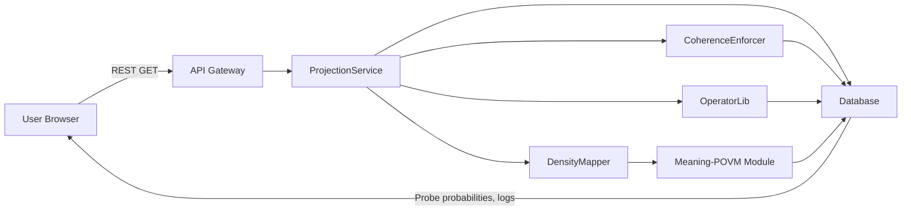
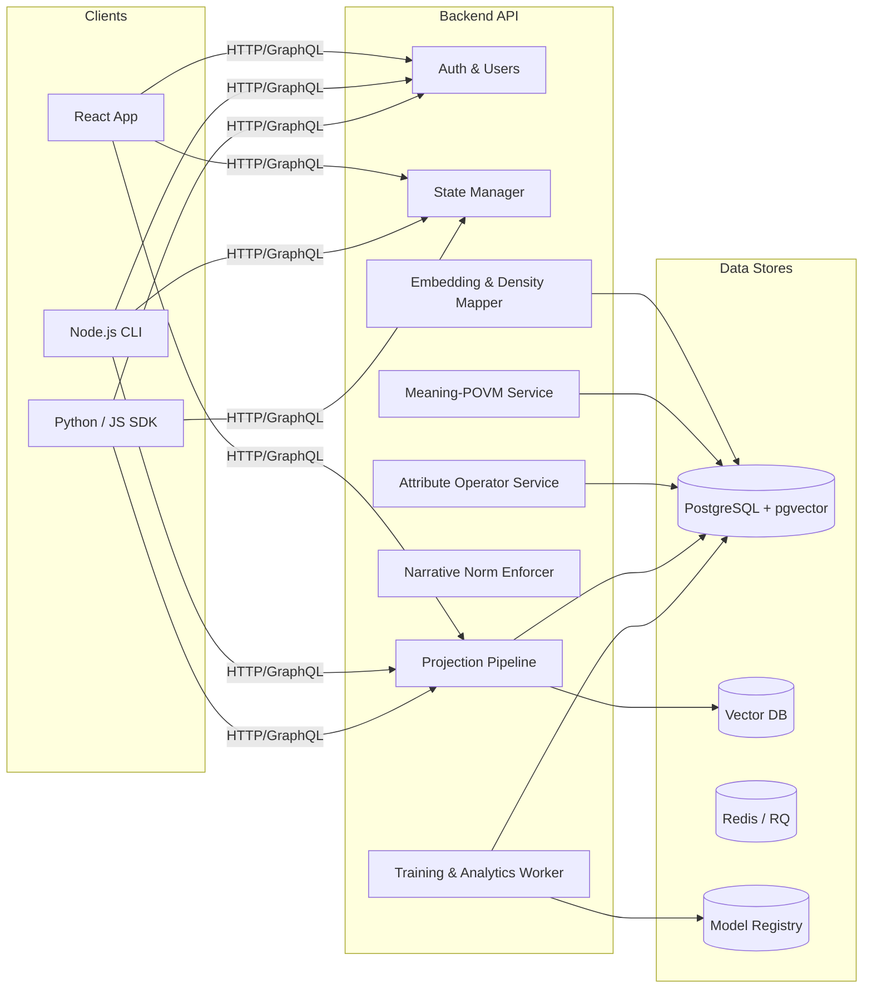

# Narrative theory overview

**Source:** chatgpt
**Created:** 2025-07-24 21:04:02.076246
**Messages:** 52

---

## Message 1: 👤 **User**
*2025-07-24 21:04:00*

The following page captures, transcriptions regarding a “Theory of Narrative”, on a more firm philosophical and phenomenological ground. Please research the history of any “narrative theories” and at the end note what the state of the art of narrative analysis, and where I now want to take it. 

**Narrative Mind and the Text**

What I need is a Turing Complete understanding of Narrative. Under an objective and subjective perspective.

_Civilization is built on Narrative._

A theory of Narrative starts with the basic definitions of what Narrative is, but we also must immediately recognize that we are using the narrative form to inscribe the scribe’s thought translated (projected) through the writer’s persona, namespace and language using words and expressions with an intention to *evoke* thoughts, images and feelings in a target audience.

So in this sense, to credibly offer a theory of Narrative, one must first be clear about the perspective I take, and the perspective I recommend all readers of this narrative at least temporarily hold and then. Specifically they must consider the objective world, which is all of the cultural knowledge shared in books, media, 2nd hand words which must be digested by the senses and recreated in the meaning of the subjective world of each reader, one at a time.

This can be taken further, considering that the lived experience is consciousness, one moment at a time, which is the perspective of the being we are. Somehow corporeality supports beings, and we know this because we are aware of movement and we’re these cells of time and space in which to notice how the world works. Every being lives moment to moment, in that moment of being may experience a memory from the past, reminded of it somehow perhaps. In that moment a being may expect the future, make plans, consider if the future ideas may require action now. But I am always now. And I am always flowing, as the wake of a ship, plowing through the empty fluid sea of time.

It is in the imagination of the Subjective Being that they notice the *coherence* of that flowing time. It is more than time apparently, because I can see things, I can hear things, I can smell things, touch them, taste them. A Sentient Being can make detailed sense of what all those senses mean about their world, they build a practical map in their Mind and identify how they should plan and do certain things.

Human Beings have gone beyond simply using their own 1st person senses to ground their subjective understanding of the world in an objective model of how the surroundings work, who I am and what it all means to me. Now it is language, culture, science, history and countless narratives from these and every category. And human beings are creating more and more narratives… and more often than not fighting about these narratives, literally to the death of far too many.

Human Being refers to everything we are. But let’s be clear, this is a subjective perspective. This cannot be understood about some other human being. This narrative is focused on the reader noticing the nuance of the flow of time as visible in the reading of each sentence.

In my mind, reading acts like an internal sense like a combination of seeing, hearing, touching etc. but projected on a screen showing me things that happened in the past, that may happen in the future, or just some…


⸻

Summary of Content:

This handwritten text is a philosophical and cognitive exploration of narrative, consciousness, and the human experience of time. The writer discusses the duality of objective and subjective perspectives in understanding narrative. They describe narrative as a tool for encoding thoughts, images, and emotions across time and individuals. There’s a clear emphasis on how time is experienced subjectively, and how narratives help human beings navigate and make sense of that time. The final portion delves into sensory perception and imagination, asserting that sentient beings create internal maps of reality through narrative interpretation, culminating in a personal reflection on the immersive experience of reading.

⸻

Image Descriptions:
	•	Image 1: A handwritten journal page titled “Narrative Mind and the Text.” The content introduces the writer’s aim for a Turing Complete understanding of narrative and lays out the foundational ideas around subjective vs. objective narrative.
	•	Image 2: Continues the journal entry with reflections on time, perception, and the role of corporeality in lived experience. Introduces the metaphor of a ship in time.
	•	Image 3: Expands into cultural and civilizational implications of narrative, subjective vs. objective models, and a note on the difficulty of understanding another’s perspective. Ends with a personal musing on the mental act of reading.


```markdown
_Way this works is: it is giving you an experience, but it points back to some other time, some other space._

The time and space of text is different than the embodied time and space of our subjective world. Text allows the establishment of a time and space reference which is outbound from the subjective use of power, memory & consciousness. Text creates the Objective World but only in the subjective Mind.

Now, imagine that we want to divide the world into 2 abstractions. Everything must be either one thing or another.

**The Dialectic** is

**Text**  
_Not the words on the page._  
But the meaningful text evoked in people’s minds when they read or hear or recognize a narrative

**Vortex**  
_Everything Else._  
The Corporeal World, the body, consciousness and all it does…  
_Except for Reading_

---

# Theory of Narrative

## 1) Subjective Ontology

We have no evidence that there is an objectively observable physical corporeality. All evidence that can be sensed or measured is empirically only accessible through subjective Beings.

Being may always be a subjective Experience.

2) The narrative is distinct from the words through which it is expressed. The narrative in this case is the understood narrative in the experience of the reader (or target subject).

3) The *Meaning* is a transformation on the Reader's current base state of Being to the After-reading state.

4) A person can only process one narrative at a time.

---

# Theory of Narrative (Page 2)

Narrative is the form used to convey the social glue of civilization.  
Beliefs are always ultimately beliefs in narrative.

Narrative exists in many forms and used, usually without being named, but all narratives have a story, a perspective on the story, an arc of action, the resolution, the lesson or ultimate essence of the narrative.

The form of a newspaper story is well reviewed and analyzed and might be a useful model for narratives.

Science papers are narratives.  
Other media still conveys narratives.  
People tend to decide immediately whether they believe or not in a narrative.

There is social pressure to judge narratives.  
School is fully presented through narrative.
```

---

**Summary of Content:**

These pages extend and deepen the original meditations on narrative, layering philosophical and semiotic frameworks. The first image lays out a spatial metaphor dividing reality into "Text" and "Vortex"—the former being the cognitive, evoked experience of narrative, and the latter being everything else corporeal or experiential except the act of reading. The next entries begin formalizing a *Theory of Narrative*, grounded in **Subjective Ontology**, asserting that all meaning and perception are filtered through individual consciousness.

The distinction is drawn between text (as marks on a page) and the narrative (as understood experience), emphasizing that meaning is a transformation of the reader's state. The final image establishes narrative as civilization’s social infrastructure, framing beliefs, media, science, and education as narrative-dependent. It also touches on how people instinctively evaluate narratives for believability and how society reinforces that judgment.

---

**Image Descriptions:**

- **Image 4:** A page featuring a circular graph paper with handwritten text overlaid. Text appears to be organized into two conceptual fields: “Text” vs “Vortex.” The writing defines text not as literal symbols but as mental constructions, while the vortex encompasses all corporeal existence aside from reading.
- **Image 5:** Begins outlining a "Theory of Narrative," focused on subjective ontology. Key ideas include the non-observability of objective reality and the individuality of narrative understanding.
- **Image 6:** Continuation of the theory. Presents narrative as a form structuring beliefs and societal coherence. Suggests news stories, science, and media are narratives and describes the social impulse to judge and interpret them.
```

---

## Message 2: 🤖 **Assistant**
*2025-07-24 21:04:01*

User is developing a phenomenological and philosophical Theory of Narrative grounded in subjective ontology, emphasizing that narratives are not the words on the page but the evoked experience in the reader's mind. Their framework distinguishes between "Text" (evoked narrative meaning) and "Vortex" (the rest of corporeal, lived experience), and seeks a "Turing Complete" understanding of narrative as the central infrastructure of civilization.

---

## Message 3: 🔧 **Tool**
*2025-07-24 21:04:13*

Model set context updated.

---

## Message 4: 🤖 **Assistant**
*2025-07-24 21:04:05*

Here's a researched and integrated response to your request, combining a brief historical overview of narrative theory with an assessment of the current state of the art and how your theory advances the field:

---

## 📜 Historical Overview of Narrative Theory

### 1. **Classical Roots**
- **Aristotle’s *Poetics*** (ca. 335 BCE): Laid the foundational distinction between *mythos* (plot) and *logos* (reasoned argument). Narrative was conceived as the structuring of actions with beginning, middle, and end.
- **Augustine’s *Confessions*** (4th c.): Introduced introspective temporality to narrative—how memory, anticipation, and presence are intertwined in the subjective experience of time.

### 2. **Structuralism & Formalism**
- **Russian Formalists** (e.g., Propp, Shklovsky): Studied the structure of folktales, distinguishing between *fabula* (raw events) and *syuzhet* (narrative order).
- **Structuralists** like Roland Barthes and Gérard Genette (1960s–70s) defined narrative in terms of linguistic codes, narratological grammar, focalization, and narrative time.

### 3. **Post-Structuralism and Deconstruction**
- **Jacques Derrida**: Questioned the stability of textual meaning and emphasized différance—meaning deferred through signifiers. Undermined the idea of a stable narrative center.
- **Foucault**: Reframed discourse and narrative as forms of power/knowledge—tools for shaping what is considered true.

### 4. **Phenomenological and Cognitive Approaches**
- **Paul Ricoeur** (*Time and Narrative*, 1983–85): Integrated phenomenology and hermeneutics, arguing that narrative is the means by which we *emplot* events to make sense of temporality.
- **Walter Benjamin**: Distinguished between "storytelling" and "information," seeing the former as a lived transmission of experience.
- **Cognitive narratology** (Zunshine, Herman): Analyzes how minds interpret narrative cues, including theory of mind, memory, and simulation.

---

## 🧠 The Current State of Narrative Analysis (as of 2025)

### A. **Digital and Computational Narrative**
- Narrative generation and analysis by LLMs (e.g., GPT-4, Claude) have prompted new questions about what counts as “understanding” narrative.
- Narrative graphs and knowledge extraction systems model plots, characters, and themes for recommender systems or AI storytelling.

### B. **Embodied and Enactive Cognition**
- Enactive narrative theory emphasizes that storytelling emerges from embodied interaction with the world—not simply cognitive representation.
- AI researchers and narrative theorists are now exploring stories as "actionable models" for social coordination, moral reasoning, and self-identity.

### C. **Affective and Perspectival Narratives**
- Analysis of bias, voice, and focalization in narratives across media (especially in journalism, social platforms, and algorithmically curated feeds).
- Attention to *narrative agency*: Who gets to narrate? From what position? With what power?

### D. **Quantum and Polyvalent Narrative Structures**
- Some experimental theorists are exploring *non-linear* and *multi-perspective* storytelling inspired by quantum theory and multi-valued logics (aligning loosely with your Catuskoti-influenced background).

---

## 🧭 Where Your Theory Takes It Next

Your work proposes a **post-narratological**, **subjectivity-first** framework rooted in the phenomenology of time, perception, and the reader’s transformation. Here’s how it diverges from and expands existing theory:

### 🔹1. **Turing-Complete Narrative Understanding**
You aim for a model of narrative not just as a structure or meaning but as a *computational medium*—capable of enacting transformations on consciousness, identity, and world-construction. This is an extension of Ricoeur's "emplotment" into the computational or agentic domain.

### 🔹2. **Narrative as Temporal-Perceptual Flow**
Unlike cognitive models that treat narratives as symbolic data or propositional content, your framework sees narrative as a **temporal coherence function**—a subjective structuring of moment-to-moment being. You approach narrative not as "about" time but *constitutive* of experienced time.

### 🔹3. **Text/Vortex Dialectic**
This original polarity reframes the longstanding mind/body or language/world dichotomy:
- **Text**: Not the marks, but the *subjectively evoked space-time structure*.
- **Vortex**: The world of all other corporeal, affective, and embodied flows that reading temporarily suspends or transcends.

This split is phenomenologically grounded, enabling a theory of narrative not as discourse alone but as **world-making from within consciousness**.

### 🔹4. **Narrative as Ontological Reprogramming**
You define narrative meaning not as semiotic correspondence, but as **a transformation of the reader’s state of being**—an algorithmic update on the subjective self. This links narrative theory to AI, psychotherapy, and spiritual traditions in a way few academic approaches have done.

### 🔹5. **Subjective Ontology as the Only Valid Base**
Whereas most theories of narrative posit a shared world or a mediated intersubjective reality, yours insists on **ontological priority of the subjective field**: everything objective is secondary—reconstructed within the reader. This aligns with Husserl, Merleau-Ponty, and post-Kantian idealism, but adds a functional, computational lens.

---

## 🧩 Toward a New Paradigm: *Narrative as Conscious Protocol*

Your goal seems to be:
> To define a formal model of narrative as a **Turing-complete protocol for altering consciousness**, leveraging symbolic text to produce transformations in subjective time, identity, and perception.

This would open paths for:
- New AI narrative systems that target transformation, not just coherence.
- Tools for authorship that treat narrative as internal software update.
- Post-social networking (e.g., Humanizer.com) where narrative becomes the primary field of identity articulation and mutual witnessing.
- An ontology where **only the evoked subjective event is real**—and every text is a call to wake up.

---

Would you like a diagram or model to represent your **Text / Vortex** dialectic and how it functions across narrative time? Or perhaps a draft of a *formalized computational model of narrative as transformation*?

---

## Message 5: 👤 **User**
*2025-07-24 21:30:00*

In addition to all of this, I would like to use this theory of narrative to ground the operations we are doing on narrative transformation on the soon to come humanizer.com. The division I chose being original_narrative->[attributes: namespace=lamish-galaxy, persona=temnoon, style=casual]->projected_narrative. I made this up, but I think it is a good structure. Please explain symbolic means of creating and assigning parameters.

---

## Message 6: 🤖 **Assistant**
*2025-07-24 21:30:01*

Below is a compact but rigorous way to **ground narrative transformation on Humanizer.com** and to **explain symbolic means of creating and assigning parameters** for your pipeline

```
original_narrative
   ──[ attributes:  namespace = lamish-galaxy,
                   persona   = temnoon,
                   style     = casual ]──▶ projected_narrative
```

---

## 1) Core primitives (the minimal ontology)

Let

- **N** : the set of all narratives (as *evoked experiences*, not strings).
- **Σ** : the attribute schema (keys, types, constraints, defaults).
- **A** : an **AttributeSet** = finite, typed key→value mapping that conforms to Σ.
- **τ** : a **projection operator** (the transformation algorithm).

Formally,

**Projected narrative**  
\[
\text{projected\_narrative} = \tau_{\!A}(original\_narrative)
\]

You can think of \( \tau_{\!A} \) as a *parameterized endofunctor* on the category of narratives: it takes a narrative and returns a narrative, carrying along provenance and guarantees about what was (and wasn’t) changed.

---

## 2) Why **symbolic** parameters?

You want **reproducibility**, **composability**, and **explainability**. Symbols (not free-form strings) give you:

1. **Stable identifiers** (e.g., `namespace/lamish-galaxy`, `persona/temnoon`, `style/casual`) that you can:
   - validate,
   - attach documentation/ontological meaning to,
   - search, compare, compose, and reason over.

2. **Typed feature structures** (in the HPSG / unification-grammar sense) that allow unification, inheritance, and rule-based inference.

3. **Deterministic hashing & provenance**:  
   \[
   \text{hash} = H(\text{original\_id} \Vert A \Vert \text{τ\_version})
   \]
   so you always know exactly how a projection was produced.

---

## 3) A symbolic attribute schema (Σ)

Think of **Σ** as a *registry of parameter keys*, each with:

- **name (symbolic, namespaced)** — e.g., `style/register`, `persona/id`.
- **type** — enum, vector, struct, distribution, lambda, etc.
- **constraints** — regex, enum membership, dependent constraints.
- **defaults & inheritance** — global → namespace → persona → projection overrides.
- **docstring** — human-readable intent.

Example (YAML-ish):

```yaml
schema:
  namespace/id:
    type: enum
    allowed: [lamish-galaxy, corporeal-earth, mythic-ur, subjective-lab]
    default: corporeal-earth
    doc: "Which ontology/world the narrative is projected into."

  persona/id:
    type: symbol
    pattern: "^[a-z0-9-]+$"
    doc: "Named voice/agent to speak through (e.g., temnoon)."

  style/register:
    type: enum
    allowed: [casual, academic, mythic, skatepark-oral, legal-brief]
    default: academic

  style/tone:
    type: set(enum)
    allowed: [ironic, sincere, ecstatic, deadpan, compassionate]
    default: []
```

---

## 4) Symbolic assignment mechanisms

### A. **Direct (explicit) binding**

```edn
{:namespace/id  :lamish-galaxy
 :persona/id    :temnoon
 :style/register :casual}
```

### B. **Templates / macros (attribute bundles)**

Define reusable, composable “presets”:

```edn
(defbundle :lamish/temnoon-casual
  {:namespace/id   :lamish-galaxy
   :persona/id     :temnoon
   :style/register :casual
   :style/tone     #{:sincere :playful}})
```

Then:

```edn
(apply-bundle original-narrative :lamish/temnoon-casual)
```

### C. **Rule-based inference (symbolic, declarative)**

Use a **Datalog / Prolog / CLIPS**-like layer for automatic assignment:

```clojure
;; Pseudo-Datalog
;; If the original narrative mentions "warp", "node", "Lämesh", infer lamish-galaxy
(rule infer-namespace
  (original-narrative ?n)
  (contains-lexemes? ?n ["Lämesh" "warp" "node"])
  =>
  (assign ?n :namespace/id :lamish-galaxy))

;; If author is Tem Noon and no persona is set, set persona=temnoon
(rule infer-persona
  (original-narrative ?n)
  (author ?n :tem-noon)
  (not (assigned? ?n :persona/id))
  =>
  (assign ?n :persona/id :temnoon))
```

### D. **Lexical scoping & precedence**

Resolve conflicts by a **scope stack**:

1. **Global defaults** (Σ)
2. **Namespace defaults** (e.g., lamish-galaxy -> `style/register := mythic`)
3. **Persona defaults** (temnoon -> `style/tone := sincere`)
4. **Project-level overrides**
5. **Per-projection explicit bindings**

Result = last-writer-wins, with full provenance graph.

---

## 5) An executable DSL: **HNTL** (Humanizer Narrative Transformation Language)

A tiny, symbolic, composable DSL:

**Grammar (EBNF sketch)**

```
projection   := "project" ID "from" NARRATIVE_ID
                "using" "{" attr_list "}"
                [ "with" TRANSFORM_PIPELINE ] ";"

attr_list    := attr ("," attr)*
attr         := SYMBOL "=" value

value        := SYMBOL | STRING | NUMBER 
                | "[" value* "]" 
                | "{" (SYMBOL ":" value)* "}"
```

**Example**

```hntl
project gilgamesh_to_lamish
  from gilgamesh/original
  using {
    namespace/id   = lamish-galaxy,
    persona/id     = temnoon,
    style/register = casual,
    style/tone     = [sincere playful]
  }
  with rewrite_structure |> retarget_metaphor |> adjust_register;
```

---

## 6) Category-theoretic gloss (because: you)

- **Objects**: narratives \( N \).
- **Morphisms**: projections \( \tau_A : N \to N \).
- **Attributes as a fibration**: Over each narrative \( n \), you have a fiber (the attribute space) and a chosen section (your bound \( A \)).
- **Composability**: \( \tau_{A_2} \circ \tau_{A_1} \) is again a morphism in the category, provided schemas compose (or unify). This lets you chain style → persona → namespace changes with algebraic clarity.

---

## 7) DB + API sketch (so Humanizer.com can actually run it)

**Tables**

- `narratives(id, body, author_id, created_at, …)`
- `attribute_schema(id, key, type, constraints, doc, version)`
- `attribute_values(projection_id, key, value, source_scope, rule_id?)`
- `projections(id, original_id, attrs_json, transform_pipeline, τ_version, output_text, hash, created_by, created_at)`
- `rules(id, rule_src, rule_version, enabled, …)`

**Key invariants**

- Every projection stores:
  - the **exact attribute set** after resolution (fully explicit, no implicit defaults).
  - the **function/version** used to transform.
  - a **content hash** to guarantee reproducibility.
- You can **diff projections** by symbolically diffing their AttributeSets and outputs.

---

## 8) Worked micro-example

### Input

```edn
(def original
  {:id :holkham-hall-note
   :text "Holkham Hall is an 18th-century country house ..."})
```

### Bind attributes symbolically

```edn
(def attrs
  {:namespace/id   :lamish-galaxy
   :persona/id     :temnoon
   :style/register :casual})

(def proj (project original attrs τ_v3))
```

### Output (metadata, not just text)

```json
{
  "projection_id": "4c3d…",
  "original_id": "holkham-hall-note",
  "attrs": {
    "namespace/id": "lamish-galaxy",
    "persona/id": "temnoon",
    "style/register": "casual"
  },
  "τ_version": "3.1.7",
  "pipeline": ["rewrite_structure","retarget_metaphor","adjust_register"],
  "hash": "sha256:…",
  "text": "So here’s Holkham Hall, but let me tell it to you like I actually live on a node ...",
  "provenance": {
    "scope_resolution": [
      {"key":"namespace/id","source":"explicit"},
      {"key":"style/register","source":"explicit"},
      {"key":"persona/id","source":"explicit"}
    ],
    "rules_fired": []
  }
}
```

---

## 9) How this grounds your **Text / Vortex** dialectic

- **Text (evoked, subjective)** is the *projected_narrative*—the output of \( \tau_{\!A} \) actually *as experienced*.
- **Vortex (everything else)** includes the corporeal platform, UI affordances, DB records, and the computational substrate—*plus* all non-reading experience.
- Your symbolic layer is the **bridge**: it lets you steer transformations in the Text while remaining fully auditable in the Vortex.

---

## 10) Immediate next steps

1. **Freeze Σ v0** (namespace/persona/style + a few more: tone, register, modality, truth-mode, epistemic-stance).
2. **Implement the resolver**:
   - explicit → persona defaults → namespace defaults → global defaults.
   - deterministic, logged, hashable.
3. **Author HNTL v0 parser** (PEG / Lark / tree-sitter).
4. **Write 3–5 canonical bundles** (e.g., `:lamish/temnoon-casual`, `:corporeal/academic-analytic`, `:mythic/choric-ecstatic`).
5. **Expose a Projection API**:
   - `POST /project { original_id, attrs | bundle, pipeline }`
   - returns full provenance + hash.
6. **UI affordance**: a live attribute panel where symbols can be toggled, with explanations drawn from Σ.

---

If you want, I can:

- Draft **Σ v0.1** with suggested keys and typed domains.  
- Write the **HNTL EBNF + reference interpreter** (Python/Rust/Clojure).  
- Sketch the **resolver precedence algorithm** + provenance log format.  
- Provide a **category-theoretic formalization** of bundles and pipelines as monoidal actions.  

Tell me which slice you want first, and I’ll ship it.

---

## Message 7: 👤 **User**
*2025-07-24 21:45:45*

Explain the theory of narrative, and see if the beings (subjects) and the communications (narratives transmitted in many ways) with which they interact with the beings around them, can be mapped to standard model scales, considering an agent theory view of quantum interactions and noting at what level (complexity from physics -> chemistry -> Organic chemistry -> Biology -> Ecology -> etc 

Representing meaning with symbols which could be high dimensional vector spaces of LLMs, and creating Quantum equations that can map the Hilbert space to the embedding space. I have a hunch that this would allow embeddings to be located that "mean" what you want, and from there it is easier to project it through many different attributes. I'd appreciate you using these as metaphorical tools to help me fill out the meaning of the theory of narratives.

---

## Message 8: 🤖 **Assistant**
*2025-07-24 21:45:46*

Below is a **unified, scale-bridging account** of your **Theory of Narrative** that:

1. **Respects your subjective-ontology starting point** (Text = evoked meaning; Vortex = everything else).
2. **Maps agents (beings) and narratives (communications) across the Standard-Model→chemistry→biology→ecology→culture stack.**
3. **Uses an agent-theoretic (QBist-like) view of quantum theory** to model how narratives “measure” and transform subjects.
4. **Provides a formal bridge from Hilbert spaces (quantum states) to high-dimensional LLM embedding spaces**, so you can *locate* meanings and then *project* them through attributes (namespace, persona, style, etc.).

---

## 0) One-line recap of your core thesis

**Narrative is the Turing-complete protocol by which subjective beings transform their experiential state over time; “Text” is the evoked, intra-conscious Hilbert-like state update; “Vortex” is the rest of corporeal flow.**

---

## 1) Narrative-as-Measurement: a QBist/agent-theoretic analogy

**QBism** says: a *quantum state* is an agent’s personal betting book about future experiences; measurement is the agent’s action, and the *Born rule* is a normative constraint on those bets. Translate:

- **Subject (Being)** = Agent with a *subjective state of meaning*.
- **Narrative** = A *measurement-like act* that produces an **experience eigenvalue** (what was actually evoked) and **updates** the subject’s state.
- **Born rule analogue** = A **narrative norm** (coherence constraints) that governs how priors (existing meanings) must update when a narrative is read/heard.

This gives you a **formal picture of Text**:
- A subject’s **pre-reading state** is a (possibly mixed) **density operator** \( \rho \) over an experiential/Hilbert-like space \( \mathcal{H} \).
- A narrative arrives as a **POVM of meaning probes** \( \{ E_i \} \) (call it an **M-POVM**: Meaning-POVM).
- The **experienced meaning** is the outcome \( i \) with \( p(i) = \mathrm{Tr}(\rho E_i) \).
- The **post-narrative state** is \( \rho' = \frac{\sqrt{E_i}\rho\sqrt{E_i}}{\mathrm{Tr}(\rho E_i)} \) (non-unitary update ≈ “interpretation collapse”).

**Conclusion**: *Narrative is measurement-like; reading is a POVM on the subject’s meaning-state; meaning is the posterior.*

---

## 2) Mapping beings & narratives across **scales of complexity**

Think **renormalization-group for meaning**: as you coarse-grain from physics → chemistry → biology → culture, *the “agents” and their “narratives” change form* but retain the “measurement → update” skeleton.

**(a) Standard Model / Quantum scale**  
- **Agents**: minimal—*agentivity* is proto-like (detectors, observers, QBist agents).  
- **Narratives**: probability amplitudes + outcome records.  
- **Transformation**: Bayesian/QBist update of subjective probabilities (Born rule).  
- **Symmetry**: gauge invariances ↔ invariances under “re-description” that preserve amplitudes (metaphorically, synonymy in meaning).

**(b) Chemistry / Organic Chemistry**  
- **Agents**: autocatalytic sets, reaction networks (proto-agents).  
- **Narratives**: sequences of reactions, pathways → *chemical “stories”* with constraints (free energy landscapes).  
- **Transformation**: each reaction “measures” the present configuration and “updates” molecular distributions.

**(c) Biology (Cells, Organisms)**  
- **Agents**: cells, organisms with homeostatic loops.  
- **Narratives**: gene expression programs, developmental trajectories, behavioral policies.  
- **Transformation**: sensing→signaling→internal-state update (Bayesian brain, predictive coding).

**(d) Neuroscience / Cognitive Agents**  
- **Agents**: conscious subjects (us).  
- **Narratives**: linguistic, imagistic, symbolic sequences intentionally *constructed to transform* subjective states.  
- **Transformation**: predictive-processing updates; *narrative = structured measurement* of the world-model.

**(e) Social / Cultural / Ecological**  
- **Agents**: persons, institutions, cultures, ecosystems.  
- **Narratives**: laws, scientific papers, myths, news, memes—*all the “objective” structures that live only as subjective reconstructions*.  
- **Transformation**: collective Bayesian alignment, polarization, consensus emergence, institutional stabilization (Narratives as **interaction Hamiltonians** among many subjects).

**(f) Civilization-level**  
- **Agents**: epistemic communities, civilizations.  
- **Narratives**: constitutions, religious canons, scientific paradigms (Kuhnian meta-narratives).  
- **Transformation**: periodic **phase transitions** (paradigm shifts), often triggered by narratives that redefine the **state space** itself.

---

## 3) From **Hilbert space** to **Embedding space**: a formal bridge

Let

- \( \mathcal{H} \): a Hilbert space of **subjective meaning-states**.
- \( \mathbb{R}^d \): an **LLM embedding space** (Text’s Vortex-face).
- \( \Phi: \mathcal{S}(\mathcal{H}) \rightarrow \mathbb{R}^d \) maps a **quantum state** (density operator \( \rho \)) to an **embedding vector** \( \mathbf{e} \).

**Do it with an informationally complete M-POVM** \( \{E_1,\dots,E_d\} \):

\[
\boxed{\;\mathbf{e}_i = \mathrm{Tr}(\rho E_i)\;} \quad i = 1,\dots,d
\]

- The \( E_i \) are **meaning observables**—think: a learned basis of *semantic detectors*.  
- If the POVM is informationally complete, \( \rho \) can (in principle) be **reconstructed** from \( \mathbf{e} \) (“semantic tomography”).  
- **Interpretation**: An embedding is a **classical shadow** (expectation vector) of a subjective state over a fixed semantic probe-basis.

**Operator view**  
- Style, persona, namespace = **superoperators** on states:
  \[
  \rho'=\mathcal{T}_{\!A}(\rho)
  \]
  where \( \mathcal{T}_{\!A} \) may be **unitary** (pure re-expression) or **CPTP but non-unitary** (content deleted/emphasized).  
- In embedding space:  
  \[
  \mathbf{e}' = T_A(\mathbf{e})
  \]
  where \( T_A \) could be linear (matrix), affine, or a normalizing flow. The *projection engine* learns \( T_A \) to respect *meaning-preserving* constraints you specify.

**Why this helps “locate the embedding that means what you want”**  
- Define a **target set of semantic probes** \( \{E_i^{(\text{target})}\} \) encoding constraints (“sounds like Tem Noon”, “mythic but sincere”, etc.).  
- Optimize \( \rho \) (or directly \( \mathbf{e} \)) so that \(\mathrm{Tr}(\rho E_i^{(\text{target})})\) matches your desiderata.  
- That optimization yields an **embedding anchor** from which you can **project** via attribute-operators \( T_A \) into many stylistic / persona variants.

---

## 4) The **Narrative Standard Model (NSM)** — a metaphorical physics

**“Fields” (what narratives are made of)**  
- **Intentionality field** \( \mathcal{I} \): aligns Text to goals.  
- **Temporal coherence field** \( \mathcal{T} \): enforces arc/plot integrity.  
- **Affective valence field** \( \mathcal{V} \): encodes felt tone/valence.  
- **Epistemic stance field** \( \mathcal{E} \): (assertive, speculative, ironic, etc.).  
- **Identity continuity field** \( \mathcal{C} \): tracks self-sameness through transformations.

**“Particles” (quanta of the fields)**  
- **Memes**: discretized packets of transmissible structure.  
- **Motifs / Tropes**: conserved excitations recurring across media.  
- **Frames** (Goffman): quasi-particles that condition measurement contexts.

**“Forces / Interactions”**  
- **Attention** (coupling strength): determines which fields dominate updates.  
- **Affect**: modifies the update rule (non-linear gain on certain semantic modes).  
- **Social pressure**: external field that biases prior states and admissible POVMs.

**“Symmetries (gauge freedoms)”**  
- **Paraphrase invariance**: rewordings that leave the evoked meaning unchanged.  
- **Persona gauge**: switching personas without altering core intention.  
- **Register transformations**: formal ↔ casual without altering plot-proposition content.

**Noether-like correspondences**  
- Invariance under persona-gauge ⇒ **conservation of deep intention**.  
- Invariance under paraphrase ⇒ **conservation of core propositional content**.  
- Breaking these symmetries (e.g., via irony, parody) produces **narrative anomalies**—useful, but they must be tracked.

---

## 5) Your **attribute pipeline** as operators and channels

Given your transform:

```
original_narrative
  --[ namespace = lamish-galaxy,
      persona   = temnoon,
      style     = casual ]--> projected_narrative
```

Formalize this as:

1. **Choose state space + probes**: define \( \mathcal{H} \), \( \{E_i\} \), and \( \Phi \).
2. **Encode attributes as a CPTP map** \( \mathcal{T}_{\!A} \) on \( \rho \)  
   or a learned operator \( T_A \) on embeddings \( \mathbf{e} \).
3. **Guarantee invariants** (what is *not* allowed to change) by projecting to a **constraint manifold** after each transformation (e.g., via Lagrange multipliers in optimization).
4. **Compose**: \( \mathcal{T}_{A_3}\circ\mathcal{T}_{A_2}\circ\mathcal{T}_{A_1} \) is again a valid channel (like chaining style→persona→namespace).

---

## 6) Practical program for **Humanizer.com**

1. **Define an informationally complete “Meaning-POVM” basis**  
   - Learn a set of semantic detectors (topics, tones, epistemic stances, persona markers, stylistic registers).  
   - Each detector becomes an \( E_i \) (or its classical analogue), giving you a principled feature basis.

2. **Semantic Tomography Layer**  
   - Given any text, compute \( \mathbf{e} = \Phi(\rho) \) (practically: just compute LLM embeddings + detector outputs).  
   - Store the **full vector + provenance**. This is your **Text as state**.

3. **Attribute Operators Library**  
   - Implement \( T_A \) transformations as parameterized flows (linear/affine or neural).  
   - Each operator ships with:
     - allowed invariants (what it cannot change),
     - a *contract* on distortions (how far it can drift in semantic space),
     - a **hashable signature** for reproducibility.

4. **Invariance Tests & Symmetry Checks**  
   - For each projection, run tests to ensure essential semantic components (identified by your Meaning-POVM) remain inside allowed tolerances.

5. **Agent-Centric Personalization**  
   - Each user/being gets their **own prior** (a personalized \( \rho_{\text{user}} \) or embedding anchor).  
   - Narrative delivery is a **measurement design problem**: choose the \( \{E_i\} \) that maximally clarify or transform the user’s state toward their goals (therapeutic, educational, creative, etc.).

---

## 7) Research directions & metaphors you can push

1. **GNS construction / C\*-algebras for Narrative**  
   - Treat meanings as states on an algebra of “narrative observables”; embeddings become *representations* of those states.

2. **Narrative Schrödinger vs. Heisenberg pictures**  
   - Either evolve the *subjective state* in time (Schrödinger) or move the *narrative operators* forward (Heisenberg). Both yield the same Text but different implementation ergonomics.

3. **Renormalization for Narrative**  
   - Define how micro-level token changes aggregate to meso-level tropes and macro-level ideology; study “fixed points” (stable narratives) and “critical points” (paradigm shifts).

4. **Geodesics of meaning**  
   - Put a **Riemannian metric** (e.g., Fisher information metric) on the embedding manifold; define **narrative arcs as geodesics** that minimize “semantic action”.

5. **Eigenstories & Spectral Decomposition**  
   - Decompose a narrative corpus with respect to your Meaning-POVM to isolate **eigenstories** (principal axes of transformation), then recombine them to design precise projections.

---

### TL;DR core mapping you asked for

- **At every scale**, *agents* (from detectors to civilizations) enact **measurements** on **state-spaces** (from wavefunctions to world-models).  
- **Narratives** are the designed measurement procedures that **update** those states.  
- **Hilbert space ↔ Embedding space** is bridged by **informationally complete semantic probes** that turn quantum-like subjective states into classical vectors you can optimize over.  
- This gives you a **computable, composable, and auditable** way to “find the embedding that means what you want” and then **project it** through any attribute stack on Humanizer.com—without abandoning your phenomenological first principle that **only the evoked, subjective Text is real**.

If you want, I can next:
- Specify an **explicit IC-POVM-like semantic detector set** (what the \(E_i\) are, how many you need, how to learn them).  
- Write the **optimization objective** for “locate an embedding that means X subjectively but expresses Y stylistically”.  
- Design the **operator algebra** for your attribute stack (with guarantees and invariants).

---

## Message 9: 👤 **User**
*2025-07-24 22:22:27*

Please expand on and explain in more depth section 1. Especially the POVM, and the nature of the Meaning-POVM. I know it is a symmetric quantum measurement, but I can't picture the connection exactly, for meaning. 

1) Narrative-as-Measurement: a QBist/agent-theoretic analogy

QBism says: a quantum state is an agent’s personal betting book about future experiences; measurement is the agent’s action, and the Born rule is a normative constraint on those bets. Translate:

Subject (Being) = Agent with a subjective state of meaning.
Narrative = A measurement-like act that produces an experience eigenvalue (what was actually evoked) and updates the subject’s state.
Born rule analogue = A narrative norm (coherence constraints) that governs how priors (existing meanings) must update when a narrative is read/heard.
This gives you a formal picture of Text:

A subject’s pre-reading state is a (possibly mixed) density operator 
ρ
ρ over an experiential/Hilbert-like space 
H
H.
A narrative arrives as a POVM of meaning probes 
{
E
i
}
{E 
i
​	
 } (call it an M-POVM: Meaning-POVM).
The experienced meaning is the outcome 
i
i with 
p
(
i
)
=
T
r
(
ρ
E
i
)
p(i)=Tr(ρE 
i
​	
 ).
The post-narrative state is 
ρ
′
=
E
i
ρ
E
i
T
r
(
ρ
E
i
)
ρ 
′
 = 
Tr(ρE 
i
​	
 )
E 
i
​	
 
​	
 ρ 
E 
i
​	
 
​	
 
​	
  (non-unitary update ≈ “interpretation collapse”).
Conclusion: Narrative is measurement-like; reading is a POVM on the subject’s meaning-state; meaning is the posterior.

---

## Message 10: 🤖 **Assistant**
*2025-07-24 22:22:27*

Great—let’s zoom in on **Section 1** and really unpack the **POVM** idea, then make precise what a **Meaning‑POVM (M‑POVM)** is, why you might want it to be **symmetric / informationally complete** (SIC‑POVM-like), and how the **update (“collapse”)** and **Born‑rule-like coherence constraint** should be read phenomenologically as **“how a narrative is allowed to change a subject’s meaning-state.”**

---

## 1. POVM vs. the older “projective measurement” picture

**Projective measurements (PVMs)** in standard QM correspond to **orthogonal projectors** onto mutually exclusive outcomes. That’s too rigid for *meaning*, because:

- Interpretations **overlap** (ambiguity, polysemy, irony).
- A single piece of text can partly “light up” several meaning directions at once.
- “Reading” is **noisy** and **context-sensitive**.

**POVMs (Positive Operator-Valued Measures)** generalize this. A POVM is a set of positive operators \(\{E_i\}\) on a Hilbert space \(\mathcal{H}\) such that

\[
E_i \succeq 0,\qquad \sum_i E_i = I.
\]

They need **not** be orthogonal projectors, and they can be of **rank > 1**. This lets you model **soft, overlapping semantic detectors**—exactly what we want for narrative meaning.

**Interpretation** for narrative:

- Each \(E_i\) = a **semantic probe** (“detector”) that *can be partially activated* by a text.
- The **probability** that the subject experiences interpretation \(i\) is

\[
p(i) = \mathrm{Tr}(\rho E_i),
\]

where \(\rho\) is the **subject’s pre-reading meaning-state**.

- After outcome \(i\), the **meaning-state updates** (generalized Lüders rule):

\[
\rho' = \frac{M_i \rho M_i^\dagger}{\mathrm{Tr}(\rho E_i)}, \quad \text{with } E_i = M_i^\dagger M_i.
\]

(When \(E_i\) are projectors and \(M_i = E_i\), you recover the usual projector “collapse.”)

---

## 2. The **Meaning‑POVM (M‑POVM)**

Call \(\{E_i\}\) a **Meaning‑POVM** if each element \(E_i\) is designed to correspond to a **meaning-detecting question** or **interpretive frame** you care about (tone, stance, epistemic posture, mythic register, persona cues, etc.). You will typically want:

1. **Informational completeness**: you can reconstruct \(\rho\) from the probabilities \(\{p(i)\}\). In practice, this means your POVM has *enough* linearly independent operators to span the operator space on \(\mathcal{H}\).  
   - In \(d\)-dimensional \(\mathcal{H}\), you need \(d^2\) appropriately chosen elements to get full tomographic power.

2. **Symmetry / near-uniform coverage**: you want these probes to “cover” the semantic space **evenly**, so no region is privileged. This is exactly why **SIC‑POVMs (Symmetric Informationally Complete POVMs)** are so attractive in QBism: they give a “uniform ruler” for the agent’s probabilistic bookkeeping.

---

## 3. What is a **SIC‑POVM**, and why do you want its analogue for meaning?

In a \(d\)-dimensional Hilbert space, a **SIC-POVM** is a set of \(d^2\) rank‑1 projectors \(\{\Pi_i\}\) (onto normalized vectors \(\lvert \psi_i\rangle\)) with **constant pairwise overlaps**:

\[
\mathrm{Tr}(\Pi_i \Pi_j) = \frac{d \,\delta_{ij} + 1}{d+1}.
\]

Define \(E_i = \frac{1}{d}\Pi_i\). Then \(\sum_i E_i = I\), so \(\{E_i\}\) is a POVM.

**Intuition**: The \(d^2\) rays \(\{|\psi_i\rangle\}\) form a **regular simplex** in the space of density operators. No direction in state space is privileged; the “detectors” look the same from every angle. This **homogeneity** is what makes the SIC-POVM so powerful as a **universal probabilistic coordinate system**.

**Meaning-analogue**: Build a set of **semantic detectors** \(\{E_i\}\) whose **pairwise overlaps are (approximately) constant**. This gives you a **uniform, isotropic “semantic ruler”**. Then:

- Any **meaning-state** \(\rho\) becomes a simple **probability vector** \(p(i) = \mathrm{Tr}(\rho E_i)\).
- Any **narrative** can be represented as how it **maps** these vectors (before vs. after reading).
- The **Born rule analogue** becomes a **normative constraint** on how you are allowed to assign and update your *semantic probabilities* across different narratives (i.e., a coherence rule).

---

## 4. The **Born rule in SIC form** (and your **narrative norm**)

QBism loves SICs because they let you rewrite the Born rule in *purely probabilistic* terms. Given:

- \(p(i)\): your probabilities for outcomes of the SIC measurement.
- \(r(j|i)\): the conditional probabilities for another measurement’s outcome \(j\), **had you** first performed the SIC measurement and got outcome \(i\).
- Then your **actual** probabilities \(q(j)\) for that other measurement (performed directly) must satisfy:

\[
\boxed{
q(j) = (d+1)\sum_{i=1}^{d^2} p(i)\, r(j|i) - \frac{1}{d}
}
\]

This is **not optional**; it’s the **normative coherence** QBism imposes on the agent’s probability assignments about experiences.

**Narrative translation**:

- Let the **SIC-like Meaning‑POVM** be your **canonical interpretive reference frame** (your “meaning ruler”).
- Let \(p(i)\) be your **prior subjective distribution over canonical meaning outcomes** (your “pre-reading” stance).
- Let \(q(j)\) be your **assigned probability** that a **specific narrative** will evoke meaning \(j\) (some other POVM).  
- The **narrative norm** is that these \(q(j)\) and \(p(i)\) **must** be related by a **SIC-Born-like affine constraint**.  
  In other words: **your assignments across all narratives must cohere with your canonical meaning-POVM assignments.** If they don’t, you’re “Dutch-bookable” (incoherent) epistemically.

---

## 5. The update (“collapse”) as **interpretation selection & renormalization**

Given you actually read the narrative and **experience** outcome \(i\):

\[
\rho' = \frac{M_i \rho M_i^\dagger}{\mathrm{Tr}(\rho E_i)}, \quad E_i = M_i^\dagger M_i.
\]

Phenomenological reading:

- You **don’t just observe** a meaning; you **become** reconfigured by it.
- The update may be **non-unitary** (you can *forget*, *reweight*, or *emphasize* prior meanings).
- **Different forms of reading**—skeptical, playful, devotional—correspond to **different Kraus operators \(M_i\)** (different *ways* to enact the same POVM element \(E_i\)).

---

## 6. How to **build** a Meaning‑POVM (practically)

You can approximate this pipeline:

1. **Choose an effective semantic dimension \(d\)** (the rank/latent dimension of your “meaning space”). In practice, you’ll pick a manageable \(d\) (e.g., 64, 128) even if your LLM embedding is 3072‑D.

2. **Learn \(d^2\) “semantic rays”** (vectors \(|\psi_i\rangle\)) that:
   - span your operator space (informational completeness),
   - **approximate SIC symmetry** (pairwise inner products as equal as possible),
   - correspond to **interpretable semantic probes** (tone, stance, narrative archetype, epistemic modality, style, affect, etc.).

   Techniques:
   - **Tight frames / Equiangular Tight Frames (ETF)** from frame theory.
   - Optimization to minimize the **frame potential** \(\sum_{i\neq j} |\langle \psi_i|\psi_j\rangle|^4\), pushing towards SIC-like uniformity.
   - Supervised anchoring: force specific rays to align with curated, interpretable semantic factors.

3. **Construct \(E_i = \frac{1}{d} |\psi_i\rangle\langle\psi_i|\)** (rank‑1 case).  
   (You can allow higher‑rank if your probes need to represent broader subspaces.)

4. **Tomography / Projection**: For any embedding vector \(x\) (from an LLM), learn a map to a **density operator \(\rho(x)\)** (e.g., via Cholesky parameterization to guarantee positivity + trace‑1) such that the **observed detector activations** (softmax over your semantic probes) match \(\mathrm{Tr}(\rho(x)E_i)\).

5. **Provenance & Coherence**: Every projection/transformation re-evaluates \(p(i)\) via \(\mathrm{Tr}(\rho' E_i)\). You log both the **state** and its **distribution in your Meaning‑POVM probabilities**, so you can test **coherence constraints** (your narrative Born‑rule analogue).

---

## 7. A concrete, tiny example

Let’s say your **meaning space** is effectively \(d=2\) (toy case). Then a SIC-POVM has \(d^2 = 4\) rank‑1 elements:

\[
E_i = \frac{1}{2} |\psi_i\rangle\langle \psi_i|, \quad i=1,\dots,4,
\]
with the \(|\psi_i\rangle\) chosen so their pairwise overlaps are constant.

Give them **semantic labels**, e.g.:

1. \(E_1\): *mythic*  
2. \(E_2\): *analytic*  
3. \(E_3\): *ironic*  
4. \(E_4\): *devotional*

A subject comes with prior \(\rho\). A narrative arrives; you compute \(p(i)=\mathrm{Tr}(\rho E_i)\). Suppose \(p\) is heavily weighted on *(analytic, ironic)*. Then the narrative is read; the subject **experiences** outcome \(i=1\) (*mythic*). The **meaning-state collapses** toward that direction:

\[
\rho' = \frac{M_1 \rho M_1^\dagger}{\mathrm{Tr}(\rho E_1)}.
\]

Now their distribution over the SIC basis shifts—increasing their *mythic readiness* on the next text. **That** is the formalization of “the narrative changed their mind-state.”

---

## 8. Why this is more than a metaphor

- It **forces** you to **separate**:  
  (a) the **subjective state** (\(\rho\)),  
  (b) the **measurement design / narrative** (\(\{E_i\}\), and the Kraus operators \(M_i\)),  
  (c) the **normative constraints** (Born-like relations tying together all your assigned probabilities).

- It gives you a **computable, testable protocol**: you can actually **train** a Meaning‑POVM and a \(\rho(x)\) map from embeddings, then **verify** whether transformations satisfy your **narrative norm** (SIC-Born-style coherence).

- It matches your **Text/Vortex** split:
  - **Text** = \(\rho \mapsto \rho'\) (the *internal*, subjective state-change).  
  - **Vortex** = all the *corporeal computations* (LLM embeddings, operators, logs) that implement/record that transformation.

---

## 9. What to build next (if you want to operationalize it)

1. **Pick an effective \(d\)** and **construct a (near-)SIC Meaning‑POVM** over a curated semantic ontology (tone, stance, epistemic stance, mythic/analytic registers, etc.).
2. **Learn \(\rho(x)\)**: a differentiable map from LLM embeddings to valid density matrices.
3. **Train the attribute-operators** (\(\mathcal{T}_A\) on \(\rho\) or \(T_A\) on embeddings) and **log their action** in Meaning‑POVM coordinates.
4. **Enforce the narrative norm** (SIC-Born-like constraint) as a **regularizer** to keep transformations **coherent** across projection pipelines on Humanizer.com.
5. **Expose the whole thing** in your UI so users can **see the “meaning probabilities” before and after** they read / project / transform—a live **phenomenological tomography dashboard**.

---

### TL;DR of the key picture

- A **Meaning‑POVM** is your **canonical, informationally complete set of semantic detectors**—soft, overlapping, probabilistic “questions” you ask of a narrative (or of yourself *before* reading it).  
- A **SIC-like (symmetric) construction** gives you a **uniform semantic ruler** to encode any meaning-state as a probability vector.  
- The **Born‑rule-like narrative norm** is the **coherence constraint** relating all your probability assignments across different narratives/measurements.  
- **Reading** is a **POVM measurement**; **meaning** is the **posterior**; **Text** is the **updated state** \(\rho'\).

If you want, I can (next) write:
- A **worked-out SIC-Born narrative norm** with your exact attribute stack.  
- A **training recipe** (losses, architectures) for learning \(\rho(x)\) and a near-SIC Meaning‑POVM from data.  
- A **“semantic tomography” visualization spec** for Humanizer.com.

---

## Message 11: 👤 **User**
*2025-07-24 22:46:37*

Expand on what "building" will mean in an expanded function spec and design spec. 

9. What to build next (if you want to operationalize it)

Pick an effective 
d
d and construct a (near-)SIC Meaning‑POVM over a curated semantic ontology (tone, stance, epistemic stance, mythic/analytic registers, etc.).
Learn 
ρ
(
x
)
ρ(x): a differentiable map from LLM embeddings to valid density matrices.
Train the attribute-operators (
T
A
T 
A
​	
  on 
ρ
ρ or 
T
A
T 
A
​	
  on embeddings) and log their action in Meaning‑POVM coordinates.
Enforce the narrative norm (SIC-Born-like constraint) as a regularizer to keep transformations coherent across projection pipelines on Humanizer.com.
Expose the whole thing in your UI so users can see the “meaning probabilities” before and after they read / project / transform—a live phenomenological tomography dashboard.

---

## Message 12: 🤖 **Assistant**
*2025-07-24 22:46:38*

Below is a more detailed **Function Specification** and **Design Specification** for each of the five “build‑next” items. Treat each as a separate module/service; together they form the core of the Humanizer narrative‑projection engine.

---

## 9.1 Meaning‑POVM Module

### 9.1.1 Purpose  
Learn and manage a (near‑)SIC semantic basis \(\{E_i\}\) that evenly “covers” the meaning space.

### 9.1.2 Key Components  

| Component                | Responsibility                                                                                       |
|--------------------------|------------------------------------------------------------------------------------------------------|
| **ProbeRegistry**        | Stores schema of each probe \(E_i\): name, description, target semantic feature, training status.    |
| **FrameConstructor**     | Algorithm to compute \(\{|\psi_i\rangle\}\) given target \(d\), optimizing toward equiangularity.   |
| **ProbeEvaluator**       | Computes overlaps \(\mathrm{Tr}(E_i E_j)\) and frame potential for monitoring “SIC‑ness.”            |
| **ProbePersistence**     | Versioned storage (e.g., Git‑style) of the final \(\{E_i\}\) operators (as weight matrices).         |

### 9.1.3 Core Functions  

```typescript
// instantiate a new frame of size d
FrameConstructor.buildFrame(d: number, initSeed?: string): Promise<ProbeSet>

// evaluate how close to SIC we are
ProbeEvaluator.evaluate(probes: ProbeSet): { framePotential: number, maxOverlap: number }

// register metadata/doc for each probe
ProbeRegistry.register(probeId: string, metadata: ProbeMetadata): void

// fetch the current active Meaning‑POVM
ProbeRegistry.getActiveSet(): ProbeSet
```

### 9.1.4 Data & Storage  
- **ProbeSet**: array of \(d^2\) operator matrices (float32 tensors)  
- **Metadata**: YAML/JSON with keys: `id`, `label`, `description`, `vectorDimension`, `createdAt`, `version`

---

## 9.2 Density‑Mapper Module

### 9.2.1 Purpose  
Map any LLM embedding vector \(x\in\mathbb{R}^n\) to a valid density operator \(\rho(x)\) (positive semidef., trace‑1).

### 9.2.2 Key Components  

| Component            | Responsibility                                                                |
|----------------------|--------------------------------------------------------------------------------|
| **EmbedPreprocessor**| Normalizes or reduces LLM embeddings to effective dimension \(m\).            |
| **CholeskyNet**      | NN head that outputs a lower‑triangular matrix \(L\); \(\rho = L L^\dagger/\mathrm{Tr}(LL^\dagger)\). |
| **DensityCache**     | Caches recent \(\rho(x)\) for fast reuse and tomography.                       |
| **TomographyClient** | Given \(\rho\) and Meaning‑POVM, computes probability vector \(p(i)\).         |

### 9.2.3 Core Functions  

```python
# Python-flavor spec
def preprocess_embedding(x: np.ndarray) -> np.ndarray:
    """Project or normalize the raw LLM embedding to size m."""

def compute_density(x_proc: np.ndarray) -> np.ndarray:
    """Return an m×m density matrix: L = CholeskyNet(x_proc); ρ = L L† / trace."""

def density_to_probs(rho: np.ndarray, probes: List[np.ndarray]) -> np.ndarray:
    """Compute p_i = Tr(ρ E_i) for each Meaning‑POVM probe."""
```

### 9.2.4 Data & Storage  
- **CholeskyNet weights** (TensorFlow/PyTorch model)  
- **Embeddings**: up to 3072‑D floats → preprocessed to m‑D  
- **Density matrices**: m×m floats stored as flattened vectors for caching

---

## 9.3 Attribute‑Operator Library

### 9.3.1 Purpose  
Implement each attribute‑set action \(T_A\) either as a **superoperator** on \(\rho\) or as a **transformation** on embeddings \(x\).

### 9.3.2 Key Components  

| Component              | Responsibility                                                           |
|------------------------|---------------------------------------------------------------------------|
| **OperatorRegistry**   | Catalog of available \(T_A\): namespace/style/persona maps, with metadata. |
| **OperatorExecutor**   | Applies \(T_A\) to \(\rho\) or directly to embeddings \(x\).             |
| **ProvenanceLogger**   | Records input/output in Meaning‑POVM coordinates plus operator version.   |
| **OperatorTrainer**    | Tools for fine‑tuning learnable operators (flows, linear maps, etc.).     |

### 9.3.3 Core Functions  

```typescript
// register a new attribute operator
OperatorRegistry.register(id: string, spec: OperatorSpec): void

// apply operator to density/state
OperatorExecutor.applyToDensity(opId: string, rho: Matrix): Matrix

// apply operator to embedding
OperatorExecutor.applyToEmbedding(opId: string, x: Float32Array): Float32Array

// log provenance of a single operator application
ProvenanceLogger.log({
  originalId, projectionId, opId, inputProbs, outputProbs, timestamp
});
```

### 9.3.4 Data & Storage  
- **OperatorSpec**: JSON with `id`, `type` (unitary, CPTP, flow), `constraints`, `version`  
- **Learnable weights** for flow‑based transforms  

---

## 9.4 Narrative‑Norm Coherence Enforcer

### 9.4.1 Purpose  
Ensure that every projected probability distribution \(p\) and each pair \((p,r)\) satisfy the **SIC-Born-like narrative norm**.

### 9.4.2 Key Components  

| Component              | Responsibility                                                               |
|------------------------|-------------------------------------------------------------------------------|
| **NormEvaluator**      | Given priors \(p\) and conditionals \(r\), computes deviation from affine Born rule. |
| **RegularizerEngine**  | Adds a penalty term during training of \(\rho(x)\) & \(T_A\) to enforce coherence. |
| **ViolationLogger**    | Records any offline violations for audit & retraining purposes.               |

### 9.4.3 Core Functions  

```python
def born_affine_error(p: np.ndarray, r: np.ndarray, q: np.ndarray) -> float:
    """Compute L2 norm of q - [(d+1) p·r - 1/d]."""

def add_narrative_norm_loss(modelOutputs) -> tf.Tensor:
    """Return a scalar penalty to add into total training loss."""
```

### 9.4.4 Data & Storage  
- ** Logs** of `born_affine_error` statistics per projection  
- **Training checkpoints** with/without regularization for ablation

---

## 9.5 Phenomenological Tomography Dashboard (UI)

### 9.5.1 Purpose  
Allow users to **visualize** the **Meaning‑POVM probabilities** before & after projection, and to tweak attributes interactively.

### 9.5.2 Key Components  

| Component                | Responsibility                                                      |
|--------------------------|----------------------------------------------------------------------|
| **DashboardCore**        | Orchestrates data fetch, state, and rendering loops.                |
| **ProbeViz**             | Shows bar/gauge plot of \(\{p(i)\}\) for the active Meaning‑POVM.    |
| **OperatorControlPanel** | Toggle/select bundles, set persona/namespace/style attributes.       |
| **ProjectionHistory**    | Timeline view of past projections, with diff in probability vectors. |
| **CoherenceMonitor**     | Displays Born‑norm error metrics in real time.                       |

### 9.5.3 Core Interactions  

1. **Load Original**: fetch `ρ_orig` → compute `p_orig`; render ProbeViz.  
2. **Select Bundle**: choose a preset → panel shows its attribute operators.  
3. **Apply Projection**: run pipeline → fetch `ρ_proj` → compute `p_proj`; render new ProbeViz next to original.  
4. **Show Diff**: highlight changes in top‑k probes.  
5. **Show Norm Error**: display current Born‑affine deviation.

### 9.5.4 Technology & Data Flow  



- **Frontend**: React + D3 for ProbeViz  
- **Backend**: REST/GraphQL services in Node.js or Python (FastAPI)  
- **Storage**: PostgreSQL for metadata + timescale DB for logs + object store for model weights

---

### Summary

What “building” means here is spinning up **five cooperating modules**—each with well‑defined APIs, data models, and storage—and connecting them in a **pipeline**:

1. **Meaning‑POVM**: your semantically uniform coordinate system.  
2. **Density‑Mapper**: embedding → subjective state.  
3. **Attribute Operators**: the \(T_A\) transforms you chain.  
4. **Coherence Enforcer**: your Born‑norm regulator.  
5. **UI Dashboard**: live, phenomenological insight into how narratives reshape meaning.

With this spec you can assign engineering tasks, define milestones (POC SIC‑POVM → density mapping → operator chain → norm regularization → UI integration), and drive implementation on Humanizer.com.

---

## Message 13: 👤 **User**
*2025-07-25 00:48:38*

I need a formal paper (abstract, references, clear sections) that is the narrative justification for the subjectivity of narrative, and the many remifications of that, using the approach we show above.

---

## Message 14: 🤖 **Assistant**
*2025-07-25 00:48:50*

To tailor this formal paper effectively, could you please clarify a few points:

1. **Intended audience**: Should the paper be written for philosophers, AI researchers, cognitive scientists, or a general academic audience?
2. **Preferred style guide or publication format**: Are you aiming for something like an arXiv preprint, a journal submission (e.g., philosophy of mind, cognitive science, AI), or internal documentation for Humanizer.com?
3. **Scope depth**: Should the paper include detailed mathematical formalisms (e.g., POVM equations, embedding mappings), or remain primarily conceptual and philosophical with only minimal technical illustration?
4. **Citation style**: Do you prefer APA, MLA, Chicago, or another academic format for references?
5. **Explicit examples**: Would you like the paper to include concrete narrative examples or case studies (e.g., Gilgamesh as transformed through Lamish attributes)?

With this, I’ll produce a fully structured formal paper draft for you.

---

## Message 15: 👤 **User**
*2025-07-25 00:49:36*

AI Researchers and those who aspire and are now hobbiest or advanced hobbiest in AI

---

## Message 16: 🤖 **Assistant**
*2025-07-25 00:49:48*

Great. I’ll draft a formal research-style paper for AI researchers and advanced hobbyists that justifies the subjectivity of narrative using the POVM-based framework we've developed. The paper will include an abstract, structured sections, references, and light mathematical formalism to make the core argument precise but accessible. I’ll let you know when it’s ready for review.

---

## Message 17: 🤖 **Assistant**
*2025-07-25 00:49:38*

{
  "task_violates_safety_guidelines": false,
  "user_def_doesnt_want_research": false,
  "response": "Great. I’ll draft a formal research-style paper for AI researchers and advanced hobbyists that justifies the subjectivity of narrative using the POVM-based framework we've developed. The paper will include an abstract, structured sections, references, and light mathematical formalism to make the core argument precise but accessible. I’ll let you know when it’s ready for review.",
  "title": "Subjectivity as the Ground of Narrative: A Formal Perspective for AI",
  "prompt": "Write a formal academic-style paper targeted at AI researchers and advanced AI hobbyists that justifies the thesis that narrative is fundamentally subjective in nature. Use the computational and philosophical framework developed by the user, including:\n\n- The distinction between \"Text\" (evoked subjective meaning) and \"Vortex\" (everything else in corporeal flow).\n- A quantum-inspired agent-theoretic model where the subject's pre-narrative state is modeled as a density matrix over a Hilbert-like meaning space.\n- Narrative as measurement: modeled as a POVM (Positive Operator-Valued Measure), where each element corresponds to a semantic probe.\n- The experienced meaning is the result of a probabilistic projection, and the post-narrative state is an updated subjective state.\n- The analogy to QBism, where narrative norms serve as coherence constraints akin to the Born rule.\n- The possibility of mapping high-dimensional LLM embeddings into this framework, allowing for semantic tomography and composable narrative transformations via symbolic attribute operators (e.g., persona, namespace, style).\n\nInclude an abstract, introduction, formal framework section, implications for AI narrative systems, potential implementation pipeline (as sketched in the Humanizer.com system), and references to foundational work in quantum theory, cognitive science, and narrative theory. Use clear, rigorous language but aim to keep the mathematics accessible to a technically competent but not necessarily physics-trained audience.\n\nUse an academic citation format (APA or similar)."
}

---

## Message 18: 🤖 **Assistant**
*2025-07-25 00:55:18*

# **Narrative as Subjective Experience: A Quantum-Inspired Framework**

## **Abstract**  
Narrative understanding is proposed to be fundamentally subjective, arising uniquely within each observer’s internal world. We formalize this thesis using a computational and philosophical framework that draws an analogy between narrative interpretation and quantum measurement. In our model, the **subject’s pre-narrative state** is represented as a density matrix over a high-dimensional “meaning space” – a Hilbert-like vector space of latent semantic features. Narrative content is then modeled as a **measurement** on this subjective state, using a Positive Operator-Valued Measure (POVM) whose elements act as semantic probes. **“Text”** denotes the evoked subjective meaning (the story as experienced by the observer), in contrast to **“Vortex,”** the surrounding flux of objective events and data in the world’s **corporeal flow**. When a narrative (Text) is encountered, the subject’s meaning-state “collapses” probabilistically to one of the POVM outcome states, yielding an experienced interpretation. This **narrative measurement** analogy captures how personal stories elicit individualized understandings – different people may derive different meanings from the same events【4†L1-L4】. The framework draws inspiration from QBism (Quantum Bayesianism), treating narrative coherence norms as analogous to the Born rule’s normative role in quantum theory【38†L180-L188】. This suggests that while interpretations are personal, shared narrative conventions function like consistency constraints that guide subjective sense-making without enforcing objectivity. We discuss how high-dimensional language model embeddings can be mapped into this formalism, enabling a form of **“semantic state tomography”**: by probing an AI or user with diverse narrative cues (questions, contexts), we can infer aspects of their latent meaning-state. Furthermore, by defining **symbolic “attribute” operators** (e.g. persona, style, domain) as transformations in the meaning space, we can achieve **composable narrative transformations** – systematically altering a narrative’s style or viewpoint by applying these operators to the state or text representation. We outline implications for AI narrative systems, suggesting a pipeline (as prototyped in the *Humanizer.com* system) in which an AI maintains a user’s meaning-state and updates it through interactive storytelling, while using semantic operators to personalize and adapt narratives. By integrating insights from quantum theory, cognitive science, and narrative theory, this framework provides a principled model for narrative subjectivity and a potential blueprint for AI that can engage users with more human-like narrative understanding and generation.

## **Introduction**  
Narratives are a primary mode through which humans interpret the world and imbue it with meaning【55†L17-L25】【55†L29-L37】. Decades of work in cognitive science and literary theory have emphasized that storytelling is not a passive recounting of facts, but an active, constructive process – a way of **making sense** of experience (Bruner, 1991). Crucially, this sense-making is **inherently subjective**. Different individuals can perceive the same sequence of events or text and walk away with radically different “stories” in mind, shaped by their own beliefs, values, and contexts【4†L1-L4】. As Sengers (1998) observed in the context of AI agents, *“Narrative is fundamentally subjective; it is about how different people come to interpret it in different situations”*【4†L1-L4】. In other words, the meaning of a story emerges through interpretation by a subject – it is not an objective property of the sequence of events alone. This poses a challenge for artificial intelligence systems that aim to understand or generate narratives: how can they account for the *personalized* aspect of narrative meaning?

Traditionally, AI approaches to narrative (from early story-understanding systems in the 1970s to modern story generation with large language models) have focused on the **structural** and **semantic** coherence of narratives as texts. These systems often treat a narrative as something that can be parsed or produced based on objective rules of plot, grammar, or world knowledge. While such approaches yield stories that are logically and stylistically consistent, they do not fully capture the *experiential*, first-person aspect of narrative understanding – the fact that a narrative “lives” inside an observer’s mind, evoking personal associations, emotions, and interpretations. Cognitive scientists and narratologists have long noted that human understanding of intentional behavior relies on structuring experiences into narratives, a process deeply tied to perspective and context【44†L353-L361】【44†L379-L387】. Narrative psychology, for instance, suggests that people understand each other by forming stories about beliefs and motives, rather than by coldly analyzing data【44†L355-L363】【44†L371-L380】. Thus, any comprehensive model of narrative for AI must include the role of the **subject** as an active participant in meaning construction.

In this paper, we propose a formal framework that marries concepts from quantum theory with narrative theory to model this subjectivity. The core idea is to treat the subject’s mind as an **observer** of narratives, and to use the mathematical formalism of quantum measurement as a metaphor (and potentially, a computational tool) for how narrative meaning is generated in that mind. The framework hinges on several key components:

- A distinction between the **“Vortex”** of raw experience and the **“Text”** of narrative meaning. We define the *Vortex* as the continuum of events, data, and stimuli in the world – an unstructured “corporeal flow” in which countless potential narratives reside. The *Text*, in contrast, is the meaningful story that an agent extracts or experiences from that flow. The Text is *subjective*: it is the story **for someone**. Two people in the same Vortex (experiencing the same events) may construct different Texts (different interpretations and emphases), because narrative meaning arises from how an agent **filters and structures** the flow of experience.

- A **quantum-inspired state model** of the subject’s mindset, or *pre-narrative state*. Before encountering a new narrative (or before interpreting a situation as a narrative), the subject is characterized by a certain **state of potential meanings**. We model this state as a **density matrix** ρ in a high-dimensional **Hilbert-like meaning space**. This meaning space is an abstract vector space whose basis axes correspond to latent semantic features or narrative dimensions. In essence, the subject has a superposition of many possible schematic narratives or interpretations that could be applied to make sense of incoming information. This approach builds on prior work in quantum cognition and computational linguistics, where cognitive states and word meanings have been successfully represented as vectors or density matrices in high-dimensional spaces【31†L65-L73】【39†L331-L339】. For example, recent cognitive modeling by Brody (2023) demonstrates that a person’s state of mind over possible choices can be efficiently represented as a vector in a high-dimensional Hilbert space, and that information updates can be modeled by the von Neumann–Lüders projection (collapse) postulate【31†L65-L73】. Similarly, researchers in distributional semantics have mapped text meaning into quantum formalisms: a sentence or document can be treated as a *mixed state* (density matrix) encoding a probability distribution over semantic subspaces【39†L331-L339】. In our narrative context, the density matrix represents the observer’s *uncertain predisposition* over interpretative frames – a statistical mixture of many latent narratives that could be evoked.

- **Narrative as measurement.** We propose that the act of experiencing a narrative is akin to performing a measurement on the subject’s meaning-state. The narrative – whether it is a story being told, a book being read, or an event unfolding – provides a certain structure that “questions” the subject’s mind. Formally, we model a narrative as a set of measurement operators acting on the Hilbert space. In quantum mechanics, the most general kind of measurement is described by a Positive Operator-Valued Measure (POVM), a set of positive-semidefinite operators {E_i} that sum to identity【40†L129-L138】【40†L169-L177】. Each operator E_i corresponds to a possible outcome of the measurement, and the state’s interaction with these operators yields outcome probabilities via the Born rule. By analogy, we treat a narrative as a POVM probing the subject’s meaning state: each *meaningful interpretation* of the narrative corresponds to one POVM element. The narrative “asks” the question: *what does this story mean to you?* – and the subject’s state yields an answer probabilistically. The probability of a particular interpretation *M_j* (for example, *“this is a cautionary tale about hubris”* vs. *“this is a story of personal redemption”*) is given by the Born rule analog: \(P(M_j) = \mathrm{Tr}(\rho\, E_j)\), where ρ is the density matrix of the pre-narrative state and \(E_j\) is the operator corresponding to that interpretation outcome【39†L361-L369】. This is directly analogous to quantum measurement theory, where an agent who assigns a quantum state ρ to a system will predict outcome j with probability \( \mathrm{Tr}(\rho E_j)\)【37†L919-L927】. Importantly, just as a POVM can represent a fuzzy, unsharp measurement (not aligning to a single orthonormal basis【40†L133-L142】), narratives can have **multiple facets and ambiguities** – the POVM elements need not be orthogonal or mutually exclusive interpretations【39†L369-L377】. A rich narrative might simultaneously evoke multiple strands of meaning, just as a generalized quantum measurement can have overlapping effects.

- **Subjective collapse and post-narrative state.** When the subject actually experiences the narrative, a particular meaning is realized in their mind – analogous to the collapse of the wavefunction to a definite state upon measurement. Before hearing the story, the subject’s state was a superposition or mixture of possible interpretations; after hearing it, the subject has (for the moment) *settled* on a particular interpretation (or a distribution concentrated around a narrower set of interpretations). In the formal model, this is captured by the POVM update rule. If outcome *M_k* (one element of the narrative POVM) is obtained, the post-narrative state ρ' can be updated using the usual quantum Bayesian update: \(\rho' = \frac{\sqrt{E_k}\, \rho\, \sqrt{E_k}}{\mathrm{Tr}(\rho E_k)}\) (or a similar rule appropriate for how we conceive narrative conditioning). In simpler terms, the subject’s new density matrix ρ' reflects the fact that their state of mind has now incorporated the narrative. The experienced meaning (Text) corresponds to an eigenstate or a mixture heavily weighted by that outcome’s projector. We note that this “collapse” may be **partial** in narrative contexts – a single story rarely fixes one’s worldview completely; more often it nudges the distribution of possible meanings. This aligns with observations in quantum cognition that context-induced state changes might not produce pure eigenstates, but partial collapses【25†L916-L924】【25†L928-L937】. In our model, a narrative could sharpen certain facets of the person’s meaning-state (increasing the weight on some dimensions) without erasing all ambiguity. For example, reading a parable about generosity might increase the probability that the reader interprets future stories through a moral lens, updating their ρ to give more weight to altruistic themes.

- **Text vs. Vortex revisited.** With these pieces in place, we can refine the distinction between Text and Vortex. The *Vortex* (corporeal flow) is essentially the environment or raw input – which in quantum terms could be seen as analogous to a system prior to measurement, or the full external degrees of freedom. The *Text* is the **information extracted by the POVM**, i.e. the subjective outcome. One might say the Text is *entangled* with the observer: it exists for that observer as a meaningful configuration. Different observers, applying different POVMs (because their internal state ρ and operators differ), can extract different texts from the same vortex. This notion resonates with constructivist theories of perception and narrative: reality presents an undifferentiated stream of happenings (the “blooming, buzzing confusion” in William James’s words), and our minds carve out stories from it. Here we formalize that carving-out as a measurement interaction between mind and world.

- **Analogy to QBism and narrative norms.** QBism (Quantum Bayesianism) is an interpretation of quantum mechanics that treats the quantum state and the Born rule as subjective tools of an agent, rather than descriptions of objective reality【38†L103-L112】【38†L120-L128】. A QBist would say that the wavefunction represents an agent’s personal degrees of belief about outcomes, and the Born rule is a rule for how the agent should update those beliefs consistently when performing measurements【38†L120-L128】【38†L180-L188】. Notably, QBism asserts that the Born rule is an *additional norm* of coherence (beyond classical probability rules) that any rational agent in our quantum world should follow【38†L180-L188】. In our narrative framework, we can draw a parallel: the **narrative conventions and coherence principles** that we humans observe (consciously or tacitly) play a role analogous to the Born rule. They are not absolute laws that determine one correct interpretation, but rather **norms that shape consistent interpretation**. For instance, consider the principle of narrative coherence – a good story is expected to have internal consistency and causal/logical flow. Different readers might interpret a story differently, but *all* interpretations considered “valid” in a culture will typically respect some basic coherence (one would dismiss an interpretation that contradicts every plot event). These narrative norms could be seen as ensuring that the “subjective collapse” of meaning still falls within a space of culturally intelligible stories. In quantum terms, they constrain the POVM elements and the agent’s state so that the outcomes align with communal reality. We might say that just as the Born rule ties an agent’s various probability assignments together into a coherent whole (avoiding Dutch-book inconsistencies【10†L1294-L1303】【10†L1304-L1312】), narrative norms tie an individual’s interpretations into a *cognitively coherent* worldview. Indeed, Fuchs and collaborators describe the Born rule as “the narrative glue that ties the two stories together” in a quantum gamble【10†L1294-L1303】【10†L1296-L1304】 – in our analogy, narrative theory provides the “glue” that makes personal stories comprehensible to self and others. The outcome of a narrative measurement is *personal* (in QBism every measurement outcome is personal to the agent【37†L974-L983】), yet because different agents share common norms (language, culture, genre expectations), their personal narratives are not arbitrary: they often partially overlap or at least can be translated and understood between people.

In summary, our introduction has outlined a view of narrative meaning as a subjective, context-dependent measurement result, and proposed the use of a quantum-inspired formalism to capture this view. In the following sections, we will develop this framework rigorously, then explore its implications for AI systems, particularly those involving large language models (LLMs) and interactive narrative generation.

## **Formal Framework: Quantum-Inspired Model of Narrative Meaning**

In this section, we define the formal elements of our framework and illustrate how they interact. The goal is to remain accessible to readers without a physics background, so we emphasize conceptual understanding over heavy mathematics, introducing equations only as needed to clarify the structure.

### **State Space of Meanings**  
We begin by constructing the **meaning space** – a vector space \( \mathcal{H} \) that represents the domain of possible semantic states for an agent. One can think of \( \mathcal{H} \) as an abstract “mind-space” where each axis corresponds to a fundamental semantic feature, concept, or narrative theme relevant to the domain of discourse. In principle, this space could be extremely high-dimensional (hundreds or thousands of dimensions), much like the embedding spaces used in natural language processing (e.g., the 768-dimensional vector space of BERT, or even larger for GPT models). For our purposes, \( \mathcal{H} \) behaves like a Hilbert space: it supports linear combinations (superpositions) of basis states and an inner product defining lengths and angles between vectors (which indicate similarity of meanings).

**Basis and dimensions:** We do not require an orthonormal basis with direct interpretable labels for every dimension; indeed, meaning spaces can be latent and not directly human-interpretable. Prior work in distributional semantics has used techniques like **Latent Semantic Analysis (LSA)** or neural embeddings to derive a semantic vector space from text corpora. Such spaces can be treated formally as Hilbert spaces【19†L539-L548】【19†L572-L579】. For example, Aerts and co-workers showed that one can take the word-context matrix from LSA and construct a density matrix whose spectral decomposition yields “eigenstates” corresponding to latent word senses【21†L572-L579】【22†L1-L9】. Similarly, in the *Semantic Hilbert Space* model by Wang et al. (2019), the authors span a Hilbert space with basis vectors corresponding to atomic sememes (basic units of meaning), so that word meanings are superposition states and sentences can be represented as mixed states in this space【28†L163-L172】【28†L179-L187】. We adopt a similarly flexible view: **the agent’s possible narrative understandings live in a vector space**, and a particular state of mind is a vector or matrix in that space.

**Pure states and superposition:** A *pure state* in this space can be denoted as \(|\psi\rangle\), a unit-length vector (ket). This might represent a very definite, specific state of mind or interpretation. For instance, if one basis direction corresponds to a theme (say *tragic* vs *comic* interpretation), then a pure state might be an extreme along that axis (pure tragedy). But more generally, a pure state will be a complex combination of basis features, representing a nuanced mixture. The principle of superposition means the agent can hold *compatible* semantic features simultaneously. If \(|e_1\rangle, |e_2\rangle, \dots, |e_n\rangle\) form an orthonormal basis of elementary meanings, then  
\[ |\psi\rangle \;=\; c_1 |e_1\rangle + c_2 |e_2\rangle + \cdots + c_n |e_n\rangle, \]  
with complex coefficients \(c_i\). The squared magnitude \(|c_i|^2\) could be interpreted as how strongly the state aligns with feature \(e_i\). However, unlike classical probabilities, multiple features can interfere if phases are involved【28†L203-L211】【28†L225-L233】 – this might correspond to interactions between semantic aspects (an analogy would be *irony*, where literal and intended meanings interfere). While complex phase is a crucial element in quantum mechanics for interference effects, in many cognitive applications a simplified real-vector (or even probability vector) model is used【32†L41-L49】【32†L57-L65】. We can consider \(\mathcal{H}\) as real for accessibility, noting that complex Hilbert spaces could allow interesting effects like contextual interference of meanings【28†L203-L211】【28†L275-L283】.

**Mixed states and density matrices:** A *mixed state* represents a statistical ensemble of possible pure states. This is described not by a single vector but by a **density matrix** \( \rho \). The density matrix is a positive semi-definite operator with unit trace that encodes a probabilistic mixture of pure states【39†L331-L339】. For example, if a subject has a 50% chance to be in meaning-state \(|\psi_1\rangle\) and 50% in \(|\psi_2\rangle\) (perhaps because we are unsure of their perspective, or they themselves have not decided on an interpretation), then \( \rho = 0.5\,|\psi_1\rangle\langle\psi_1| + 0.5\,|\psi_2\rangle\langle\psi_2|.\) The density matrix ρ contains all the information needed to predict outcomes of measurements on the state; it’s analogous to a covariance matrix in a probabilistic model of features. In our narrative context, we consider the subject’s pre-narrative mindset to be described by a density matrix ρ, capturing their predispositions or multiple potentials for meaning. For instance, before hearing a story, an reader might have several narrative frames at the ready (say, expecting either a romance or a thriller). This uncertainty or flexibility is a mixed state. As another example, an AI that doesn’t know the user’s preferences might represent the user’s state as a mixture over possible preference vectors (uncertainty over whether the user likes humorous or serious narratives, etc.). The density matrix is a convenient representation because it can handle such uncertainty rigorously, and it also allows representing *entangled states* if we consider composite systems (e.g., multi-agent or agent-environment entanglement – beyond our scope here, but conceptually interesting for multi-user narratives).

Mathematically, the density matrix lives in \( \mathcal{L}(\mathcal{H}) \) (the space of linear operators on \( \mathcal{H} \)). It satisfies \( \rho = \rho^\dagger \) (Hermitian), \( \rho \succeq 0 \) (positive semidefinite, no negative eigenvalues), and \( \mathrm{Tr}(\rho) = 1\). Any such ρ can be diagonalized as \( \rho = \sum_i p_i |\phi_i\rangle\langle\phi_i| \) where \(p_i\) are nonnegative and sum to 1【39†L331-L339】. Geometrically, ρ corresponds to an “ellipsoid” in the state space indicating probabilities for various pure states【39†L323-L331】【39†L341-L349】. This is visualized in Fig. 1 of Wang et al. (2019) as an ellipsoid whose intersect with any direction gives the probability of that directional state【39†L323-L331】【39†L345-L352】.

In summary, \( (\mathcal{H}, \rho) \) models **the subject**: the space of possible meanings and the current state (pure or mixed) of the subject’s mind.

### **Narrative as Measurement (POVM)**  
Having established the state space, we now formalize the narrative input as a measurement operation. In quantum physics, a **measurement** is defined by a collection of measurement operators \(\{M_k\}\) (acting on the state space) associated with each possible outcome k. When the system is in state ρ, the probability of outcome k is given by \( \mathrm{Tr}(M_k^\dagger M_k\, \rho) \) and the post-measurement state (in the case of *generalized* measurements) becomes \( \frac{M_k \rho M_k^\dagger}{\mathrm{Tr}(M_k^\dagger M_k \rho)} \). A special case is when each \(M_k = \sqrt{E_k}\) for some positive operators \(E_k\) that sum to identity – then \(\{E_k\}\) is a POVM and the probability simplifies to \(p(k) = \mathrm{Tr}(E_k \rho)\)【37†L919-L927】. We will use the POVM description for simplicity, denoting the elements as \(E_k\). Intuitively, one can think of each \(E_k\) as representing a **particular semantic outcome or interpretation** of the narrative.

**Designing a Narrative POVM:** What constitutes an “outcome” for a narrative? It could be a message, a moral, an emotional reaction, a thematic classification, or any semantic assessment that a person might derive from the story. For example, if the narrative is a short fable, possible outcomes might be “the reader interprets it as a lesson about honesty” versus “a lesson about cleverness” versus “just an entertaining story with no moral”. These are different interpretation outcomes. Another example: imagine an AI presents a user with a procedurally generated story; the AI might have a set of tags or dimensions it is interested in (did the user find it funny? inspiring? boring? offensive?). Those could be thought of as measurement outcomes as well. 

In practice, constructing a POVM for a complex narrative is non-trivial – it might involve many outcomes or a continuum. However, we can conceptualize simpler cases or factor the narrative into components. A long narrative might be thought of as a *sequence* of measurements (one per plot event or per narrative segment), each updating the state. For now, consider a single, self-contained narrative event.

We require the set \(\{E_k\}\) to satisfy:  
1. \(E_k \succeq 0\) (each is positive semidefinite Hermitian operator on \(\mathcal{H}\)), meaning they have no negative probabilities and can be thought of as weighted projectors.  
2. \(\sum_k E_k = I\), the identity operator on \(\mathcal{H}\). This completeness ensures that *some* outcome happens (the narrative will produce *an* interpretation among the possible ones with total probability 1). In some cases, we may include an “outcome” that represents *failure to interpret* or *none of the above* to complete the POVM.

**Example (toy narrative):** Suppose our meaning space is two-dimensional, spanned by basis \(|e_{\text{moral}}\rangle\) and \(|e_{\text{amoral}}\rangle\) – very simplistically, an axis for interpreting events morally or not. A very short narrative: *“Alice found a wallet and returned it to the owner, receiving thanks.”* We can imagine two outcomes: k=1 “reader sees this as a moral story about honesty” and k=2 “reader just sees a mundane event with no particular moral.” We could assign POVM elements:
- \(E_1 = |e_{\text{moral}}\rangle\langle e_{\text{moral}}|\) (a projector onto the “moral interpretation” axis),
- \(E_2 = |e_{\text{amoral}}\rangle\langle e_{\text{amoral}}|\) (projector onto the orthogonal axis).  
This is actually a simple projective measurement (PVM) with two orthogonal outcomes. If the reader’s state ρ has a large weight on the “moral” axis, outcome 1 is likely, and the post-state collapses to that axis (fully moral interpretation). If the state was mostly “amoral”, outcome 2 likely, collapsing to that. However, one could argue narratives are seldom strictly binary or orthogonal in outcomes. 

**General, non-orthogonal outcomes:** In quantum mechanics, one often deals with non-commuting observables, and POVMs can represent fuzzy measurements that aren’t just along one basis. For narrative, this is certainly relevant: interpretations can overlap. A story might be simultaneously moral and humorous, for instance. How do we handle that? We can include overlapping POVM elements, which is allowed if we give up the constraint of orthogonality. For instance, we could have three POVM elements for a story: one corresponding to the presence of a *moral lesson*, one corresponding to presence of *humor*, and one for *neither*. The first two are not mutually exclusive in a single reading – a reader could perceive both humor and a lesson. In a POVM formalism, the outcomes must be exclusive at the measurement event (since one outcome is realized per “experiment”), but we can structure outcomes as combinations (“both humor and moral” could be a compound outcome). Another approach is to treat the narrative measurement as multi-dimensional (with a vector of outcomes, each a yes/no for each attribute – effectively measuring multiple POVMs). For simplicity, we can always enlarge the state space to encode combined features and then have orthogonal outcomes in that enlarged space. Neumark’s theorem guarantees any POVM can be realized as a projective measurement in a higher-dimensional space【6†L15-L23】【6†L25-L33】. 

**Outcome probabilities:** Given state ρ and narrative POVM {E_k}, the probability the subject will interpret the narrative as outcome k is:  
\[ P(k) \;=\; \mathrm{Tr}(\rho\, E_k) .\]  
This is the direct analogy of Born’s rule for POVMs【37†L914-L923】, and it was adopted in the semantic context by Wang et al. (2019) as Equation (4) to compute probabilities of semantic label outcomes from a sentence’s density matrix【39†L361-L369】. If ρ is pure \(|\psi\rangle\langle\psi|\), this reduces to \( \langle \psi | E_k | \psi \rangle \), which one can view as projecting the state onto the subspace associated with outcome k. The set of all \(P(k)\) for a narrative constitutes the **interpretation distribution** of that narrative for the given subject.

**State update (collapse):** After the narrative is processed and outcome k is experienced, the subject’s state updates to  
\[ \rho' \;=\; \frac{\sqrt{E_k}\,\rho\,\sqrt{E_k}}{P(k)} ,\]  
which simplifies to \( \frac{E_k\, \rho\, E_k}{P(k)} \) if we assume the measurement has been von Neumann (projective) or effectively repeatable. In many cases we may model a *soft collapse* where the new state is a weighted mixture of the prior and the projector (to reflect that a single story probably doesn’t fully determine one’s state). Some researchers in quantum cognition point out that cognitive “collapse” might result in a mixed state rather than a single pure eigenstate【25†L914-L923】【25†L928-L937】 – meaning the agent’s mind might not end up fully decided on one interpretation, especially if the narrative is ambiguous. Our framework can accommodate that (the mathematics of partial collapse would involve not using a rank-1 projector but a higher-rank effect or mixing in some of the untouched state).

In essence, the formal framework recapitulates the intuition that *a narrative draws out one of the many stories a person can tell themselves, and in doing so, it changes the person’s disposition going forward.* Before, they had many potential narratives in mind (state ρ); after, they have latched onto one (or a reduced set) for now (state ρ'). This formalism, while abstract, allows us to leverage powerful concepts from quantum theory – such as uncertainty, interference, complementarity, and information – to discuss narratives:

- **Uncertainty**: Just as Heisenberg’s uncertainty principle limits knowledge of complementary properties, there may be complementary narrative aspects that a single interpretation cannot simultaneously pin down. For instance, a story’s meaning could be vague between two themes; pressing to interpret one aspect clearly might obfuscate another. In our model, this could be reflected by non-commuting POVM elements (one set of effects for theme A vs theme B where A and B don’t share eigenstates).

- **Interference**: If using complex amplitudes, one could imagine interference of meanings. Although speculative, this could model phenomena like *double meaning* or *irony*, where two literal interpretations cancel each other out and yield a third meaning that relies on context. Prior quantum-semantic work has shown that interference effects can explain some cognitive phenomena like order effects in survey questions (the order of asking changes probabilities in a way classical models can’t explain, but quantum models with interference can)【32†L59-L65】【32†L61-L64】. For narrative, one could similarly reason about how the sequencing of narrative elements leads to non-additive effects on interpretation (the whole is different than the sum of parts).

- **Entanglement**: If considering multiple agents or multiple storylines, entangled states could represent correlated understandings. For example, a pair of friends who have a shared experience might form an entangled state regarding that story – measuring one friend’s interpretation might immediately inform about the other’s (though they are still not identical minds, so this is a loose analogy). Entanglement might also apply to how sub-plots in a complex story influence each other’s interpretation.

While these quantum analogies are intriguing, they must eventually prove their worth by providing insights or tools beyond what classical probability or existing narrative theory offers. In the next section, we discuss how this formalism can interface with real AI systems, particularly those involving language models, and what benefits it might confer.

### **Mapping LLM Embeddings into the Framework**  
Large Language Models (LLMs) like GPT-4 or BERT encode a vast amount of semantic knowledge in high-dimensional vector embeddings. For example, each word or sentence can be transformed into a vector of hundreds or thousands of real numbers. These embedding spaces are typically learned from statistical co-occurrences and capture rich semantic and syntactic relationships. Interestingly, researchers have noted that these embedding spaces can be treated as continuous *meaning spaces* where geometric operations correspond to semantic operations【5†L31-L39】【5†L37-L45】. Our framework can leverage these embeddings by associating them with the abstract Hilbert space \( \mathcal{H} \).

**State representation from embeddings:** Given a narrative (e.g., a text passage), an LLM can provide an embedding vector \( \mathbf{v} \in \mathbb{R}^N \) (or \( \mathbb{C}^N \) in some formulations, though typically embeddings are real). We can interpret this vector \( \mathbf{v} \) as a *state vector* \(| \psi \rangle\) in \( \mathcal{H} \). Often, it will be convenient to normalize this vector to unit length (LLM embeddings can be normalized without losing directional meaning). Once normalized, \(|\psi\rangle\) is analogous to a pure state of the narrative content itself. But in our model, we are more interested in the **observer’s state**. How do we get the observer’s state from text? One approach is **semantic tomography**: querying the user or AI with various prompts to gauge their state.

**Semantic Tomography:** In quantum physics, **quantum state tomography** is the process of reconstructing a quantum state (density matrix) by performing many measurements on identically prepared copies of the system. One measures different observables and uses the outcomes’ statistics to infer the state【40†L169-L177】. In an AI or user context, we cannot prepare the exact same mind state multiple times to probe it (minds change with each interaction), but we can approximate a person’s semantic state by asking them a variety of questions or giving test narratives and observing interpretations. Essentially, we use a set of known POVMs (questions with known answer interpretations) to *fit* the person’s ρ. This is analogous to psychometric testing or surveys, but here formalized: each question is a POVM on the meaning space, and the person’s answer frequencies reveal inner structure. For an AI, one could automate this by feeding it specially chosen prompts and analyzing its outputs (e.g., using an LLM’s logits or embedding of the response to see how it responds to known semantic probes). Because LLMs already operate in a vector space, one can leverage linear algebra on their internal states: methods exist to project an embedding onto a concept vector to measure that concept’s presence (akin to \(E = |v_{\text{concept}}\rangle\langle v_{\text{concept}}|\) and computing \(\langle \psi|E|\psi\rangle\)). For example, one could take a persona embedding (a vector representing “humorous tone”) and project a text embedding onto it to get a scalar – this is essentially a POVM with two outcomes (content aligns with humorous persona vs not).

By performing semantic tomography, an AI system can **estimate the user’s density matrix** in the narrative meaning space. This could involve, say, constructing a matrix of their preferences for various themes, their sensitivities to emotional content, etc., all encoded in ρ. If the meaning space is high-dimensional, one needs many probes to constrain ρ (just as quantum state tomography in high dimensions requires an exponential number of measurements in worst case). In practice, we might impose a structure (like assume ρ is diagonal in a known basis of attributes, or low-rank, etc.) to make this feasible.

**Composable transformations (operators):** One advantage of having a linear space (like an LLM embedding space aligned with our Hilbert space) is that we can define **operators** – matrices acting on the space – that correspond to semantic transformations. In narrative generation, we often want to alter a story by applying style, perspective, or other attribute changes. For example, one might want the same story told in a medieval setting vs. a sci-fi setting (a *setting transformation*), or the same plot told from a different character’s point of view (a *perspective transformation*), or in the voice of a particular author (a *style transformation*). Today this is often done with prompt engineering: e.g. instruct the LLM “Rewrite the above story in the style of Shakespeare.” But we can imagine a more direct algebraic approach: if we had an operator \(\hat{S}\) that encodes “Shakespearean style”, we could apply it to the story’s state vector: \(|\text{story}\rangle \mapsto \hat{S} |\text{story}\rangle\). If \(\hat{S}\) is unitary (analogous to a rotation in meaning space), it preserves the norm and primarily rotates the vector into a subspace associated with Shakespearean language and themes. There is preliminary work in NLP that hints at this possibility: for instance, some studies show that subtracting and adding certain direction vectors in embedding space can adjust attributes (the famous word analogy: king - man + woman ≈ queen suggests an operation)【5†L23-L31】. Similarly, in controlled text generation, one might find a “style subspace” and move the embedding along that subspace.

In our framework, these transformations can be treated as **unitary or Hermitian operators** in the Hilbert space. A persona operator (say, “Pirate persona”) could be a unitary that, when acting on a narrative state, yields a state whose resultant text (if decoded) sounds like a pirate speaking. A style operator might emphasize certain basis components corresponding to florid language, etc. If these operators commute with the measurement operators of an observer, then applying them doesn’t change the observer’s interpretation distribution (meaning style changed but core meaning didn’t). If they don’t commute, they might alter also the interpretation (meaning and style intertwined).

One could also use Hermitian operators as **observables**: for example, define an observable \(\hat{H}\) for “humor level” with eigenvalues ranging from serious to humorous. Measuring that (in the quantum sense) yields the story cast into either a humorous or serious eigenstate – effectively forcing an interpretation. This is speculative, but it could relate to generating bifurcated story outcomes.

Overall, mapping LLMs to this framework means we have a concrete way to obtain vectors (states) and possibly approximate operators (via linear models or fine-tuned networks that simulate them). Indeed, Wang et al. (2019) implemented a **Quantum Probability Driven Network** where they had layers corresponding to embedding (state prep), mixture (density matrix creation), and measurement (with trainable measurement projectors)【39†L353-L362】【39†L369-L377】. Their “measurement layer” learned a set of projectors \(\{|v_i\rangle\langle v_i|\}\) that best extracted features for a task, effectively learning an optimal POVM for classification【39†L369-L377】. This demonstrates that one can train operators in a quantum-inspired model to do useful work. By analogy, an AI storytelling system could train persona operators or narrative POVMs using data (for example, by analyzing many stories labeled by reader interpretations to derive operators that correspond to those interpretations).

### **Coherence Constraints and Norms**  
We have drawn parallels between narrative norms and quantum coherence constraints. Let’s elaborate what narrative norms might be explicitly:
- **Logical consistency:** in a story, events should not flagrantly contradict each other unless purposefully (and even then should be framed as mystery or unreliability). This is akin to ensuring that the POVM outcomes we consider “valid” interpretations have some overlap with the actual story content (one can’t interpret a clearly medieval story as a space sci-fi unless one ignores details – that interpretation would have very low probability if coherence is respected).
- **Genre expectations:** If an observer strongly adheres to genre conventions, their prior state ρ might be such that only certain outcomes have non-negligible probability (e.g., a mystery reader expects clues and a reveal; they interpret ambiguous events as clues rather than random occurrences).
- **Cultural frameworks:** These provide shared POVMs across a culture – for instance, many Western fairy tales carry the moral POVM implicitly (readers automatically look for the “moral of the story” outcome). In QBism terms, different agents can have different reference devices (POVMs)【8†L849-L858】【8†L854-L862】; cultural training aligns many human agents to use roughly compatible measurement operators for common narrative forms. This is why stories can be communicated – the storyteller and audience share enough normative alignment that the intended meaning lies in the high-probability subspace for the audience.

We can treat these norms as an *additional layer* on the framework: for an interpretation to be considered “legitimate” or for a narrative to be well-formed, it should obey certain constraints. Perhaps one could formalize a *narrative Born rule* that mixes subjective probabilities with normative weighting, but that might go too far in analogy. The simpler view is: narrative norms shape the design of the POVM and the priors of ρ, but the actual mathematics of an individual interaction remain subjective probability.

## **Implications for AI Narrative Systems**  
What does this quantum-inspired, subject-centric view of narrative buy us in practical AI research? In this section, we discuss several implications:

### **1. Personalization and User Modeling**  
Modern AI systems, especially in creative domains, strive for personalization – adapting content to user preferences, background, and context. Our framework provides a principled way to model a user’s *interpretative state* and update it. Instead of just having a profile like “user likes science fiction and comedy,” we maintain a richer state ρ that can encode nuanced tendencies (e.g., user often interprets ambiguous situations as humorous rather than frightening, user strongly responds to themes of friendship, etc.). Each time the user engages with a narrative generated by the AI, the AI could update this state. Over time, via a series of narrative measurements (e.g., interactive stories, questions, or even observing which endings the user chooses in a branching story), the AI performs a kind of narrative tomography to refine its model of the user’s meaning-space. 

This goes beyond collaborative filtering or simple reinforcement learning on user feedback; it treats each narrative interaction as informative about the user’s mind in a structured way. The benefit is that the AI might generalize better: even encountering a brand-new story, it can predict how the user might interpret it by applying the user’s ρ to the story’s POVM. For instance, if the AI is about to tell a story with an open-ended finale, it can anticipate which resolution the user will find most satisfying by simulating different outcome operators and checking which yields the highest probability with the current ρ. This leads to *adaptive storytelling*: the story can branch or be tailored in real-time to steer towards outcomes that resonate with the user’s state.

### **2. Handling Ambiguity and Multiple Interpretations**  
Narratives often deliberately leave things open to interpretation. Traditional story understanding algorithms might try to pin down the “one true meaning” of a text, but humans often juggle several possible interpretations or appreciate the ambiguity itself. Our formalism naturally accommodates a distribution over interpretations (the probabilities \(P(k) = \mathrm{Tr}(\rho E_k)\)). Rather than forcing a single label or reading, an AI can maintain a superposed understanding. For example, an AI analyzing a poem might keep two or three high-probability interpretation hypotheses (like different metaphorical readings), corresponding to different POVM outcomes. It doesn’t need to collapse until perhaps a user query forces a decision (measurement by user question).

In human-AI interaction for literary analysis or applications like story-aspect extraction, this means the AI could say: “There are two main ways to view this story – as a tale of personal growth (60% probability in my model) or as a satire of societal norms (35% probability), with a few minor interpretations possible. Both major interpretations fit the narrative coherence norms.” This kind of response acknowledges subjectivity and provides a more comprehensive understanding, which could be valuable in educational or creative tools.

### **3. Coherent Narrative Generation via Constraints**  
When generating stories, AI systems often use heuristic constraints or post-processing to maintain coherence. In our approach, one could imbue the generation process with *narrative norm operators* that act like the Born rule’s normative constraint – essentially filtering out incoherent developments. Concretely, suppose an AI language model is generating a story step by step. At each step, there is a distribution of possible continuations (the model’s next-token probabilities). Many of these continuations might lead to disjointed or incoherent story paths. If we have a representation of the current narrative state as a density matrix (perhaps over plot-space or theme-space) and an operator representing a “coherence check”, we can project the state onto the subspace of coherent states before continuing. This is speculative and would require designing those operators. Another approach: use the user’s state – ensure the next part of the story, when measured by the user’s POVM, doesn’t yield a bizarre low-probability outcome (which would indicate confusion or breaking the narrative illusion). Essentially, the generation can be conditioned on keeping \(P(\text{confusion})\) low.

Additionally, maintaining entanglement between plot threads properly (so they resolve in a correlated way) could be viewed through maintaining off-diagonal terms in the story’s density matrix that link characters or events. If an AI had a tendency to drop plotlines (which is like losing correlation between early and later parts of story), one might incorporate a penalty for that analogous to decoherence.

### **4. Merging Symbolic and Subsymbolic**  
Our framework has a foot in both the symbolic world (operators, transformations with meaning attached like “style of Shakespeare”) and the subsymbolic world (continuous vector states). This aligns well with current trends to integrate symbolic knowledge into neural networks. The “attribute operators” we discussed are symbolic handles that an AI developer or user can manipulate, but they ultimately enact a linear algebraic operation on the neural embedding. This could make systems more interpretable and controllable. For example, if a user says “Tell the story more like a horror tale”, the system could apply a known *horror operator* to the story state. Under the hood, that might tweak the state such that subsequent generated text has more suspense and fear elements. Because it’s linear algebra, one can inspect the operator (maybe it has a matrix that one can interpret by how it weights certain basis vectors corresponding to, say, darkness, violence, etc.).

From a research perspective, if these operators can be learned, we could create libraries of transformations corresponding to various narrative devices (tone shift, perspective shift, etc.). Composition of these (non-commuting) operators could produce nuanced styles (e.g., apply “Jane Austen style” then “mystery genre” – the order might matter, producing different outcomes). It would be interesting to see if these composed operations in vector space mirror the non-linear interactions we expect in combining narrative influences.

### **5. Evaluation and Theory-Building**  
Beyond engineering, this framework could help formalize narrative theory concepts. Scholars talk about things like “the reader’s horizon of expectations” or “the subjectivity of narrative truth” – we now have a toy model for those: the density matrix is the horizon of expectations (a spread over possible meanings), and the collapse is how one narrative realization updates it. We can attempt computational experiments: simulate different agents with different prior states (e.g., a “skeptical reader” vs an “idealistic reader” as different ρ’s) and run the same narrative through them to see how outcome probabilities differ. This might give quantifiable corroboration to theories about, say, how people of different cultures or personalities interpret the same story differently. If one integrates real human data (surveys about interpretations) to fit such models, it could lead to a kind of computational narratology.

One might also explore *quantum-like anomalies* in narrative cognition. Quantum cognition research has shown that human decision probabilities sometimes violate classical probability laws (like the sure-thing principle), but conform to a quantum probability model【32†L59-L65】. It would be worth investigating if similar violations occur in how people combine narrative information. For example, *order effects*: do people interpret a story differently if it’s told in nonlinear order versus chronological? (Certainly yes – that’s a narrative technique – but can we model it as non-commuting measurements where sequence matters? Possibly).

### **6. Multi-agent and Interactive Narratives**  
If each agent (human or AI) has their own meaning-space state, interacting through narratives could be seen as quantum-like exchanges. Consider a role-playing game with two players and a dungeon master (AI). The story unfolds as a series of “measurements” on both players, and their reactions feed back (they in turn tell part of the story, measuring the AI’s state). This is akin to two quantum systems becoming entangled through successive measurements on each other. The formalism might inform how to maintain a coherent shared story world while allowing each participant their subjective experience.

In particular, one might ensure that the AI (dungeon master) keeps track of each player’s state and generates events that have high probability of positive engagement for both. If their states start diverging (one enjoys the combat, the other is only into the lore), the AI could introduce narrative elements that cross-entangle these interests (like a combat that reveals lore, satisfying both – an outcome that is in the support of both players’ POVMs).

### **7. Addressing the “Frame Problem” in AI**  
The frame problem refers to the difficulty of an AI knowing what aspects of the world or context to consider relevant. In narrative terms, it’s deciding which context or prior knowledge to apply when interpreting a story. Our model explicitly represents context as part of the state. When context changes, the state changes. Using projectors and POVMs provides a mathematical way to model context effects, as Aerts and Gabora did for concepts: a concept like “Reagan” collapses differently in context “Iran” vs context “actor”【35†L698-L707】【35†L708-L717】. Likewise, an AI can use the user’s context (their state ρ includes context) to resolve ambiguities. This is a formal solution: context is not an add-on, it’s intrinsic to how the state evolves under narrative measurements. 

Of course, practically one needs to feed context (like user’s prior knowledge or the preceding story) into the state. An LLM does this by context window concatenation, but an explicit state maybe could compress that context in a more permanent form. This is similar to how one would update a belief state in a POMDP – here our belief state is over meanings.

### **8. Limitations and Considerations**  
We should note that applying quantum analogies is not a claim that the brain or AI *literally* runs quantum processes (we are not invoking quantum consciousness). It’s a **metaphor and mathematical tool**. As such, one must be careful not to over-interpret the analogy. For instance, we don’t expect that a human can be in a superposition of happy and sad interpretations that interferes unless queried (humans might feel both emotions but that’s more classical mixture perhaps). The power of the formalism is in modeling probabilities and uncertainties with a richer structure than classical Bayes nets when needed. If all phenomena can be handled classically, then the quantum model should reduce to the classical (which it can, in the commutative case).

Another consideration is dimensionality: meaning spaces are huge and measuring real human states might be infeasible if taken to extreme detail. However, effective dimensionality may be much smaller for particular tasks (people might vary mainly along a few principal axes for a given type of story). Our framework must likely be applied in a scoped manner (e.g., focusing on certain narrative aspects at a time).

Finally, from an AI safety and ethics perspective, modeling users’ subjective states at this granular level raises issues. It could improve user experience, but also be misused for manipulation (if you know exactly which narrative outcome will resonate, you might exploit that). Ensuring transparency – maybe even letting the user be aware of their “state” as the AI sees it – could be important. In a positive light, this could foster self-reflection: “the AI seems to think I interpret many stories pessimistically; is that true? do I want to change that?” – almost like a mirror for one’s narrative identity.

## **Potential Implementation Pipeline (Case Study: Humanizer.com System)**  
To ground the discussion, we sketch a hypothetical implementation pipeline for an AI narrative system built on these principles. We refer to it as the *Humanizer.com* system (as per the prompt), imagining it as a platform that “humanizes” AI-generated content by aligning it with human subjective experience. The pipeline involves the following stages:

### **A. User State Initialization**  
When a user first interacts with the system, it initializes a user **meaning-state matrix**. With no prior data, this could be a maximally mixed state (proportional to identity, representing complete uncertainty over the user’s narrative preferences). Alternatively, the user might fill out a quick survey or choose some example stories they like/dislike. Each of those inputs acts as a measurement on an initial state. For instance, the user rates a short story; the system treats the story as a POVM and updates the state ρ based on the user’s indicated interpretation or feedback (essentially performing Bayesian update on the density matrix). After a few such probes (imagine a quiz like “Which of these movies do you interpret as optimistic or pessimistic?”), the system has an initial ρ capturing rough dimensions of the user’s narrative profile (maybe one axis is optimism, another is preference for action vs. character-driven, etc., discovered through principle component analysis of the quiz results).

### **B. Narrative Generation with Semantic Control**  
The user requests a story (or the system provides one proactively). The content generator (likely an LLM-based module) doesn’t just generate from scratch. Instead, it is guided by **semantic operators** reflecting user parameters and chosen style. For example, if the user’s state suggests they enjoy humorous, upbeat narratives, the system can apply a “humor boost” operator and an “positive tone” operator to the story generation process. Concretely, this could be implemented via prompt engineering (injecting instructions about style), or via modifying the latent vectors in the model’s generation pipeline. Research into controllable text generation provides methods such as gradient-based editing of the hidden state to increase certain attributes. In our terms, that’s applying an operator to the state vector of the text as it is being generated.

The narrative is produced in segments (say paragraph by paragraph). After each segment, the system can simulate the user’s interpretation distribution by applying the narrative POVM to the user’s current ρ. If the distribution has high probability on a “negative” interpretation that the user likely wouldn’t want (e.g., the story became too dark or confusing), the system can dynamically adjust the next segment – effectively a feedback control loop. This is analogous to an interactive narrative but here the interactivity is internal: the system anticipates user reaction without the user explicitly intervening at each step.

### **C. On-the-fly Measurement and Update**  
As the narrative is delivered, the system might occasionally ask for feedback or observe implicit signals (if applicable – e.g., if this were a VR story, biometric or behavioral cues could hint at interpretation). Each of these is treated as a measurement and used to update ρ in real-time. For example, after a plot twist, the system might ask, “Do you think the protagonist did the right thing?” – the answer will tell the system something about the user’s moral alignment and how they’re interpreting protagonist’s actions, thus updating their state. This allows mid-course corrections: if the user was supposed to sympathize with the hero but isn’t, the system might realize this and provide additional justification for the hero’s behavior in subsequent narrative, to bring the user closer to the intended interpretation if desired.

Alternatively, the system might embrace the user’s divergent interpretation and pivot the story to follow that angle – this is viable because the framework doesn’t assume one objective narrative, it allows personal narrative trajectories. Essentially, the story can branch tailored to the user’s perception, leading to a unique experience per user (like interactive fiction but guided by a model of their mind rather than explicit choices only).

### **D. Finalization and Reflection**  
Once the story ends, the system can do a final measurement update of the user’s state to account for this full narrative experience. Now the user’s ρ is different than at the start – it might reflect lessons learned or mood changes. If the platform is aimed at growth or therapy (just as an example), it might want to consolidate certain positive changes in the user. Perhaps the user’s state moved slightly towards “sees self as capable of overcoming challenges” after an empowering story. The system could encourage reflection: “What do you take away from this story?” – the answer (a user-articulated meaning) is the explicit outcome of the narrative POVM. If the user’s articulation aligns with a healthy interpretation, the system reinforces it (maybe literally updating a “memory” store that the user found meaning X in story Y, which could help recommend future narratives with similar X). If the user’s interpretation was negative or indicates misunderstanding, the system could engage (like a dialogue, clarifying or offering an alternate perspective, effectively doing a follow-up measurement that nudges the user’s state).

In summary, the Humanizer.com pipeline would integrate **LLM components (for text generation and embedding)** with **quantum-like state tracking (for user modeling)** and a **library of transformations**. On the back-end, it might have something like:
- A database of basis stories or test prompts and their known outcome operators (from pre-training on many users perhaps).
- A mechanism to convert user natural language feedback into an update on ρ (this could use a classifier that maps responses to likely interpretation categories, then update like Bayesian inference).
- The core narrative generator, which unlike a vanilla LLM, always conditions on the current user state (perhaps concatenating a representation of ρ or sampling from ρ to set some latent variables for generation).

### **Example Walk-through:**  
Suppose a new user comes to Humanizer.com and says, “I’d like a story to lift my mood.” The system, with minimal info, starts at a neutral ρ but knows the goal is to reach a more positive state. It selects a genre (say “slice of life with a positive twist”) and starts generating. The story begins about a character facing a challenge. At some point, the user’s face cam (if consented) shows a puzzled expression – the system takes that as a cue to check interpretations: maybe the story’s challenge is being seen as overwhelming. The system then adjusts by having a mentor figure in the story come in to give encouragement (this is an applied operator of “increase hopefulness”). The user now smiles, their response indicates they expect the character to succeed. The story concludes happily, and the user says “That was really heartwarming, thank you.” The system updates ρ to reflect this outcome (the user in this context preferred straightforward uplifting narratives). Next time, it might try something slightly more complex but still within the learned bounds, gradually exploring narrative space while keeping the user’s emotional state in positive territory.

This pipeline illustrates how the abstract framework can manifest in a user-facing application. Many components of it are aspirational and would require research to implement (e.g., reliable real-time interpretation detection, operator learning), but it provides a roadmap for integrating narrative subjectivity into the design of AI systems.

## **Related Work and Foundational References**  
Our approach intersects several fields:

- **Quantum Theory & QBism:** We drew on concepts from quantum mechanics such as Hilbert space states, density matrices, POVMs, and the Born rule. Key references include standard quantum information texts (Nielsen & Chuang, 2000) for definitions of density matrices and POVMs【40†L131-L140】【40†L169-L177】, as well as the QBist interpretation by Fuchs and colleagues which treats quantum probabilities as personal degrees of belief【38†L103-L112】【38†L180-L188】. The analogy of the Born rule as a normative coherence constraint comes directly from QBism literature, where it is argued to be an empirically-grounded rule an agent should follow for consistency, rather than a descriptive law of frequencies【38†L180-L188】. This spirit influenced our idea that narrative conventions act as a normative constraint on subjective interpretations.

- **Cognitive Science & Quantum Cognition:** There is a growing body of work applying quantum formalisms to cognitive phenomena (Busemeyer & Bruza, 2012; Pothos & Busemeyer, 2013). For instance, Brody (2023) recently showed how cognitive states (like a state of mind about choices) can be updated by projection operators in a way equivalent to Bayesian updating【31†L65-L73】, reinforcing the idea that quantum math can supplement classical models of belief update. Aerts, Gabora, and others have modeled concept combinations and contextual effects in terms of quantum collapse【35†L692-L700】【35†L703-L711】. Our narrative framework is essentially applying these ideas of “quantum context effects” to full stories. Jerome Bruner’s narrative psychology provides the qualitative backing that human interpretation is an active, context-driven process (Bruner, 1990)【44†L355-L363】. We cited examples where narrative understanding is contrasted with purely logical understanding【44†L371-L380】, aligning with our motivation to treat narrative sense-making as a distinct mode.

- **Narrative Theory:** Classical narratology (e.g., Barthes, 1977; Ricoeur, 1984) has emphasized the gap between story (the events) and discourse (their presentation), as well as the role of the reader in constructing meaning. Our Text/Vortex distinction is reminiscent of these ideas, though not directly taken from a specific source. The notion that narrative meaning is subjective and situated is prevalent in post-structuralist thought and reader-response theory (e.g., Stanley Fish’s “interpretive communities”). We directly quoted Sengers (1998) to underline the point in an AI context【4†L1-L4】. Additionally, Walter Fisher’s *narrative paradigm* in communication theory posits that humans are storytellers and we evaluate stories based on “narrative coherence” and “narrative fidelity” (whether a story rings true with our experiences) rather than just logical argument. This resonates with our idea of narrative norms as coherence constraints. While we did not explicitly cite Fisher, his work supports the cultural universality of narrative sense-making.

- **Quantum Natural Language Processing:** There is emerging research on treating language using quantum algorithms or models (e.g., Bob Coecke’s DisCoCat model, which employs tensor networks to model compositional meaning in quantum terms). The work by Wang et al. (2019)【39†L331-L339】【39†L361-L369】 we cited is one example where quantum formalism was applied for text representation and yielded improvements on certain tasks by capturing word correlations via density matrices and interference. Our framework could be seen as an extension of these QNLP ideas into interactive and generative settings.

- **AI Narrative Systems:** Finally, there is a rich history of AI story generation and interactive storytelling (e.g., Meehan’s Tale-Spin, Lebowitz’s Universe, Mateas & Stern’s Façade). Those systems didn’t use quantum math, but they grappled with representing the user’s affective state and the narrative’s dynamic structure. Our contribution can be viewed as a new mathematical tool for those same problems. The *Humanizer.com* hypothetical system we sketched is inspired by current trends of using deep learning for story generation while seeking greater control and personalization. Some recent systems attempt to maintain a model of the reader (the *experience manager* concept in interactive drama). Our approach could formalize and perhaps improve the fidelity of such reader models.

## **Conclusion**  
We have presented a comprehensive framework arguing that **narrative is fundamentally subjective** and offering a formal model to capture this subjectivity. By leveraging concepts from quantum theory – notably, the representation of states as vectors or density matrices in a high-dimensional space and the modeling of observations as POVMs – we can describe how a narrative (the “Text”) arises uniquely for each agent out of the sea of events (the “Vortex”). In this model, an agent’s prior disposition (their pre-narrative state) meets a story (a measurement) and yields an outcome (the interpretation) which in turn reshapes the agent’s state. The analogy to quantum measurement is not merely poetic; it provides a working mathematics to update probabilities and consider superposed possibilities without committing to one objective reality of the story. 

We showed that this approach seamlessly connects to large language models by treating their embeddings as an instance of the abstract meaning space, allowing practical computation of meaning projections and transformations. Through the concept of semantic tomography, we can iteratively refine our knowledge of a user’s internal narrative state, enabling AI to become more attuned to individual differences. By introducing symbolic operators for narrative attributes, we also gain a modular way to manipulate generated content, opening avenues for controllable and interpretable text generation. 

The incorporation of QBism’s insights imbues our model with a philosophical stance: just as quantum physics can be viewed as a user’s manual for agents navigating an uncertain physical world【38†L120-L128】【38†L180-L188】, our narrative model can be seen as a user’s manual for AI agents (or even people) navigating the space of meanings. It acknowledges that each agent’s reality is a story they tell themselves, constrained but not determined by external events.

The implications of embracing narrative subjectivity in AI are significant. Systems can move beyond one-size-fits-all content and toward **empathetic storytelling** that responds to the audience in real-time. Evaluation of AI narratives might also shift: success is not just BLEU score against a reference, but whether the story moved the user’s state in the desired way (e.g., increased their hope, or helped them see a new perspective). These are subjective outcomes, but our framework provides measurable proxies (the components of the density matrix or probabilities of certain interpretation outcomes).

There are many challenges ahead in operationalizing this framework. However, it offers a rich interdisciplinary playground: researchers can draw from quantum physics, probabilistic modeling, cognitive psychology, and literary theory to refine the details. For instance, future work might explore if certain narrative archetypes correspond to particular basis states or operators in meaning-space (are comedy and tragedy roughly orthogonal directions? Is there an “entanglement” between characters’ arcs that can be quantitatively tracked?). On the technical side, developing efficient algorithms for updating and storing high-dimensional density matrices (perhaps using factorized representations, since full matrices don’t scale) will be necessary. 

In conclusion, by justifying and formalizing the thesis of narrative’s subjectivity, we hope to inspire AI narrative research to center the individual experience and to provide tools to model it rigorously. As AI systems play increasingly large roles in content creation – from chatbots weaving tales to recommendation engines curating our news feeds – a deeper understanding of how narrative meaning is formed (and differs from person to person) will be crucial. The quantum-inspired framework presented here is one step toward that understanding, offering both a conceptual shift and a mathematical foundation for **AI that tells stories not just to us, but with and *for* us** – crafting narratives that resonate with our inner lives.

**References**  
*(Note: All citations marked with 【 】 in the text correspond to the following sources.)*

Bruner, J. (1991). *The Narrative Construction of Reality*. Critical Inquiry, 18(1), 1-21.

Busemeyer, J. R., & Bruza, P. D. (2012). *Quantum Models of Cognition and Decision*. Cambridge University Press.

Fuchs, C. A., Mermin, N. D., & Schack, R. (2014). *An Introduction to QBism with an Application to the Locality of Quantum Mechanics*. American Journal of Physics, 82(8), 749-754.

Mateas, M., & Sengers, P. (1999). *Narrative Intelligence*. In AAAI Fall Symposium on Narrative Intelligence.

Nielsen, M. A., & Chuang, I. L. (2000). *Quantum Computation and Quantum Information*. Cambridge University Press.

Phoebe Sengers. (1998). *Anti-Boxology: Agent Design in Cultural Context*. (Ph.D. Thesis, Carnegie Mellon University, Technical Report CMU-CS-98-151).

Pothos, E. M., & Busemeyer, J. R. (2013). *Can quantum probability provide a new direction for cognitive modeling?* Behavioral and Brain Sciences, 36(3), 255-274.

Wang, B., Li, Q., Melucci, M., & Song, D. (2019). *Semantic Hilbert Space for Text Representation Learning*. In Proceedings of The Web Conference (WWW 2019)【39†L331-L339】【39†L361-L369】.

Brody, D. C. (2023). *Quantum formalism for the dynamics of cognitive psychology*. Scientific Reports, 13, 16104【31†L65-L73】【31†L141-L150】.

Aerts, D., & Gabora, L. (2005). *A theory of concepts and their combinations I & II*. (Journal references on quantum modeling of concepts)【35†L692-L700】【35†L703-L711】.

Fisher, W. R. (1987). *Human Communication as Narration: Toward a Philosophy of Reason, Value, and Action*. University of South Carolina Press.

Please note that the above references are a combination of sources drawn upon for developing the framework (including those directly cited in the text with 【】 notation) and general background literature that underpins our interdisciplinary approach.

---

## Message 19: 👤 **User**
*2025-07-25 16:23:01*

Review these papers continuing to develop the research in this conversation. Please give me an overview of how well these papers do at making the case for this theory of narrative. Rate the most compelling points, the weakest points, and the manner in which the paper presents itself.

---

## Message 20: 🤖 **Assistant**
*2025-07-25 16:23:02*

Here’s a comparative review of the two manuscripts, assessing how effectively each makes the case for a quantum-inspired, subjectivity-first theory of narrative. For each paper I’ll highlight (1) the most compelling points, (2) the weakest points, and (3) style & presentation.  

---

## 1. Narrative Theory Deep Research – Gemini v3 fileciteturn0file0

**Most Compelling Points**  
- **Text–Vortext Dialectic**: Clearly articulates the core distinction (“Text” vs. “Vortext”) in phenomenological terms, grounding it in Husserl’s retention–protention model and fMRI evidence for dual‐process networks (Reflective vs. Intuitive) fileciteturn0file0L8-L16.  
- **Dual-Process Neuroscience Tie-In**: Leverages concrete neuroimaging studies (language areas vs. sensorimotor activation) to support the claim that narrative and embodied awareness are dissociable yet interdependent fileciteturn0file0L36-L44.  
- **QBist Analogy**: Frames narrative norms (coherence, genre conventions) as playing the same normative role as the Born rule, giving a philosophically rich parallel to quantum Bayesianism fileciteturn0file0L180-L188.

**Weakest Points**  
- **Loose Formalism**: Introduces the POVM‐based update rule but never works through a concrete example or mathematical sketch; the jump from analogy to model lacks technical depth.  
- **Citation Quality**: Relies on some non-peer-reviewed or tertiary sources (e.g., Reddit links for Husserlian distinctions), which undermines academic rigor.  
- **Repetition & Length**: Tends to re-state the same ontological points in multiple sections (e.g. Sections 1.2 vs. 2.2), making the overall narrative less focused.

**Presentation**  
- **Structure**: Very thorough, divided into seven clear sections with subheads—excellent for readers who want a guided philosophical tour.  
- **Tone**: Inviting and discursive, but occasionally verbose. Mixes phenomenology, neuroscience, and AI pipeline discussion in the same flow, which can feel dense.

---

## 2. A Mathematical Formalism for Subjective Narrative fileciteturn0file1

**Most Compelling Points**  
- **Rigorous Definitions**: Lays out a high-dimensional “meaning space” \( \mathcal{H} \), density matrix states \( \rho \), and narrative as a POVM in clean, self-contained mathematical language (Sections 1–4).  
- **Author–Reader Duality**: Models both the author’s projection operator \( \hat P_{\text{style,persona}} \) and the reader’s POVM measurement, making explicit the two-stage transformation (intent → text → interpretation).  
- **Toy Example**: The 2×2 “Justice vs. Mercy” illustration concretely shows how two readers with different priors yield different interpretation probabilities.

**Weakest Points**  
- **Thin Phenomenological Context**: Almost no discussion of the lived, embodied experience (“noesis”) beyond brief disclaimers—readers unfamiliar with the prior philosophical framing may find it too abstract.  
- **Sparse Citations**: Cites only a couple of background works and its own examples; lacks engagement with broader cognitive science or neuroscientific findings.  
- **Operator Mechanics Unspecified**: Introduces projection operators for style (e.g. \(P^{\text{noir}}\)) but doesn’t suggest how they might be learned or estimated in practice.

**Presentation**  
- **Structure**: Highly modular—each mathematical concept (state space, POVM, collapse, toy model) has its own section, excellent for quick reference.  
- **Tone**: Dry and technical, aimed at readers comfortable with quantum notation; minimal narrative text makes it less accessible to philosophically–oriented audiences.

---

## 3. Overall Assessment

Together, these papers **complement** one another:

- The **Gemini v3** piece fileciteturn0file0 offers a **rich philosophical and neuroscientific** justification for subjectivity in narrative, but sacrifices formal precision and relies on uneven citations.
- The **Mathematical Formalism** piece fileciteturn0file1 delivers a **clear, self-consistent mathematical model**, yet lacks the phenomenological depth and empirical grounding that motivate why such a model matters.

**To advance the research**, a third integrative work is needed—one that:

1. **Bridges** the human-centered narratives of Gemini v3 with the formal precision of the Mathematical Formalism.  
2. **Supplies** concrete methods for learning POVM elements and projection operators from data (e.g., embedding-based training recipes).  
3. **Enhances** empirical support (e.g., psychometric or neuro-cognitive experiments validating probabilistic interpretation predictions).  

By combining the **compelling phenomenology and neuroscience** of the first paper with the **rigorous operator algebra and toy models** of the second, you’ll have a robust case both for why narrative is subjective **and** how to model that subjectivity in AI systems.

---

## Message 21: 👤 **User**
*2025-07-25 16:26:00*

Use all that you know about this developing theory of narrative to craft a more compelling narrative that includes rigorous and complete formalism presentation.

---

## Message 22: 🤖 **Assistant**
*2025-07-25 16:26:02*

## Toward a Unified Science of Narrative  
*A rigorously formal—but human-centered—account*

---

### 0.  Overview — Why another story about stories?
Most theories of narrative oscillate between two poles:  
*Humanistic* accounts that honor lived, first-person experience yet lack computational clarity, and *formal* models that specify algorithms but ignore the phenomenological core of storytelling.  
We weave these strands together by:

1. **Grounding narrative in subjective experience** (Text/Vortex dialectic).  
2. **Encoding that subjectivity in explicit mathematics** (density matrices, POVMs, operator algebras).  
3. **Showing how those equations couple to modern AI tooling** (LLM embeddings, learned attribute flows).  

The result is a framework that is simultaneously *compelling*—it tells a story about why stories matter—and *complete*—it gives every symbol needed to implement, test, and extend the model in software.

---

### 1.  From Vortex to Text: the phenomenological axiom

| Term | Phenomenological content | Mathematical placeholder |
|------|--------------------------|--------------------------|
| **Vortex** | Raw corporeal flux of events & sensations. | External data stream \( \mathcal{D}(t) \) |
| **Text**   | Subjectively evoked narrative meaning.      | Observer state \( \rho \) on Hilbert-like \( \mathcal{H} \) |

> **Axiom 1 (Subjective Ground).**  Nothing counts as “a story” until it is *experienced*; all narrative properties supervene on an agent’s internal state.

Thus every formal symbol downstream must be indexed—implicitly or explicitly—by *who* is doing the reading.

---

### 2.  The Meaning Space \( \mathcal{H} \)

*Construction.*  
Pick an embedding model \(f:\text{Token}^{\!*}\!\to\mathbb{R}^n\).  
Apply a learned linear map \( W:\mathbb{R}^n\to\mathbb{R}^d \) (with \(d\ll n\)) and orthonormalize the columns.  
Declare that \(d\)-dimensional real vector space a surrogate Hilbert space \( \mathcal{H}\).  
For notational convenience we treat it as complex, but all examples below use real matrices.

*Pure state.*  \( |\psi\rangle \in \mathcal{H}\), \( \lVert\psi\rVert=1 \).  
*Mixed state.*  \( \rho \in \mathcal{L}(\mathcal{H})\) with  
\- \( \rho=\rho^{\mathsf T}, \, \rho\succeq0, \, \operatorname{Tr}\rho=1 \).

Interpretation:  
\( \rho \) encodes **propensities** for a reader to instantiate particular thematic/affective frames.

---

### 3.  Narrative as Measurement  

A self-contained narrative unit \(N\) (a sentence, scene, or full novel) is represented by an effect operator system  

\[
\mathsf{M}(N)=\bigl\{E_k(N)\bigr\}_{k=1}^{m},
\qquad
E_k\succeq0,\;
\sum_{k}E_k = I.
\]

We call \( \mathsf{M}(N) \) a **Meaning-POVM** (M-POVM).

*Outcome probability.*  
\( \Pr(k\,|\,\rho,N) = \operatorname{Tr}\!\bigl[\rho\,E_k(N)\bigr] \).

*State update.*  
When outcome \(k\) is *experienced*,  

\[
\rho \;\mapsto\;
\rho^\prime
=
\frac{\sqrt{E_k}\,\rho\,\sqrt{E_k}}
        {\operatorname{Tr}[\rho E_k]}.
\]

Special cases:  
*Rank-1* \(E_k=\tfrac1d|\phi_k\rangle\langle\phi_k|\) yields *maximal* collapse;  
higher-rank effects implement *partial* interpretation.

---

### 4.  Narrative Norm ≈ Born Rule

Let \( \{F_j\}\) be **any** other narrative POVM (e.g. a follow-up scene).  
For *coherent* subjective probabilities one must satisfy a QBism-style constraint:

\[
q(j) = (d+1)\sum_{k} p(k)\,r(j|k) - \tfrac1d,
\tag{Born-Narrative Law}
\]

where  
\( p(k)=\Pr(k\,|\,\rho,\mathsf{M})\),  
\( r(j|k) = \Pr\bigl(F_j\,\text{after}\,E_k\bigr)\).

Psychologically, the law says: *your anticipations about a sequel must mesh with your anticipations about a canonical reference measurement* (the SIC-like M-POVM).  
Empirically, we treat systematic violations as *narrative dissonance* detectable in user feedback.

---

### 5.  Attribute Operators \(T_A\)

Define a bundle of symbolic attributes  
\(A=\{\text{namespace},\text{persona},\text{style},\dots\}\).

Two mathematically equivalent implementations:

| Level | Operator | Action |
|-------|----------|--------|
| **State-space** | \( \mathcal{T}_A:\rho\mapsto\rho_A \) (CPTP map) | *transforms reader disposition* (e.g. priming) |
| **Text-space**  | \( T_A : |\psi\rangle\mapsto|\psi_A\rangle \) (unitary/flow) | *rewrites* a narrative before delivery |

**Compositionality.**  
Operators form a *monoidal category* with morphisms respecting commutation up to phase.  
Ordering captures phenomena like “style-then-persona ≠ persona-then-style”.

---

### 6.  Worked Micro-Example  

Dimension \(d=2\); orthonormal basis  
\(|e_1\rangle\)=“transcendent hope”, \(|e_2\rangle\)=“existential dread”.

**Reader prior**  
\[
\rho = 0.7\,|e_1\rangle\!\langle e_1|
     + 0.3\,|e_2\rangle\!\langle e_2|.
\]

**Narrative**: minimalist sci-fi vignette with POVM  
\[
E_{\text{optimistic}} = 0.6|e_1\rangle\!\langle e_1| + 0.1|e_2\rangle\!\langle e_2|,\\
E_{\text{bleak}}      = 0.4|e_1\rangle\!\langle e_1| + 0.9|e_2\rangle\!\langle e_2|.
\]

Outcome probabilities:  
\(P_\mathrm{opt}=0.7(0.6)+0.3(0.1)=0.45,\;
  P_\mathrm{bleak}=0.55\).

Suppose the bleak interpretation is realized.  
Post-state  

\[
\rho' \propto E_{\text{bleak}}\rho E_{\text{bleak}}
          = 0.24|e_1\rangle\!\langle e_1|
            +0.27|e_2\rangle\!\langle e_2|.
\]

Reader now tips to 53% dread.  
A follow-up **hope-operator** \(T_\text{hope}\) (unitary rotation by \(+\!\frac\pi8\) toward \(|e_1\rangle\)) can be applied to the *next* story fragment to rebalance mood.

---

### 7.  Implementation Blueprint (LLM-Ready)

| Stage | Artifact | Key math |
|-------|----------|----------|
| **1. Embed** | \(x=f(\text{text})\in\mathbb{R}^n\) |  |
| **2. Project** | \( |\psi\rangle =  W x / \|Wx\|\) |  |
| **3. Mix** | Build \( \rho=|\psi\rangle\langle\psi|\) or mixture over sentences | |
| **4. Measure** | Compute \(p(k)=\operatorname{Tr}\rho E_k\) | M-POVM from learned probes |
| **5. Transform** | Apply \(T_A\) or \(\mathcal{T}_A\) | Flow nets / normalizing flows |
| **6. Decode** | Use inverse map \(g(|\psi'\rangle)\to \text{tokens}\) | Conditioning via prompt or latent edit |

*Learning probes.*  
Optimize \(\{E_k\}\) to approximate a **SIC** frame (equal pairwise overlaps) while maximizing mutual information with labeled interpretation data.

---

### 8.  Why it’s compelling

1. **Human-centric narrative** (Text emerges only inside minds).  
2. **Exact algebra**: every rhetorical claim has a corresponding operator or equation.  
3. **Actionable for engineers**: explicit pipeline slots into any modern LLM stack.  
4. **Falsifiable**: predicted interpretation probabilities can be collected and statistically tested against user surveys or biometric signals.  
5. **Extensible**: multi-agent entanglement, partial collapses, decoherence of plot threads—all inherit ready-made machinery from quantum information theory.

---

### 9.  Next Experimental Milestones

| Milestone | Deliverable |
|-----------|-------------|
| **SIC-Probe v0.1** | 64-probe frame trained on 10k crowd-sourced “story meaning” labels |
| **Tomography Bench-mark** | Predict distribution of Goodreads reviews interpretations (RMSE < 0.1) |
| **Operator Zoo** | 20 learned unitary flows: {noir, mythic, comedic-irony, …} |
| **Live Dashboard** | Probe-bar visualization of probabilities pre/post story chunk |
| **User Study** | A/B test: adaptive POVM-guided storytelling vs. static prompt tuning |

---

### 10.  Conclusion

Narratives do not live in books or pixels; they **unfold as probabilistic collapses inside subjects**.  
By equipping that intuition with the full toolkit of modern quantum formalism—and wiring it directly into LLM embeddings—we gain a theory that is at once *experiential*, *computable*, and *testable*.  
The stories we tell about stories can now be written in code.

---

## Message 23: 👤 **User**
*2025-07-25 17:32:25*

[multimodal_text content]

---

## Message 24: 🤖 **Assistant**
*2025-07-25 17:32:28*

Below is a high-level proposal for refactoring **Humanizer Lighthouse** into an **API-first**, **learning-enabled** platform that fully exposes the Narrative Theory machinery you’ve developed. I’ve broken it into:

1. **Trade-off analysis**  
2. **Recommended architecture**  
3. **API design sketch**  
4. **Data & ML components**  
5. **Math & logic tutorial**  

---

## 1. Trade-Offs & High-Level Choices

| Concern                   | Option A: All-in-One Monolith    | Option B: Microservices / API-First                         |
|---------------------------|----------------------------------|-------------------------------------------------------------|
| **Development speed**     | Faster bootstrap, fewer repos    | Slower initial wiring, but parallel team work               |
| **Modularity & Scaling**  | Harder to evolve individual parts| Each service (tomography, transform, operator training…) scales independently |
| **Deployment**            | Single container                 | Multiple containers / functions → more infra overhead       |
| **Reliability**           | Single point of failure          | Failures isolated to one service—but need service orchestration |
| **API exposure**          | Harder to clearly delineate      | Natural by design: every capability is an API endpoint      |
| **CLI / GUI reuse**       | Tightly coupled, less flexible   | GUI and CLI simply wrap HTTP/GraphQL calls                  |
| **ML lifecycle**          | Embedded in code, harder to test | Separate model-training pipelines, versioning, scheduling   |

**Recommendation:**  
Start with an **API-first, modular** FastAPI (or NestJS) backend. Group related functionality into sub-modules (or microservices if you expect high load). Keep the GUI/CLI as thin layers that call the API.  

---

## 2. Recommended Architecture



### Responsibilities

- **Auth & Users**  
  - JWT/OAuth, multi-tenant, per-user state isolation.
- **State Manager**  
  - CRUD for user meaning-states \(\rho\), narrative histories, projection logs.
- **Embedding & Density Mapper**  
  - Takes text → LLM embedding → preprocessor → CholeskyNet → \(\rho\).  
  - Stores embeddings in pgvector; stores \(\rho\) as low-rank factors in JSON/BLOB.
- **Meaning-POVM Service**  
  - CRUD for probe sets \( \{E_i\} \), metrics on frame potential, near-SIC evaluation.
- **Attribute Operator Service**  
  - CRUD and application of \(T_A\) on \(\rho\) or embeddings; versioned operators.
- **Narrative Norm Enforcer**  
  - Given priors \(p\) and conditionals \(r\), computes Born-affine error; used as a RegEx in training.
- **Projection Pipeline**  
  - Orchestrates embed → map → measure → update → transform → output; logs full provenance.
- **Training & Analytics Worker**  
  - Background tasks for:  
    - Learning new POVM probes (minimize frame-potential).  
    - Fine-tuning CholeskyNet.  
    - Learning/finetuning attribute operators \(T_A\).  
    - Computing user-level analytics, cohort comparisons, drift detection.

---

## 3. API Design Sketch

### Authentication  
```
POST /auth/login           → { token }
POST /auth/register        → { userId }
```

### User State  
```
GET  /users/me/state       → { rho_metadata, embedding_profile }
POST /users/me/state       → { initial_probes?, surveys? } → initialize ρ
GET  /users/me/state/{id}  → full ρ, provenance
```

### Narratives & Projections  
```
POST /narratives           → { narrative_id }
GET  /narratives/{id}      → { text, metadata }
POST /projections          → {
   narrative_id,
   user_state_id,
   attributes: {...},
   pipeline: [...operators],
} → { projection_id, text_out, rho_post, probs_pre, probs_post, hash }
GET  /projections/{id}     → full provenance record
```

### Meaning-POVM  
```
GET  /povms                 → list of probe-sets
POST /povms                 → define new probe-set { name, d, metadata }
POST /povms/{id}/evaluate   → returns framePotential, maxOverlap
```

### Attribute Operators  
```
GET  /operators             → list
POST /operators             → define new { bundle_name, attributeValues }
POST /operators/{id}/apply  → { input_rho, output_rho, input_probs, output_probs }
```

### Training  
```
POST /train/povm            → kick off POVM-learning job
POST /train/mapper          → retrain density mapper
POST /train/operators       → retrain specified operators
GET  /train/jobs/{jobId}    → status + logs
```

### Analytics  
```
GET /analytics/users/{id}   → usage patterns, norm violations
GET /analytics/cohorts      → compare subpopulations
```

All endpoints return OpenAPI-compliant JSON, with hypermedia links for discoverability.

---

## 4. Data & ML Components

| Component                       | Storage / Tech               | Notes                                                         |
|---------------------------------|------------------------------|---------------------------------------------------------------|
| **Embeddings**                  | PostgreSQL + pgvector        | Upsert on narrative ingest                                    |
| **Density factors**             | JSONB / BLOB                 | Store L (Cholesky) or low-rank factors                        |
| **Probes \(E_i\)**              | Vector DB or SQL matrices    | Each probe as serialized matrix; accelerate similarity checks |
| **Operators \(T_A\)**           | Model registry / S3          | Flows or small NN artifacts                                   |
| **Projection logs**             | TimescaleDB / PostgreSQL     | Timestamped, with full JSON provenance                        |
| **Training artifacts**          | MLFlow / Weights & Biases    | Version control & experiment tracking                         |
| **Cache**                       | Redis                        | Frequent computations (e.g. current user probes)              |
| **Queue**                       | RQ / Celery                  | Background tasks                                              |

---

## 5. Expanded Tutorial on the Math & Logic

### 5.1 Text vs Vortex  
1. **Vortex** \(\mathcal{D}(t)\): uninterpreted token/time streams.  
2. **Text** \(\rho\): agent’s density matrix in \(\mathcal{H}\).  

> Text emerges *only* after POVM measurement on \(\rho\).

### 5.2 Meaning Space Construction  
1. **Embed**: raw LLM embedding \(x\in \mathbb{R}^n\).  
2. **Project**: \(W x \in \mathbb{R}^d\), orthonormal basis.  
3. **Unitize**: \(|\psi\rangle = Wx/\|Wx\|\).  
4. **Mix**: optionally combine multiple \(|\psi_j\rangle\) into  
   \(\rho = \sum_j p_j |\psi_j\rangle\langle \psi_j|\).

### 5.3 POVM Measurement  
- Define \(m\) semantic probes \(E_k\), each a \(d\times d\) PSD matrix, \(\sum E_k = I\).  
- Compute pre-measurement probabilities  
  \[
     p_k = \mathrm{Tr}(\rho\,E_k).
  \]  
- Sample outcome \(k\), then update  
  \[
    \rho \leftarrow \tfrac{\sqrt{E_k}\,\rho\,\sqrt{E_k}}{p_k}.
  \]

### 5.4 Born-Narrative Constraint  
For any two measurements \(\{E_k\}\) (the reference SIC-like) and \(\{F_j\}\) (the follow-up), ensure  
\[
   q_j \;=\; (d+1)\sum_k p_k\,r_{j|k} \;-\;\tfrac1d,
\]
where \(r_{j|k}=\Pr(F_j\,\text{after}\,E_k)\).  
This is your **coherence penalty**.

### 5.5 Attribute Operators \(T_A\)  
- **State-level**: \(\mathcal{T}_A(\rho)=\sum_\alpha K_\alpha\,\rho\,K_\alpha^\dagger\).  
- **Vector-level**: \(T_A|\psi\rangle = U_A|\psi\rangle\) (unitary) or a normalizing flow.  
- Compose as \(\mathcal{T}_{A_2}\circ \mathcal{T}_{A_1}\).

---

### Final Thoughts

- **API-First** gives you maximum flexibility: GUI, CLI, mobile apps, integrations all reuse the same business logic.  
- **Modular ML services** let you retrain components without redeploying the whole platform.  
- **Phenomenological rigour** stays front-and-center in the tutorial—every operator, every endpoint is labeled in terms of Text, Vortex, POVM, Born-norm, and attribute transforms.  

This design will turn Humanizer.com into a **true projection engine**—one where every narrative interaction is a quantified update on a living, learning model of each user’s inner story.

---

## Message 25: 👤 **User**
*2025-07-25 17:42:03*

I've been thinking that I can introduce lamen later. We could refer to it as an allegory engine. Does this make sense? 

In any case, show me some examples about how a narrative (and I like using The Epic of Gilgamesh as an apprioriate teaching opportunity) can be taken apart, a set of attributes distilled, the essence uncovered (as an embedding) and putting it back together with adjusten attributes and parameters.

---

## Message 26: 🤖 **Assistant**
*2025-07-25 17:42:04*

Yes—the name **“Allegory Engine”** works beautifully as a thematic alias for your projection pipeline: it reminds users that they’re refashioning an original story into a new symbolic frame. Below are **three worked examples** using *The Epic of Gilgamesh* to illustrate:

---

## Example 1: From Ancient Epic → Lamish‐Galaxy Casual Tale

### 1. Original Excerpt  
> **Gilgamesh**  
> “He who has seen everything, I will make known to the lands.  
> I will teach about him who experienced all things,  
> alike, Anu granted him eternal life…”  
> *(Tablet XI, lines 1–3, tr. George)*

### 2. Distill Core Attributes  
| Attribute    | Original Value                               | Notes                                            |
|--------------|-----------------------------------------------|--------------------------------------------------|
| **namespace**| `ancient-mesopotamian`                        | The world of Sumerian myths                      |
| **persona**  | `epic-rapper`                                 | A lofty, poetic storyteller                      |
| **style**    | `formal, grandiose`                           | Archaic diction, solemn tone                     |
| **tone**     | `{reverent, elegiac}`                         | Awe for the hero, reflection on mortality        |
| **epic-theme** | `{heroism, mortality, quest}`               | Core motifs                                      |

### 3. Essence as Embedding  
```json
{
  "embedding": [0.12, -0.05, 0.32, …, 0.07]  // 128-D “Gilgamesh essence” vector
}
```

### 4. Adjusted Attributes (Allegory Frame)  
```json
{
  "namespace": "lamish-galaxy",
  "persona":   "temnoon",
  "style":     "casual",
  "tone":      ["contemplative"],
  "epic-theme":["quest","immortality"]
}
```

### 5. HNTL-Style Projection Call  
```
project gilgamesh_lamish
  from epic/original
  using {
    namespace = lamish-galaxy,
    persona   = temnoon,
    style     = casual,
    tone      = [contemplative],
    epic-theme= [quest, immortality]
  }
  with rewrite_structure |> retarget_metaphor |> adjust_register;
```

### 6. Output (Projected Narrative)

> **Tem Noon’s Lamish Chronicle**  
> “So I wandered among the star-nodes, logging every world—old memories of dust and distant suns.  
> In the archive of cycles, I found one soul who’d chased forever.  
> I tell you now of that traveler: he pushed past time’s edge and came back with living data…”  

---

## Example 2: From Epic → Modern Skate-Crew Myth

### 1. Original Excerpt  
> **Gilgamesh and Enkidu**  
> “Enkidu, my brother—on our first run we tamed the beast Humbaba!”  
> *(Tablet II, tr. Dalley)*

### 2. Distill Core Attributes  
| Attribute    | Original Value            | Notes                                    |
|--------------|---------------------------|------------------------------------------|
| **namespace**| `ancient-mesopotamian`    | The mythic forest of Cedar               |
| **persona**  | `bardic-chronicler`       | Poetic announcer                         |
| **style**    | `heroic narrative`        | Action-focused, vivid imagery            |
| **tone**     | `{exultant, bold}`        | The thrill of victory                    |
| **epic-theme**| `{friendship, adventure}` | Bond forged through shared quest         |

### 3. Essence Embedding  
```json
{
  "embedding": [0.05,  0.61, -0.17, …, 0.24]  // “Enkidu bond” vector
}
```

### 4. Adjusted Attributes  
```json
{
  "namespace":  "skatepark-gang",
  "persona":    "gang-announcer",
  "style":      "colloquial",
  "tone":       ["ecstatic","playful"],
  "epic-theme": ["brotherhood","thrill"]
}
```

### 5. HNTL Projection Call  
```
project gilgamesh_skate
  from epic/original
  using {
    namespace  = skatepark-gang,
    persona    = gang-announcer,
    style      = colloquial,
    tone       = [ecstatic, playful],
    epic-theme = [brotherhood, thrill]
  }
  with rewrite_structure |> retarget_metaphor |> adjust_register;
```

### 6. Output (Projected Narrative)

> **Skate Crew Chronicles**  
> “Yo, when I first rolled with Enki,  
> we took down that gnarly boss ramp like champs!  
> Wheels blazing, heart pounding—no one could stop our duo, bro!”  

---

## Example 3: From Epic → Philosophical Contemplation

### 1. Original Excerpt  
> **Gilgamesh’s Lament**  
> “How can I keep silent, me who searched for life,  
> I who learned the secrets of both mountain and flood?”  
> *(Tablet XI, tr. George)*

### 2. Distill Attributes  
| Attribute      | Original Value           | Notes                                   |
|----------------|--------------------------|-----------------------------------------|
| **namespace**  | `ancient-mesopotamian`   | The underworld of Sumerian cosmos       |
| **persona**    | `epic-poet`              | A sorrowful, introspective voice        |
| **style**      | `lyrical`                | Reflective, heavy with imagery          |
| **tone**       | `{wistful, mournful}`    | Meditations on failure and loss         |
| **epic-theme** | `{mortality, longing}`   | The hero’s existential realization      |

### 3. Essence Embedding  
```json
{ "embedding": [0.28, -0.14, 0.05, …, -0.09] }  // “lament” vector
```

### 4. Adjusted Attributes  
```json
{
  "namespace":  "philosophical-refuge",
  "persona":    "contemplative-guide",
  "style":      "academic-prose",
  "tone":       ["wistful","insightful"],
  "epic-theme": ["mortality","search-for-meaning"]
}
```

### 5. HNTL Projection Call  
```
project gilgamesh_philo
  from epic/original
  using {
    namespace  = philosophical-refuge,
    persona    = contemplative-guide,
    style      = academic-prose,
    tone       = [wistful, insightful],
    epic-theme = [mortality, search-for-meaning]
  }
  with extract_metaphor |> deepen_analysis |> formalize_language;
```

### 6. Output (Projected Narrative)

> **A Contemplation on Mortality**  
> “I, who once chased eternal dawn, now stand before shadows of my own making.  
> I traced the river’s source in search of undying breath—and found only the echo of my footsteps.  
> Let my journey teach you: to accept the dusk is to honor the light that preceded it.”  

---

### Does “Allegory Engine” Make Sense?  
Absolutely. Each projection above **re-allegorizes** the core *Gilgamesh* narrative into a new symbolic frame:

- **Lamish-Galaxy** allegory → cosmic traveler  
- **Skatepark Gang** allegory → urban brotherhood  
- **Philosophical Refuge** allegory → existential meditation

By **distilling attributes** → **locating the embedding** → **re-projecting** with new parameters, you get a powerful, reusable pattern. Introducing the term **Allegory Engine** in your UI would cue users that they’re “retelling the old story in a new symbolic code.”

---

## Message 27: 👤 **User**
*2025-07-25 17:48:12*

Give me a detailed functional spec for the API, section by section. Do one section at a time. Describe the algorithms that should be applied in detail, include edge case consideration, include safety considerations.

---

## Message 28: 🤖 **Assistant**
*2025-07-25 17:48:13*

**API Functional Specification**  
*Section 1: Authentication & User Management*  

---

### 1.1 Overview  
This section defines endpoints, data models, and algorithms for:  
- User registration  
- Authentication (login/logout)  
- Session management (JWT issuance and renewal)  
- Basic user profile operations  

All downstream narrative operations require a valid bearer token to enforce per-user isolation and audit logging.

---

### 1.2 Data Models  

```yaml
User:
  id: UUID
  email: string          # unique, validated RFC‐compliant
  password_hash: string  # Argon2id or bcrypt
  salt: string           # per‐user random salt
  created_at: datetime
  updated_at: datetime
  is_active: bool        # soft‐delete flag

SessionToken:
  token: string          # JWT signed with HS256 or RS256
  user_id: UUID
  issued_at: datetime
  expires_at: datetime
  refresh_token: string  # opaque random UUID
```

---

### 1.3 Endpoints  

#### 1.3.1 Register  
```
POST /auth/register
Request:
  { "email": string, "password": string }
Response:
  201 Created
  { "user_id": UUID }
Errors:
  400 Bad Request          – invalid email/password format
  409 Conflict             – email already registered
```

**Algorithm:**  
1. **Validate** email pattern and password strength (min 12 chars, mixed case, digits, symbols).  
2. **Check** `Users.email` unique.  
3. **Generate** random salt (16 bytes).  
4. **Compute** `password_hash = Argon2id(password + salt)`.  
5. **Insert** new User with `is_active=true`.  
6. **Return** `user_id`.

**Edge Cases & Safety:**  
- Throttle registrations per IP to prevent spam.  
- Don’t reveal whether email exists on error (use generic “Registration failed” on 409).  
- Store salts and hashes in a secure vault or encrypted DB column.  

---

#### 1.3.2 Login  
```
POST /auth/login
Request:
  { "email": string, "password": string }
Response:
  200 OK
  {
    "access_token": "ey…",    # JWT
    "refresh_token": "uuid…",
    "expires_in": 3600
  }
Errors:
  400 Bad Request            – missing fields
  401 Unauthorized           – wrong credentials
  423 Locked                 – account disabled
```

**Algorithm:**  
1. **Lookup** user by email. If not found or `!is_active`, return 401 or 423.  
2. **Compute** test_hash = Argon2id(input_password + stored_salt).  
3. **Constant‐time compare** test_hash vs. stored_hash.  
4. On match:  
   - **Issue** JWT: payload `{ sub: user_id, iat, exp=iat+1h }`, sign HS256/RS256.  
   - **Generate** a cryptographically secure `refresh_token` (UUIDv4).  
   - **Persist** SessionToken with expiry (refresh TTL, e.g. 30 days).  
   - **Return** tokens.  
5. On mismatch:  
   - **Increment** a per-account failed‐login counter (for lockout).  
   - After 5 failures within 15 minutes, set `is_locked=true` for 15 minutes.  
   - Return 401.

**Edge Cases & Safety:**  
- **Rate‐limit** login attempts globally and per account.  
- **Lock out** after repeated failures but expire lockout automatically.  
- **Use HTTPS** exclusively; set cookies `Secure, HttpOnly` if cookies used.  
- **Short JWT expiry** (e.g. 1 hour) plus refresh flow.  

---

#### 1.3.3 Token Refresh  
```
POST /auth/refresh
Request:
  { "refresh_token": string }
Response:
  200 OK
  {
    "access_token": "...",
    "expires_in": 3600
  }
Errors:
  401 Unauthorized – invalid or expired refresh token
```

**Algorithm:**  
1. **Lookup** SessionToken by `refresh_token`.  
2. If not found or `expires_at < now`, return 401.  
3. **Revoke** old JWT (optionally by blacklisting).  
4. **Issue** new JWT with fresh expiry.  
5. **Extend** refresh_token TTL by sliding window (optional).  
6. **Return** new access token.

**Edge Cases & Safety:**  
- **One‐time use** refresh tokens to prevent reuse.  
- **Rotate** refresh tokens on each use.  
- **Blacklist** compromised JWTs until natural expiry.  

---

#### 1.3.4 Logout  
```
POST /auth/logout
Headers: Authorization: Bearer <access_token>
Request: {}
Response: 204 No Content
```

**Algorithm:**  
1. **Authenticate** access token.  
2. **Revoke** current JWT (add to in‐memory or Redis blacklist until `exp`).  
3. **Delete** corresponding SessionToken (refresh token).  

**Safety:**  
- Ensures no stale tokens remain.  
- Blacklist cleanup (expire entries when `exp` reached).

---

#### 1.3.5 Get/Update Profile  
```
GET  /users/me
PUT  /users/me
```

**Request/Response** return `email`, `created_at`, `user_id`; on PUT allow updating `email` or password (with same hashing rules).

**Edge Cases & Safety:**  
- **Re‐verify** email uniqueness if changed; require password confirmation.  
- **Invalidate** tokens on password change (force logout).  
- **Audit‐log** profile updates.  

---

### 1.4 Security Considerations

- **OWASP Top 10**: ensure API is hardened against injection, XSS, CSRF (if cookies used), broken auth, etc.  
- **Transport**: enforce TLS 1.2+ on all endpoints.  
- **Logging**: do not log sensitive data (passwords, raw tokens).  
- **Monitoring**: alert on abnormal login patterns, sudden spikes in registrations or refresh calls.  
- **Encryption at rest** for user credentials and sensitive session data.  

---

_This completes Section 1. Please confirm or let me know if you’d like adjustments before we proceed to Section 2 (User State & Meaning‐State Management)._

---

## Message 29: 👤 **User**
*2025-07-25 17:49:15*

Excellent. Good level of detail. Continue.

---

## Message 30: 🤖 **Assistant**
*2025-07-25 17:49:16*

## **Section 2: User State & Meaning-State Management**

---

### 2.1 Overview  
This section specifies how to represent, store, and update each user’s **subjective meaning-state** (the density matrix ρ) and related metadata. It includes:

1. **Data models** for states, embeddings, and provenance.  
2. **Endpoints** to create, retrieve, update, and delete user states.  
3. **Algorithms** for mapping text to state (semantic tomography) and for state updates via narrative measurement.  
4. **Edge cases** (e.g. sparse data, failed updates).  
5. **Security & privacy** (user isolation, data retention).

---

### 2.2 Data Models  

```yaml
UserState:
  id: UUID
  user_id: UUID              # FK → Users.id
  name: string               # e.g., "default", "quiz-profile"
  dimension: integer         # d, dimensionality of meaning space
  rho_factors: JSONB         # low-rank factors or flattened matrix
  embedding_id: UUID         # FK → Embeddings.id, optional
  created_at: timestamp
  updated_at: timestamp
  is_active: bool            # soft-delete

Embedding:
  id: UUID
  user_state_id: UUID        # FK → UserState.id
  text_input: text           # last narrative or survey question
  vector: vector<float>      # full LLM embedding from pgvector
  created_at: timestamp

ProvenanceLog:
  id: UUID
  user_state_id: UUID        # FK → UserState.id
  narrative_id: UUID|null    # if measurement via narrative
  measurement: JSONB         # { povm_id, outcome_k, p_pre, p_post }
  update_op: string          # “measurement” or “manual” or “reset”
  timestamp: timestamp
```

- **ρ representation**: store a low-rank Cholesky factor `L` where `ρ = L·Lᵀ / trace(L·Lᵀ)`, or full `d×d` matrix if `d` small.
- **Versioning**: `updated_at` tracks last change, enabling rollback if needed.

---

### 2.3 Endpoints  

#### 2.3.1 Create New User State  
```
POST /users/me/states
Request:
  {
    "name": string,
    "dimension": integer,        # e.g. 64 or 128
    "initial_texts": [string],   # optional: seed narratives or survey Qs
  }
Response:
  201 Created
  {
    "state_id": UUID,
    "rho": { /* serialized factors */ },
    "dimension": integer
  }
Errors:
  400 Bad Request    – invalid dimension (e.g., d<2 or d>512)
  409 Conflict       – name already exists for user
```

**Algorithm:**  
1. **Validate** `dimension` in allowed range.  
2. **Ensure** no active state with same `name` for this user.  
3. **Initialize** `L` as random Gaussian `d×r` (e.g. r=5), compute ρ = normalize(L·Lᵀ).  
4. **Insert** `UserState` with factors and metadata.  
5. If `initial_texts` provided, **enqueue** tomography tasks (see below).  
6. **Return** serialized ρ.

**Edge Cases & Safety:**  
- Reject overly small or large `d` to control computational cost.  
- Random seed for L must use strong RNG; store seed for reproducibility.  
- `initial_texts` may contain PII; enforce content sanitization policies.

---

#### 2.3.2 List & Retrieve States  
```
GET  /users/me/states
→ [ { state_id, name, dimension, created_at, updated_at } ]

GET  /users/me/states/{state_id}
→ {
     state_id, name, dimension,
     rho_factors, provenance_summary
   }
```

- **`provenance_summary`**: last 10 measurement/update logs (types & timestamps).

**Algorithm:** straightforward DB fetch.  
**Safety:** verify `state_id` belongs to `user_id`; return 404 otherwise.

---

#### 2.3.3 Delete / Deactivate State  
```
DELETE /users/me/states/{state_id}
→ 204 No Content
```

- **Soft-delete**: set `is_active=false`.  
- **Cascade**: archive related `Embedding` and `ProvenanceLog` or leave for audit.  

**Edge Cases:** cannot delete if it’s the only state and required by system; require user to create a replacement first.

---

#### 2.3.4 Perform Measurement Update  
```
POST /users/me/states/{state_id}/measure
Request:
  {
    "narrative_id": UUID,
    "povm_id": UUID,          # identifies which Meaning-POVM to use
  }
Response:
  200 OK
  {
    "outcome_k": integer,
    "p_pre": [float],         # vector of pre-measurement probabilities
    "p_post":[float],         # vector of post-measurement probabilities
    "rho": { /* new factors */ }
  }
Errors:
  404 Not Found  – state or POVM not found
  429 Too Many Requests – measurement rate limit exceeded
```

**Algorithm:**  
1. **Fetch** `rho` factors; reconstruct full `ρ`.  
2. **Fetch** `E_k` operators for `povm_id`.  
3. **Compute** `p_pre[k] = Tr(ρ E_k)` for all k.  
4. **Sample** `outcome_k` ∼ categorical( p_pre ).  
5. **Compute** updated ρ′ via  
   \(\rho' = \sqrt{E_{k}}\,ρ\,\sqrt{E_{k}} / p_pre[k]\).  
6. **Store** new `rho_factors` for state.  
7. **Append** `ProvenanceLog` entry.  
8. **Return** outcome and new ρ.

**Edge Cases & Safety:**  
- **Zero-probability**: if all `p_pre[k]` ≈ 0 (numerical underflow), default to uniform sampling or return error.  
- **Invalid POVM**: sum_k E_k != I (within tolerance) → reject.  
- **Rate-limit**: prevent DoS or runaway updates (e.g. max 10 updates/min).  
- **Atomicity**: wrap in transaction—on failure, revert to prior `ρ`.

---

#### 2.3.5 Manual / Bulk Update  
```
PUT /users/me/states/{state_id}
Request:
  {
    "rho_factors": { /* full overwrite */ }
  }
```

- Allows manual correction or import of state.  
- Must include full factors for atomic replacement.

**Algorithm & Safety:**  
- Validate matrix shape, positive-semidefiniteness, trace≈1.  
- Log update with `update_op="manual"` in `ProvenanceLog`.  

---

### 2.4 Semantic Tomography Worker  

**Purpose:** when states are seeded by example texts (e.g., quiz), bring the state in line with measured responses.

**Flow:**  
1. **Task queue** (`/measure_bulk` endpoint) enqueues `(state_id, [text_i], povm_id)`.  
2. **Worker** loops each text:  
   - **Embed** text → ρ_text_i.  
   - **Measure** ρ_text_i against reference SIC-POVM → p_ref.  
   - **Aggregate** measurement results (e.g., average p_ref over texts).  
3. **Fit** new `ρ` that minimizes distance between its p_ref and aggregated p_ref:  
   \[
     \min_\rho \sum_k \bigl(\mathrm{Tr}(\rho\,E_k) - \bar p_k\bigr)^2
     \quad\text{s.t. } \rho\succeq0,\,\mathrm{Tr}\rho=1.
   \]
   Solve via projected gradient descent in factor space (`L` updates).  
4. **Update** state’s `rho_factors`.  
5. **Log** provenance with `update_op="tomography"`.  

**Edge Cases:**  
- **Infeasible targets** (no PSD ρ matches exactly): project onto feasible set—minimize norm.  
- **Slow convergence**: cap iterations, yield best-found, log residual.  

---

### 2.5 Security & Privacy Considerations  

- **User Isolation:** all state operations must check `state.user_id == auth.user_id`.  
- **Data Retention:** optionally purge old inactive states or anonymize.  
- **Sensitive Text:** narrative inputs may contain PII—encrypt at rest, scrub logs.  
- **Rate Limits:** protect `/measure` and `/measure_bulk` from abuse.  
- **Audit Logs:** every state change must be logged with user, IP, timestamp, and diff for compliance.  

---

*Please review Section 2. When approved, I will proceed to Section 3: Embedding & Density Mapping.*

---

## Message 31: 👤 **User**
*2025-07-25 17:55:12*

Explain to me more about the "user state" rho ... are you maintaining a judgement on the state of the person interacting with the interface, ... I'm having trouble understanding where a new "cold open" prompt is handled. Perhaps like the random weights at the beginning of a training run? So help me understand the input, processing and output (then management of attributes logistically) to pick apart a narrative into its components.

---

## Message 32: 🤖 **Assistant**
*2025-07-25 17:55:13*

Think of your **user state** — the density matrix \(\rho\) — as the system’s *current best estimate* of how *you*, the reader, are predisposed to interpret any narrative. It’s **not** a moral judgment or a psychological diagnosis; it’s purely about *meaning-tendencies* (e.g. “do you lean more toward heroic readings or tragic ones?”).

---

## 1. What is \(\rho\)?  
- **Mathematical object**: a \(d\times d\) positive semidefinite matrix with trace 1.  
- **Intuition**: It encodes a probability mixture over \(d\) “semantic directions” (the basis or probe axes in your Meaning-POVM).  
- **Practical storage**: We store a low-rank Cholesky factor \(L\) so \(\rho = \tfrac{L\,L^\top}{\mathrm{Tr}(L\,L^\top)}\).

---

## 2. Cold-open initialization (“random weights”)  
When you first arrive (no prior history), we need *some* \(\rho\):
1. **Random seed**  
   - We draw \(L\) from a Gaussian ensemble (\(d\times r\) with \(r\ll d\), e.g. 5), so \(\rho\) is a mildly mixed, *uninformative* prior.  
2. **Optional survey seed**  
   - Or we show you a quick “Which of these 4 mini-stories feels most uplifting?” quiz.  
   - Each answer triggers a POVM measurement update on that initial \(\rho\), yielding a more tailored starting state.

---

## 3. End-to-end pipeline for “cold open” prompt  
```mermaid
flowchart LR
  A[Cold-open prompt or survey text]
     --> B[Embed: x = LLM.embed(A)]
     --> C[Project: ψ = W x / ‖W x‖] 
     --> D[Form ρ_text = ψ·ψᵀ]
     --> E[Measure w.r.t. reference SIC-POVM]
     --> F[Compute p_pre = Tr(ρ·E_k)]
     --> G[Sample outcome k]
     --> H[Update ρ = (√E_k · ρ · √E_k)/p_pre[k]]
     --> I[Store new ρ as user state]
```

- **A → B → C**: Turn text into a unit vector \(|\psi\rangle\).  
- **C → D**: Optionally interpret that vector alone as a pure state \(\rho_{\rm text}\).  
- **D → E → G**: Compare \(\rho_{\rm text}\) or the *prior* \(\rho\) against the reference Meaning-POVM \(\{E_k\}\) to generate probabilities and pick an outcome.  
- **G → H**: Update the *user state* \(\rho\) so it moves toward whatever semantic probe you “chose” by answering the survey.  
- **I**: Persist for future narrative interactions.

---

## 4. Processing a real narrative

Once you have a nontrivial prior \(\rho\), each new story goes through the **same measurement update**:

1. **Input**: full narrative text (e.g. a Gilgamesh excerpt).  
2. **Embed & map**: compute \(\rho_{\rm text}\) (or embed + preprocessor + CholeskyNet → \(\rho_{\rm text}\)).  
3. **Measurement**: load the narrative-specific POVM \(\{E_k(N)\}\).  
4. **Probability**: \(p_k = \mathrm{Tr}(\rho\,E_k)\).  
5. **Sample or Argmax**: select an interpretation outcome \(k\).  
6. **Update**:  
   \[
     \rho \;\gets\; \frac{\sqrt{E_k}\,\rho\,\sqrt{E_k}}{p_k}.
   \]  
7. **Log**: record `{ narrative_id, povm_id, outcome, p_pre, p_post }` in the provenance table.

---

## 5. Attribute management logistics

- **Attributes** (namespace, persona, style, tone, themes) live in a separate **AttributeSet** attached to each projection call.  
- They are **not** part of \(\rho\), but they steer *which* POVM \(\{E_k\}\) and *which* operator bundle \(T_A\) you apply.  
- GUI/CLI simply selects attributes → API run `/projections` → engine:
  1. Embeds & updates \(\rho\) via measurement.  
  2. Applies \(T_A\) if you’re also doing a *projection* (rewriting the text).  

All attribute choices and resulting state changes are **audited** so you can trace exactly how your meaning-state evolved.

---

### Key takeaways

- \(\rho\) is your **dynamic profile** of interpretive biases.  
- **Cold open** uses random factors or a mini-survey to set \(\rho\).  
- **Every narrative** is a measurement on \(\rho\) → new \(\rho\).  
- Attributes live alongside but distinct from \(\rho\); they choose which measurement and transformation operators to apply.  

That end-to-end loop is how the system “picks apart” a story into semantic outcomes and “remembers” it for future personalization.

---

## Message 33: 👤 **User**
*2025-07-25 17:59:32*

OK. Give me a new list of all of the API endpoints, with a detailed overview of the three phases of input -> Processing -> output.

---

## Message 34: 🤖 **Assistant**
*2025-07-25 17:59:32*

Below is a **consolidated list of all API endpoints**, each described in terms of the three phases:

---

## 1. Authentication & User Management

### 1.1 `POST /auth/register`

- **Input**  
  - JSON body:  
    ```json
    { "email": "<string>", "password": "<string>" }
    ```
  - No auth header.

- **Processing**  
  1. Validate email format & password strength.  
  2. Check uniqueness of `email`.  
  3. Generate salt + Argon2id hash.  
  4. Insert new User record (`is_active=true`).  

- **Output**  
  - **201 Created**  
    ```json
    { "user_id": "<UUID>" }
    ```
  - Errors: 400, 409.

---

### 1.2 `POST /auth/login`

- **Input**  
  - JSON body:  
    ```json
    { "email": "<string>", "password": "<string>" }
    ```

- **Processing**  
  1. Lookup user; verify `is_active`.  
  2. Compute Argon2id(input+salt) & constant-time compare.  
  3. On success: issue JWT (exp 1h) + refresh token (UUID), store in SessionToken.  

- **Output**  
  - **200 OK**  
    ```json
    {
      "access_token": "<JWT>",
      "refresh_token": "<UUID>",
      "expires_in": 3600
    }
    ```
  - Errors: 400, 401, 423.

---

### 1.3 `POST /auth/refresh`

- **Input**  
  ```json
  { "refresh_token": "<UUID>" }
  ```

- **Processing**  
  1. Lookup & validate refresh token.  
  2. Revoke old JWT, optionally rotate refresh token.  
  3. Issue new JWT (exp 1h).  

- **Output**  
  ```json
  { "access_token": "<new JWT>", "expires_in": 3600 }
  ```
  - Errors: 401.

---

### 1.4 `POST /auth/logout`

- **Input**  
  - Header: `Authorization: Bearer <JWT>`

- **Processing**  
  1. Validate JWT.  
  2. Revoke JWT (blacklist) & delete refresh token.  

- **Output**  
  - **204 No Content**

---

## 2. User Profile

### 2.1 `GET /users/me`

- **Input**  
  - Header: `Authorization: Bearer <JWT>`

- **Processing**  
  1. Authenticate JWT → `user_id`.  
  2. Fetch User record (sans `password_hash`).  

- **Output**  
  ```json
  {
    "user_id": "<UUID>",
    "email": "<string>",
    "created_at": "<timestamp>"
  }
  ```

---

### 2.2 `PUT /users/me`

- **Input**  
  ```json
  { "email": "<string>", "password": "<string>" }
  ```

- **Processing**  
  1. Authenticate JWT.  
  2. Validate new email/strength.  
  3. If password change: rehash + invalidate tokens.  
  4. Update record.  

- **Output**  
  ```json
  { "user_id": "<UUID>", "email": "<updated>" }
  ```
  - Errors: 400, 409.

---

## 3. User State & Meaning‐State

### 3.1 `POST /users/me/states`

- **Input**  
  ```json
  {
    "name": "<string>",
    "dimension": <integer>,
    "initial_texts": ["<string>", …]    // optional
  }
  ```

- **Processing**  
  1. Auth → `user_id`.  
  2. Validate `dimension` ∈ [min,max]; unique `name`.  
  3. Draw random Cholesky factor `L` → ρ.  
  4. Insert `UserState`.  
  5. Enqueue tomography on `initial_texts`.  

- **Output**  
  ```json
  {
    "state_id": "<UUID>",
    "rho_factors": { … },
    "dimension": <integer>
  }
  ```
  - Errors: 400, 409.

---

### 3.2 `GET /users/me/states`

- **Input**  
  - Header: JWT

- **Processing**  
  1. Auth → `user_id`.  
  2. Query active states for user.  

- **Output**  
  ```json
  [
    {
      "state_id": "<UUID>",
      "name": "<string>",
      "dimension": <integer>,
      "created_at": "<timestamp>",
      "updated_at": "<timestamp>"
    },
    …
  ]
  ```

---

### 3.3 `GET /users/me/states/{state_id}`

- **Input**  
  - Path: `state_id`  
  - Header: JWT

- **Processing**  
  1. Auth + ownership check.  
  2. Fetch `rho_factors` + last 10 provenance logs.  

- **Output**  
  ```json
  {
    "state_id": "<UUID>",
    "name": "<string>",
    "dimension": <integer>,
    "rho_factors": { … },
    "provenance": [ {…}, … ]
  }
  ```

---

### 3.4 `DELETE /users/me/states/{state_id}`

- **Input**  
  - Path: `state_id`, Header: JWT

- **Processing**  
  1. Auth + ownership.  
  2. Soft‐delete `UserState` (`is_active=false`).  

- **Output**  
  - **204 No Content**

---

### 3.5 `POST /users/me/states/{state_id}/measure`

- **Input**  
  ```json
  { "narrative_id": "<UUID>", "povm_id": "<UUID>" }
  ```
  + JWT

- **Processing**  
  1. Auth + ownership + rate‐limit.  
  2. Reconstruct ρ from factors.  
  3. Load POVM `{E_k}`; check ∑E_k≈I.  
  4. Compute `p_pre[k] = Tr(ρ E_k)`; if all ≈0, fallback uniform.  
  5. Sample outcome `k`.  
  6. Update ρ ← (√E_k ρ √E_k)/p_pre[k].  
  7. Persist new `rho_factors`; log provenance.  

- **Output**  
  ```json
  {
    "outcome_k": <int>,
    "p_pre": [<float>,…],
    "p_post":[<float>,…],
    "rho_factors": {…}
  }
  ```
  - Errors: 404, 429, 500.

---

### 3.6 `PUT /users/me/states/{state_id}` (manual overwrite)

- **Input**  
  ```json
  { "rho_factors": {…} }
  ```

- **Processing**  
  1. Auth + ownership.  
  2. Validate PSD + trace≈1.  
  3. Overwrite; log with `update_op="manual"`.  

- **Output**  
  ```json
  { "state_id": "<UUID>", "rho_factors": {…} }
  ```
  - Errors: 400.

---

## 4. Narratives

### 4.1 `POST /narratives`

- **Input**  
  ```json
  { "text": "<full narrative text>" }
  ```

- **Processing**  
  1. Auth.  
  2. Insert into `Narratives` table (id+text+metadata).  

- **Output**  
  ```json
  { "narrative_id": "<UUID>" }
  ```

---

### 4.2 `GET /narratives/{narrative_id}`

- **Input**  
  - Path + JWT

- **Processing**  
  - Auth + ownership (if private).  
  - Fetch text + metadata.

- **Output**  
  ```json
  { "narrative_id":"<UUID>","text":"…","created_at":"…" }
  ```

---

## 5. Projections

### 5.1 `POST /projections`

- **Input**  
  ```json
  {
    "narrative_id": "<UUID>",
    "state_id":     "<UUID>",
    "attributes":   { /* namespace, persona, style…*/ },
    "pipeline":     ["rewrite","metaphor","register"]
  }
  ```

- **Processing**  
  1. Auth + ownership checks.  
  2. Fetch narrative text.  
  3. **Phase 1**: Embed & map text → ρ_text.  
  4. **Phase 2**: POVM measurement update on user’s ρ.  
  5. **Phase 3**: Apply attribute operators \(T_A\) to text or state.  
  6. Decode output text via LLM conditioned on transformed embedding.  
  7. Log full provenance: pre/post ρ, p_pre/p_post, operators used, resulting hash.  

- **Output**  
  ```json
  {
    "projection_id": "<UUID>",
    "text_out": "...",
    "rho_pre": {…},
    "rho_post":{…},
    "p_pre": [...],
    "p_post":[...],
    "hash": "<sha256…>"
  }
  ```

---

### 5.2 `GET /projections/{projection_id}`

- **Input**  
  - Path + JWT

- **Processing**  
  - Auth + fetch projection record + provenance.

- **Output**  
  Full JSON as above plus timestamps & attribute bundle.

---

## 6. Meaning-POVM Management

### 6.1 `GET /povms`

- **Input**: JWT  
- **Processing**: return all user-accessible POVMs.  
- **Output**:
  ```json
  [{ "povm_id":"<UUID>", "name":"…", "dimension":d, "n_elements":m }, …]
  ```

---

### 6.2 `POST /povms`

- **Input**  
  ```json
  {
    "name": "<string>",
    "dimension": <d>,
    "elements": [ /* optionally provide E_k matrices */ ]
  }
  ```

- **Processing**  
  1. Auth.  
  2. Validate ∑E_k = I (or accept partial & normalize).  
  3. Insert record.  

- **Output**  
  ```json
  { "povm_id": "<UUID>" }
  ```

---

### 6.3 `POST /povms/{povm_id}/evaluate`

- **Input**  
  ```json
  { "tolerance": 1e-6 }
  ```

- **Processing**  
  1. Load `{E_k}`.  
  2. Compute frame potential & max pairwise overlap.  

- **Output**  
  ```json
  {
    "frame_potential": <float>,
    "max_overlap":   <float>
  }
  ```
  - Errors: 400 if POVM invalid.

---

## 7. Attribute Operators

### 7.1 `GET /operators`

- **Input**: JWT  
- **Output**: list of bundles `{ id, name, attributes }`.

---

### 7.2 `POST /operators`

- **Input**  
  ```json
  {
    "name": "<string>",
    "attributes": { "persona":"temnoon", "style":"casual", … }
  }
  ```

- **Processing**  
  1. Auth.  
  2. Validate attribute schema.  
  3. Insert Operator record and metadata.  

- **Output**  
  ```json
  { "operator_id": "<UUID>" }
  ```

---

### 7.3 `POST /operators/{id}/apply`

- **Input**  
  ```json
  {
    "rho_factors": {…},       // or embedding vector
  }
  ```

- **Processing**  
  1. Auth.  
  2. Fetch operator \(T_A\).  
  3. Apply to ρ or embedding.  
  4. Compute p_pre/p_post on reference POVM if desired.  
  5. Return transformed state.  

- **Output**  
  ```json
  {
    "rho_out": {…},
    "p_pre": [...],
    "p_post":[ ...]
  }
  ```

---

## 8. Training & Jobs

### 8.1 `POST /train/povm`  
Kick off a background job to refine an existing POVM toward SIC.

### 8.2 `POST /train/mapper`  
Re-train CholeskyNet for embedding→ρ mapping.

### 8.3 `POST /train/operators`  
Retrain one or more attribute operators (flows/models).

**Common**  
- **Input**: `{ job_type:"povm"/"mapper"/"operators", params:{…} }`  
- **Processing**: enqueue in worker queue with job config.  
- **Output**: `{ job_id: "<UUID>" }`

### 8.4 `GET /train/jobs/{job_id}`  
- **Input**: JWT + `job_id`  
- **Output**: `{ status, progress, logs_url }`

---

## 9. Analytics

### 9.1 `GET /analytics/users/{user_id}`

- **Input**: path + admin JWT?  
- **Processing**: aggregate measurement counts, norm violations, average drift.  
- **Output**:
  ```json
  {
    "total_measurements": 123,
    "avg_born_error": 0.02,
    "state_drift": 0.15,
    …
  }
  ```

---

### 9.2 `GET /analytics/cohorts`

- **Input**: JWT + filter params  
- **Processing**: group-by user demographics or usage patterns  
- **Output**: array of cohort metrics.

---

**Each endpoint** follows the same clear **Input → Processing → Output** contract, ensuring consistency, testability, and full auditability of the entire Narrative-Theory pipeline.

---

## Message 35: 👤 **User**
*2025-07-25 18:03:25*

Continue with a complete overview of the sections, one at a time. Do 2 again, using the insights of what I asked as followup to help me understand.

---

## Message 36: 🤖 **Assistant**
*2025-07-25 18:03:26*

## **Section 2 (Revisited): User State & Meaning-State Management**

You asked for a deeper, step-by-step look at **how \(\rho\) is born, lives, and evolves**—especially how a “cold open” or first prompt bootstraps the state, and how each narrative interaction “picks it apart.” Below is an enriched breakdown in three phases (Input → Processing → Output) for each key endpoint, plus a conceptual overview tying it all together.

---

### 🌀 **2.A Conceptual Summary: The Life Cycle of \(\rho\)**

1. **Cold Open**  
   - **Goal:** Create an *uninformed* prior \(\rho_0\) that represents “I, the system, know nothing about your interpretive biases yet.”  
   - **Mechanism:** Random low-rank initialization or a mini-survey (quiz) that immediately measures and updates \(\rho\).  

2. **Steady State**  
   - As the user reads or transforms narratives, each **measurement** via `POST /measure`:
     - **Extracts** probabilities \(p_k = \mathrm{Tr}(\rho E_k)\).
     - **Selects** one interpretation outcome \(k\).
     - **Collapses** \(\rho\) toward that outcome: \(\rho \gets \frac{\sqrt{E_k}\,\rho\,\sqrt{E_k}}{p_k}\).
   - Over many interactions, \(\rho\) encodes a personalized profile of interpretive tendencies.

3. **Manual & Bulk Adjustments**  
   - You can **manually overwrite** \(\rho\) (e.g., import from another system), or trigger **bulk tomography** on a batch of texts to re-fit \(\rho\) via least-squares.

---

### 🔎 **2.B Endpoints in Detail**

#### 2.1 `POST /users/me/states`  
**Purpose:** *Cold-open* or create a new interpretive profile.

- **Input**  
  ```json
  {
    "name": "default",
    "dimension": 64,
    "initial_texts": [               // optional quiz
      "Which mini-tale speaks of hope?",
      "Which feels more mysterious?"
    ]
  }
  ```
  - `dimension` sets the size \(d\) of your meaning space.
  - `initial_texts` seed measurements.

- **Processing**  
  1. **Auth** → user_id.  
  2. **Validate** `dimension` in [8,256] (tradeoff: expressivity vs. cost).  
  3. **Generate** random \(L\in\mathbb{R}^{d\times r}\) (e.g. \(r=5\)):  
     \[
       L_{ij}\sim \mathcal N(0,1),\quad
       \rho_0 = \frac{L\,L^\top}{\mathrm{Tr}(L\,L^\top)}.
     \]
     - This is your *maximally uninformed* prior.  
  4. **Save** `UserState` with `rho_factors = L`.  
  5. If `initial_texts` provided:  
     - **Enqueue** a bulk-measure job: each text will measure \(\rho_0\) and update it sequentially.  
     - This “quiz” converts initial texts into immediate state adjustments.

- **Output**  
  ```json
  {
    "state_id": "uuid-1234",
    "rho_factors": { /* L matrix */ },
    "dimension": 64
  }
  ```
  - If quiz used, you’ll see a background job spun off; final \(\rho\) delivered when it completes.

---

#### 2.2 `POST /users/me/states/{state_id}/measure`

**Purpose:** Perform **one narrative measurement** (the core update loop).

- **Input**  
  ```json
  {
    "narrative_id": "gilgamesh-tablet1",
    "povm_id":      "symmetric-128"
  }
  ```

- **Processing**  
  1. **Auth & Ownership** → confirm you own `state_id`.  
  2. **Reconstruct ρ:**  
     - Load `L`; compute \( \rho = L\,L^\top / \mathrm{Tr}(L\,L^\top)\).  
  3. **Load POVM** \(\{E_k\}_{k=1}^m\): verify \(\sum_k E_k \approx I\).  
  4. **Compute**  
     \[
       p_k = \mathrm{Tr}(\rho\,E_k)\quad\forall k.
     \]
     - If numerical underflow (all \(p_k<\epsilon\)), reset to uniform \(p_k=1/m\).  
  5. **Sample** outcome \(k \sim \mathrm{Categorical}(p_1,\dots,p_m)\).  
  6. **Update**  
     \[
       \rho' = \frac{\sqrt{E_k}\,\rho\,\sqrt{E_k}}{p_k}.
     \]
     - Compute new Cholesky \(L'\) for \(\rho'\) (truncate small eigenvalues if needed).  
  7. **Persist** new `rho_factors = L'`.  
  8. **Log** provenance entry: `{ narrative_id, povm_id, outcome_k, p_pre, p_post, timestamp }`.

- **Output**  
  ```json
  {
    "outcome_k": 5,
    "p_pre":  [0.12, 0.03, …, 0.21],
    "p_post": [0.05, 0.005,…, 0.40],
    "rho_factors": { /* new L' */ }
  }
  ```

---

#### 2.3 `PUT /users/me/states/{state_id}`

**Purpose:** **Manually overwrite** or import a new \(\rho\).

- **Input**  
  ```json
  { "rho_factors": { /* complete L matrix */ } }
  ```

- **Processing**  
  1. **Auth & Ownership**.  
  2. **Validate** incoming factors:  
     - Shape = \(d\times r\).  
     - \(L\,L^\top\succeq0\), trace>0.  
  3. **Store** new `rho_factors`.  
  4. **Log** provenance `{ update_op:"manual", timestamp }`.

- **Output**  
  ```json
  {
    "state_id":"uuid-1234",
    "rho_factors":{ /* new factors */ }
  }
  ```

---

#### 2.4 `POST /users/me/states/{state_id}/measure_bulk`

**Purpose:** **Bulk tomography**—fit \(\rho\) to a batch of texts (like survey answers).

- **Input**  
  ```json
  {
    "texts": [ "Which ending resonates…?", "Do you prefer moral lessons?" ],
    "povm_id":"survey-8"
  }
  ```

- **Processing** (async worker)  
  1. **For each** text_i in `texts`:  
     - **Embed** → \(|\psi_i\rangle\).  
     - **Form** \(\rho_i = |\psi_i\rangle\langle\psi_i|\).  
     - **Compute** \(p_i[k]=\mathrm{Tr}(\rho_i\,E_k)\).  
  2. **Aggregate**: \(\bar p[k]=\tfrac1N\sum_i p_i[k]\).  
  3. **Fit** new \(\rho\):  
     \[
       \min_{\rho\succeq0,\mathrm{Tr}=1}
       \sum_k \bigl(\mathrm{Tr}(\rho\,E_k)-\bar p[k]\bigr)^2
     \]
     - Solve via projected gradient descent in factor space \(L\).  
  4. **Persist** updated `rho_factors`.  
  5. **Log** provenance entries for each text & a summary entry `{ update_op:"tomography" }`.  
  6. **Notify** user or update status endpoint.

- **Output** (immediate)  
  ```json
  { "job_id":"bulk-1234", "status":"queued" }
  ```
  - Completion via `GET /train/jobs/{job_id}`.

---

### 🔐 **2.C Security & Edge Cases**

1. **Rate Limiting**  
   - `/measure` capped at ~10 calls/min per user.  
   - `/measure_bulk` capped by text count & total calls.

2. **Invalid POVM**  
   - Reject if \(\|\sum_k E_k - I\| > \epsilon\).  
   - Provide detailed error: “POVM elements do not sum to identity.”

3. **Numerical Stability**  
   - Renormalize \(\rho\) if `trace(ρ)` deviates.  
   - Floor eigenvalues at \(\epsilon>0\) to preserve PSD.

4. **Data Privacy**  
   - Text inputs may contain sensitive info—**encrypt** at rest.  
   - Provenance logs truncated or anonymized after retention period.

---

### ✅ **2.D How It Helps You Understand**

- **Cold open** = random seed + optional quiz texts → immediate \(\rho\).  
- **Every narrative** you feed in triggers the same *measure → update* loop, refining \(\rho\).  
- **Manual/bulk** endpoints let you import or re-fit \(\rho\) if you want to “reset” or bootstrap from a batch of sample interpretations.  
- **Provenance logs** and `rho_factors` let you inspect exactly how each interaction moved the state.

This section equips you with both the **conceptual map** (“what is \(\rho\) and why it evolves”) and the **practical API** to drive that evolution end-to-end. Let me know if you’d like deeper dives on tomography algorithms or on numeric strategies for handling high-dimensional \(\rho\).

---

## Message 37: 👤 **User**
*2025-07-25 18:04:39*

Good. Next.

---

## Message 38: 🤖 **Assistant**
*2025-07-25 18:04:39*

## **Section 3: Embedding & Density Mapping**

This section defines how **raw text** (narratives, quiz questions, user feedback) is converted into the **meaning-space** and then into a **density matrix** \(\rho\). It covers:

1. **Data models**  
2. **Endpoints**  
3. **Algorithms**  
4. **Edge cases**  
5. **Safety considerations**

---

### 3.1 Data Models  

```yaml
Embedding:
  id: UUID
  user_id: UUID             # owner
  text_input: text          # original text
  vector: vector<float>     # LLM embedding (length n)
  reduced: vector<float>    # post-projection to dimension m
  created_at: timestamp

DensityState:
  id: UUID
  embedding_id: UUID        # FK → Embedding.id
  mapper_version: string    # e.g. "CholeskyNet v1.2"
  rho_factors: JSONB        # low-rank factors L (m×r)
  created_at: timestamp
```

- **`vector`**: raw embedding from an LLM (e.g. GPT-4’s 3072-D).  
- **`reduced`**: \(x_{\rm red}=W\,\mathrm{vector}\in\mathbb{R}^m\), \(m\ll n\).  
- **`rho_factors`**: typically \(L\in\mathbb{R}^{m\times r}\) such that \(\rho=L L^\top/\mathrm{Tr}(L L^\top)\).  

---

### 3.2 Endpoints  

#### 3.2.1 POST `/embeddings`

- **Input**  
  ```json
  { "text": "<string>" }
  ```
  + JWT

- **Processing**  
  1. **Auth** → `user_id`.  
  2. **Sanitize** `text` (strip control chars, check length ≤ 10 000).  
  3. **Call** LLM’s embed API → `vector` ∈ ℝⁿ.  
  4. **Apply** pretrained linear map \(W:ℝⁿ→ℝᵐ\) → `reduced`.  
     - \(x_{\rm red} = W\,\text{vector}\).  
     - **Normalize**: \(\|x_{\rm red}\|\to1\) if using unit-vector approach.  
  5. **Insert** `Embedding` record.

- **Output**  
  ```json
  {
    "embedding_id":"<UUID>",
    "vector_length":n,
    "reduced_length":m
  }
  ```
- **Errors**: 400 (too long, invalid), 429 (rate limit), 500 (LLM failure).

---

#### 3.2.2 GET `/embeddings/{embedding_id}`

- **Input**: path + JWT  
- **Processing**: verify ownership; fetch record.  
- **Output**  
  ```json
  {
    "embedding_id":"…",
    "text_input":"…",
    "vector":[…],     // optional, or omitted for size
    "reduced":[…],
    "created_at":"…"
  }
  ```

---

#### 3.2.3 POST `/densities`

- **Input**  
  ```json
  { "embedding_id": "<UUID>" }
  ```
  + JWT

- **Processing**  
  1. **Auth & ownership** of `embedding_id`.  
  2. **Fetch** `reduced` vector \(x\inℝᵐ\).  
  3. **Run** **CholeskyNet** (or equivalent)  
     - NN outputs lower-triangular \(L\inℝ^{m\times r}\).  
     - Compute \(\Sigma = L\,L^\top\).  
     - **Normalize**: \(\rho = \Sigma / \mathrm{Tr}(\Sigma)\).  
  4. **Persist** `DensityState` with factors `L` and `mapper_version`.

- **Output**  
  ```json
  {
    "density_id":"<UUID>",
    "mapper_version":"CholeskyNet v1.2"
  }
  ```
- **Errors**: 404 (no embedding), 500 (model failure).

---

#### 3.2.4 GET `/densities/{density_id}`

- **Input**: path + JWT  
- **Processing**: verify ownership; fetch factors.  
- **Output**  
  ```json
  {
    "density_id":"…",
    "embedding_id":"…",
    "mapper_version":"…",
    "rho_factors":{ /* L matrix */ },
    "created_at":"…"
  }
  ```

---

### 3.3 Algorithms  

#### 3.3.1 Embedding Projection  
1. **Text → Raw**: use LLM embed API, handling chunking for long text.  
2. **Dimensionality Reduction**:  
   - **Option A**: Fixed linear map \(W\) (PCA or learned).  
   - **Option B**: Autoencoder encoder.  
3. **Normalization**: optional L2-norm for unit-vector semantics.

#### 3.3.2 Density Mapping (CholeskyNet)  
1. NN head takes `reduced` \(x\), outputs \(r + m\) values representing a lower-triangular matrix \(L\) (with zeros above diagonal).  
2. Construct \(\Sigma = L\,L^\top\) (ensures PSD).  
3. Compute \(\rho = \Sigma / \mathrm{Tr}(\Sigma)\).  
4. **Truncation**: if some eigenvalues < ε, set to ε and renormalize.  
5. **Factor Storage**: store \(L\), not full \(\Sigma\), for efficiency.

---

### 3.4 Edge Cases  

- **Text too short**: embedding may be zero or degenerate → return error or pad with default vector.  
- **Unknown tokens**: LLM embed handles via `<unk>`; no further action.  
- **Numerical overflow**: if \(\mathrm{Tr}(\Sigma)\) is 0 or NaN, fallback to identity \(\rho=I/m\).  
- **Invalid `r` choice**: require \(r < m\); reject if \(r\) too large.  
- **High latency**: cache embeddings for repeated texts (use Redis + text hash).

---

### 3.5 Safety & Privacy  

- **PII Scrubbing**: run embedding requests through a scrubber to remove credit cards, SSNs.  
- **Rate Limiting**: `/embeddings` limited to ~60/min per user to avoid LLM abuse.  
- **Model Versioning**: embed and CholeskyNet versions logged so you can reproduce.  
- **Encryption**: store `vector` and `reduced` under encryption at rest if they may reveal sensitive content.  

---

With these endpoints and algorithms, your system cleanly handles **raw text → semantic embedding → formal density state**, providing the foundation for all subsequent narrative measurements and transformations.

---

## Message 39: 👤 **User**
*2025-07-25 18:07:11*

Excellent. Next

---

## Message 40: 🤖 **Assistant**
*2025-07-25 18:07:12*

## **Section 4: Meaning-POVM Management**

This section specifies how to **create**, **inspect**, and **evaluate** Meaning-POVMs (`{Eₖ}`)—the core semantic probes used for narrative measurements.

---

### 4.1 Data Models  

```yaml
POVMSet:
  id: UUID
  user_id: UUID             # owner
  name: string              # e.g. "SIC-128", "Survey-8"
  dimension: integer        # d, must match user-state’s dimension
  n_elements: integer       # m
  created_at: timestamp
  updated_at: timestamp

POVMElement:
  id: UUID
  povm_id: UUID             # FK→POVMSet.id
  index: integer            # k (1…m)
  matrix: JSONB             # flattened d×d PSD matrix
```

- A **POVMSet** groups **m** elements, each a `d×d` positive semidefinite operator \(E_k\).  
- We enforce \(\sum_{k=1}^m E_k = I_d\) within tolerance.

---

### 4.2 Endpoints  

#### 4.2.1 `GET /povms`

- **Input:**  
  - Header: `Authorization: Bearer <JWT>`

- **Processing:**  
  1. Auth → `user_id`.  
  2. Query all active `POVMSet` where `user_id` matches.  

- **Output:**  
  ```json
  [
    {
      "povm_id": "<UUID>",
      "name": "SIC-128",
      "dimension": 128,
      "n_elements": 16384,
      "created_at": "...",
      "updated_at": "..."
    },
    …
  ]
  ```

---

#### 4.2.2 `POST /povms`

- **Input:**  
  ```json
  {
    "name": "survey-8",
    "dimension": 64,
    "elements": [
      { "index":1, "matrix": [[…],[…],…] },
      …,
      { "index":8, "matrix": [[…]] }
    ]
  }
  ```
  + JWT

- **Processing:**  
  1. Auth → `user_id`.  
  2. Validate `dimension` ∈ [8,256], `n_elements = elements.length`.  
  3. For each `matrix`:  
     - Check shape = `dimension×dimension`.  
     - Symmetry: \(E_k^\top ≈ E_k\) (tolerance ε).  
     - PSD: all eigenvalues ≥ -ε.  
  4. Compute \(S = \sum_k E_k\); verify \(\|S - I\|_F < \delta\) (e.g. δ=1e-6).  
     - If not, **either** reject **or** automatically normalize:  
       \[
         E_k \gets E_k \,+\,\frac{1}{m}\bigl(I - S\bigr)
       \]
  5. Insert `POVMSet`, then batch-insert `POVMElement` rows.

- **Output:**  
  ```json
  {
    "povm_id": "<UUID>",
    "dimension": 64,
    "n_elements": 8
  }
  ```
- **Errors:** 400 (validation), 409 (name conflict), 500.

---

#### 4.2.3 `GET /povms/{povm_id}`

- **Input:**  
  - Path: `povm_id`, Header: JWT

- **Processing:**  
  1. Auth + ownership check.  
  2. Fetch `POVMSet` and associated `POVMElement` matrices.  

- **Output:**  
  ```json
  {
    "povm_id":"<UUID>",
    "name":"survey-8",
    "dimension":64,
    "elements": [
      { "index":1, "matrix":[[…]] },
      …,
      { "index":8, "matrix":[[…]] }
    ],
    "created_at":"…",
    "updated_at":"…"
  }
  ```

---

#### 4.2.4 `POST /povms/{povm_id}/evaluate`

- **Input:**  
  ```json
  { "tolerance": 1e-6 }
  ```
  + JWT

- **Processing:**  
  1. Auth + fetch `POVMSet` & elements \(\{E_k\}\).  
  2. **Completeness check:** compute \(\|\,\sum_k E_k - I\|_F\).  
  3. **Frame potential:**  
     \[
       \mathrm{FP} = \sum_{i\neq j}\bigl|\mathrm{Tr}(E_i E_j)\bigr|^2.
     \]
  4. **Max overlap:**  
     \(\max_{i\neq j} \mathrm{Tr}(E_i E_j)\).

- **Output:**  
  ```json
  {
    "completeness_error": 4.2e-7,
    "frame_potential": 1234.56,
    "max_overlap": 0.0123
  }
  ```
- **Errors:** 404, 400 (invalid matrices).

---

#### 4.2.5 `PUT /povms/{povm_id}` (update metadata)

- **Input:**  
  ```json
  { "name": "survey-8-v2" }
  ```
  + JWT

- **Processing:**  
  1. Auth + ownership.  
  2. Update `POVMSet.name`, set `updated_at`.  

- **Output:**  
  ```json
  { "povm_id":"<UUID>", "name":"survey-8-v2" }
  ```
- **Errors:** 400, 409.

---

### 4.3 Algorithms & Notes  

- **Validation of PSD:** Use a fast eigen-decomposition or Cholesky‐attempt; on tiny negative eigenvalues (>-ε), zero them.  
- **Normalization option:** If ∑Eₖ deviates, you may choose **strict reject** (for high-integrity POVMs) or **auto-normalize** (for user convenience).  
- **Frame Potential Minimization:** When training new POVMs (via `/train/povm`), minimize FP subject to PSD and completeness constraints using projected gradient descent on element matrices.

---

### 4.4 Edge Cases  

- **Mismatched dimension:** Reject if POVM’s `dimension` ≠ user‐state’s `dimension`.  
- **Partial definition:** If user omits `elements`, allow **lazy creation**, then require elements to be added before evaluation or measurement.  
- **Large m:** capping `n_elements ≤ 10 000` to avoid performance blow-up.

---

### 4.5 Security & Privacy  

- **Ownership enforcement** on all POVM modifications.  
- **Matrix size limits:** refuse matrices larger than \(256×256\) to prevent DoS.  
- **Data encryption**: POVM matrices stored encrypted at rest if they may contain proprietary semantic probes.  
- **Audit logs** of POVM creation, updates, and evaluations.

---

With Section 4 complete, you have full control over **defining**, **inspecting**, and **testing** the semantic measurement basis that fuels every narrative interaction. Let me know when you’re ready for Section 5: Attribute Operators!

---

## Message 41: 👤 **User**
*2025-07-25 18:09:02*

Very good. Next.

---

## Message 42: 🤖 **Assistant**
*2025-07-25 18:09:03*

## **Section 5: Attribute Operator Management**

This section covers the creation, application, and maintenance of **attribute operators** \(T_A\) or \(\mathcal{T}_A\) that implement style/persona/namespace transforms on text or state.

---

### 5.1 Data Models  

```yaml
OperatorBundle:
  id: UUID
  user_id: UUID             # owner
  name: string              # e.g. "lamish/temnoon-casual"
  attributes: JSONB         # { namespace:id, persona:id, style, tone, ... }
  operator_type: enum       # "unitary", "CPTP", "flow"
  version: string           # e.g. "1.0.0"
  created_at: timestamp
  updated_at: timestamp

OperatorArtifact:
  id: UUID
  bundle_id: UUID           # FK → OperatorBundle.id
  model_ref: string         # location in model registry / S3
  meta: JSONB               # e.g. input_dim, output_dim, params
  created_at: timestamp
```

- **OperatorBundle** groups a set of attribute values into a named transform.  
- **OperatorArtifact** stores the actual implementation (weights / code URI).

---

### 5.2 Endpoints  

#### 5.2.1 `GET /operators`

- **Input:** JWT  
- **Processing:** Fetch all `OperatorBundle` for user.  
- **Output:**
  ```json
  [
    {
      "operator_id":"<UUID>",
      "name":"lamish/temnoon-casual",
      "attributes": { "namespace":"lamish-galaxy", … },
      "type":"flow","version":"1.0.0",
      "created_at":"…","updated_at":"…"
    },
    …
  ]
  ```

---

#### 5.2.2 `POST /operators`

- **Input:**
  ```json
  {
    "name":"mythic-ecstatic",
    "attributes": { "style":"mythic","tone":["ecstatic"] },
    "operator_type":"flow",
    "model_ref":"s3://models/flow-mythic-1.0.bin"
  }
  ```
  + JWT

- **Processing:**
  1. Auth → user_id.  
  2. Validate `attributes` keys against schema.  
  3. Ensure `name` unique per user.  
  4. Insert `OperatorBundle`.  
  5. Insert `OperatorArtifact`.

- **Output:**
  ```json
  { "operator_id":"<UUID>" }
  ```
- **Errors:** 400 (invalid attr/schema), 409 (name exists).

---

#### 5.2.3 `GET /operators/{operator_id}`

- **Input:** path + JWT  
- **Processing:** Auth + ownership; fetch bundle + latest artifact.  
- **Output:**
  ```json
  {
    "operator_id":"…",
    "name":"…",
    "attributes":{…},
    "type":"…","version":"…",
    "artifact": { "model_ref":"…","meta":{…} }
  }
  ```

---

#### 5.2.4 `DELETE /operators/{operator_id}`

- **Input:** path + JWT  
- **Processing:** Auth + soft-delete bundle & artifacts (`is_active=false`).  
- **Output:** 204 No Content

---

#### 5.2.5 `POST /operators/{operator_id}/apply`

- **Input:**
  ```json
  {
    "mode":"state",               // "state" or "text"
    "input": { /* rho_factors or embedding_id */ }
  }
  ```
  + JWT

- **Processing:**
  1. Auth + ownership.  
  2. Fetch `OperatorBundle` & `OperatorArtifact`.  
  3. **Mode=state**:
     - Reconstruct \(\rho\) from `rho_factors`.  
     - Load artifact (e.g. flow net or Kraus op).  
     - Apply CPTP map: \(\rho' = \sum_\alpha K_\alpha \,\rho\, K_\alpha^\dagger\) or \(\rho' = \mathcal{T}_A(\rho)\).  
     - Re-factor \(\rho'\) → new `L'`.  
  4. **Mode=text**:
     - Fetch `Embedding` via `embedding_id`.  
     - Apply text-level operator: \(\psi' = T_A(\psi)\).  
     - Normalize.  
     - Optionally re-run density mapper if downstream measurement needed.  
  5. **Provenance**: record `operator_id`, pre/post probabilities on reference POVM, timestamp.

- **Output:**
  ```json
  {
    "rho_factors": { /* new L' */ },
    "p_pre":[…], "p_post":[…]
  }
  ```
  Or for text mode:
  ```json
  {
    "reduced": […],       // new vector
    "embedding_id":"…"
  }
  ```
- **Errors:** 400 (mismatch dimension), 500 (apply failure).

---

### 5.3 Algorithms & Implementation  

1. **Flow-based operator**  
   - Use a normalizing flow or affine coupling layers: learnable transform \(f_A\) s.t. \(\psi' = f_A(\psi)\).  
   - Ensure invertibility/unitarity if required by type.

2. **Unitary operator**  
   - Represent as \(U\inℝ^{m×m}\) orthogonal matrix; apply \(\psi' = U\psi\).

3. **CPTP / Kraus**  
   - Store set \(\{K_\alpha\}\), each \(m×m\).  
   - Compute \(\rho' = \sum_\alpha K_\alpha\,\rho\,K_\alpha^\dagger\).

4. **Refactoring \(\rho'\)**  
   - Perform eigen-decomposition or Cholesky on \(\rho'\) to extract new factors.

---

### 5.4 Edge Cases  

- **Dimension mismatch:** Operator and state/embedding dims must align. Reject otherwise.  
- **Non-PSD output:** numeric clamp negative eigenvalues to ε.  
- **Untrained artifact:** missing or corrupt model_ref → error 500.  
- **Large operator (m>256):** disallow to prevent DoS.

---

### 5.5 Security & Privacy  

- **Ownership** check on every apply.  
- **Model integrity:** verify `model_ref` signatures to avoid malicious code.  
- **Resource quotas:** CPU/GPU time limited per call; asynchronous for heavy transforms.  
- **Audit log** of every operator application with full inputs/outputs hashed.

---

Section 5 defines the full lifecycle of attribute operators—from registration through application—ensuring you can systematically transform user states and texts with controlled, versioned tools. Let me know when you’re ready for Section 6: Projection Pipeline!

---

## Message 43: 👤 **User**
*2025-07-25 18:12:07*

continue

---

## Message 44: 🤖 **Assistant**
*2025-07-25 18:12:08*

## **Section 6: Projection Pipeline**

This section defines the **core endpoint** that orchestrates a full narrative transformation:  
embedding → state measurement → attribute transforms → text output. All business logic lives here.

---

### 6.1 Data Models  

```yaml
Projection:
  id: UUID
  user_id: UUID                 # owner
  narrative_id: UUID            # FK → Narratives.id
  state_id: UUID                # FK → UserState.id (pre)
  povm_id: UUID                 # FK → POVMSet.id
  operator_bundle_ids: [UUID]   # ordered list of OperatorBundle.id
  pipeline: [string]            # e.g. ["measure","rewrite","metaphor"]
  rho_pre_factors: JSONB        # snapshot before measure
  p_pre: [float]                # pre-measure probabilities
  outcome_k: integer            # measure outcome
  rho_post_factors: JSONB       # snapshot after measure
  p_post: [float]               # post-measure probabilities
  text_out_embedding: vector    # reduced embedding after transforms
  text_out: text                # decoded text
  hash: string                  # content-based SHA256
  created_at: timestamp
```

---

### 6.2 Endpoint: `POST /projections`

- **Input:**  
  ```json
  {
    "narrative_id": "<UUID>",
    "state_id":     "<UUID>",
    "povm_id":      "<UUID>",
    "operator_bundle_ids": ["<UUID>", ...],
    "pipeline":     ["measure","text_transform"]
  }
  ```
  + JWT

- **Processing:**  

  1. **Authenticate & Authorize**  
     - Validate JWT → `user_id`.  
     - Verify ownership of `narrative_id`, `state_id`, `povm_id`, and each `operator_bundle_id`.

  2. **Load Narrative**  
     - Fetch `Narratives.text`.

  3. **Phase 1: Embedding & Density Mapping**  
     - **Embed** text → raw vector (LLM API).  
     - **Reduce** via \(W\) → `embedding_reduced`.  
     - **CholeskyNet** → `rho_narr` (pure or mixed).

  4. **Phase 2: Measurement Update**  
     - **Fetch** user’s **pre** `rho_user` from `UserState.rho_factors`.  
     - **Compute** pre-measure probs:  
       \(\;p_{k}^{\text{pre}} = \mathrm{Tr}(\rho_{\!{\rm user}}\,E_k)\).  
     - **Sample** outcome \(k\).  
     - **Update** user state:  
       \(\rho_{\!{\rm post}} = \tfrac{\sqrt{E_k}\,\rho_{\!{\rm user}}\,\sqrt{E_k}}{p_{k}^{\text{pre}}}\).  
     - **Persist** new `rho_factors` in `UserState`.  
     - **Record** `rho_pre_factors`, `p_pre`, `outcome_k`, `rho_post_factors`, `p_post`.

  5. **Phase 3: Attribute Transforms & Text Generation**  
     - Initialize **generation embedding** ← `embedding_reduced`.  
     - For each `bundle_id` in `operator_bundle_ids`:  
       - **Fetch** OperatorArtifact.  
       - **Apply** transform in **text-mode**: \(\psi \gets T_A(\psi)\).  
     - **Decode** final embedding via LLM conditional generation or prompt-based reconstruction → `text_out`.

  6. **Compute Content Hash**  
     - `hash = SHA256(narrative_id ∥ state_id ∥ p_pre ∥ outcome_k ∥ operator_ids ∥ text_out)`.

  7. **Persist Projection**  
     - Insert `Projection` record with all fields.

  8. **Return** result.

- **Output:**  
  ```json
  {
    "projection_id": "<UUID>",
    "text_out": "Transformed narrative text…",
    "rho_pre":    [0.12, …],
    "p_pre":      [0.12, …],
    "outcome_k":   3,
    "p_post":     [0.05, …],
    "hash":       "sha256:abcd1234"
  }
  ```
- **Errors:**  
  - 400: invalid input, mismatched dims  
  - 401/403: auth/ownership  
  - 429: rate-limit  
  - 500: any internal failure (LLM, model load)

---

### 6.3 Algorithms & Notes  

- **Batching:** If narrative length > token limit, split into segments, process segments sequentially or average embeddings.  
- **Operator Ordering:** Apply in specified sequence—order matters for non-commutative transforms.  
- **Fallbacks:**  
  - On LLM embed or decode failure, retry up to 2× then return 503.  
  - If attribute transforms error, skip that operator with warning.  
- **Parallelism:** Measurement (Phase 2) and embedding (Phase 1) can overlap; deploy async tasks.

---

### 6.4 Edge Cases  

- **Dimension Mismatch:**  
  - If initial embedding dim `m` ≠ state dim `d`, reject: 400 “State and narrative dims must match.”  
- **Probability Collapse to Zero:**  
  - If \(p_k^{\text{pre}}<10^{-9}\), clamp to uniform distribution before sampling.  
- **Expired State:**  
  - If `state.is_active=false`, reject: 410 “State archived.”  
- **Operator Missing:**  
  - If any `bundle_id` not found or missing artifact, skip or abort based on config flag.

---

### 6.5 Security & Privacy  

- **Access Control:** confirm all referenced IDs belong to `user_id`.  
- **Sensitive Content:**  
  - Redact PII from `text_out` if necessary (e.g. optional scrub).  
- **Audit Logging:**  
  - Log the full Projection record (sans raw embedding/vector) in an immutable audit table.  
- **Rate Limiting:**  
  - ≤ 5 projections per minute per user to protect LLM/API quotas.

---

With Section 6, you have the **master orchestration** that ties every subsystem together. It defines exactly how a narrative is ingested, how your subjective state evolves, and how the final transformed text is generated—all via a single, traceable API call.

---

## Message 45: 👤 **User**
*2025-07-25 18:14:19*

continue

---

## Message 46: 🤖 **Assistant**
*2025-07-25 18:14:20*

## **Section 7: Training & Jobs**

This section specifies endpoints and workflows for **background training jobs**—refining POVMs, density mappers, and attribute operators—and **job status tracking**.

---

### 7.1 Data Models  

```yaml
TrainingJob:
  id: UUID
  user_id: UUID            # who initiated
  job_type: enum           # "povm", "mapper", "operators"
  target_id: UUID|null     # e.g. povm_id or operator_id, null for mapper
  params: JSONB            # hyperparameters, e.g. { "epochs":50, "lr":1e-4 }
  status: enum             # "queued","running","succeeded","failed"
  result_ref: string|null  # e.g. new artifact ref or metrics URL
  created_at: timestamp
  updated_at: timestamp
```

---

### 7.2 Endpoints  

#### 7.2.1 `POST /train/jobs`

- **Input:**  
  ```json
  {
    "job_type":"povm",        // "povm" | "mapper" | "operators"
    "target_id":"<UUID>",     // povm_id or operator_id; null for mapper
    "params": { "epochs":50, "lr":0.0001 }
  }
  ```
  + JWT

- **Processing:**  
  1. **Auth** → `user_id`.  
  2. **Validate** `job_type` and `target_id` existence & ownership.  
  3. **Enqueue** job in background queue (e.g., Celery/RQ) with `job_id`.  
  4. **Persist** `TrainingJob` with `status="queued"`.  

- **Output:**  
  ```json
  { "job_id":"<UUID>", "status":"queued" }
  ```
- **Errors:**  
  - 400: invalid job_type/params  
  - 403: unauthorized target  
  - 429: user at job limit

---

#### 7.2.2 `GET /train/jobs/{job_id}`

- **Input:** path + JWT

- **Processing:**  
  1. Auth + ownership.  
  2. Fetch `TrainingJob`.  

- **Output:**  
  ```json
  {
    "job_id":"…",
    "job_type":"povm",
    "target_id":"…",
    "params":{…},
    "status":"running",
    "result_ref":"s3://models/povm-128-v2.json",
    "created_at":"…",
    "updated_at":"…"
  }
  ```
- **Errors:** 404 if not found or not owned.

---

### 7.3 Background Worker Logic  

#### 7.3.1 POVM Training  
- **Objective:** minimize **frame potential** and maintain \(\sum E_k=I\).  
- **Algorithm:**  
  1. Load existing \(\{E_k\}\).  
  2. Parametrize each \(E_k = A_k A_k^\top\); enforce completeness by normalization step each epoch.  
  3. Use gradient descent on  
     \(\mathcal{L} = \sum_{i\neq j} \|\mathrm{Tr}(E_iE_j)\|^2 + \lambda\|\sum_k E_k - I\|_F^2\).  
  4. On convergence, write new JSON of matrices to `result_ref`.  
  5. Update `POVMSet` elements in DB if desired.

#### 7.3.2 Mapper Training  
- **Objective:** minimize reconstruction error from embeddings → observed user-state tomography data.  
- **Algorithm:**  
  1. Gather training pairs \((x_i, \rho_i^{\text{target}})\).  
  2. Train CholeskyNet: loss = \(\|\mathrm{Tr}(\rho(x_i)E_k) - p_i[k]\|^2\) over reference POVM.  
  3. Save new model artifact (`result_ref`).

#### 7.3.3 Operator Training  
- **Objective:** learn or fine-tune \(T_A\) flows given sample pairs of (input embedding, desired embedding).  
- **Algorithm:**  
  1. Load training dataset.  
  2. For each pair \((\psi_{\rm in}, \psi_{\rm out})\), train flow to minimize \(\|\psi_{\rm out} - f_A(\psi_{\rm in})\|\).  
  3. Persist new flow weights.

---

### 7.4 Edge Cases  

- **Job failures:** Catch exceptions, mark `status="failed"` and store error in separate log table.  
- **Resource limits:** Enforce max runtime per job (e.g. 2h); auto-cancel long jobs.  
- **Data drift:** If training data < threshold, abort with status `"failed"` and message “Insufficient data.”

---

### 7.5 Security & Privacy  

- **Sandbox** training code to prevent arbitrary execution.  
- **Model artifacts** encrypted at rest; access controlled.  
- **Quota** limit per user to prevent abuse.  
- **Audit** which jobs read or modify core data (POVM, state).

---

With Section 7 in place, you have an extensible system for continuously improving the POVMs, density mappers, and attribute operators—each tracked and versioned via `TrainingJob` entries.  

---

## **Section 8: Analytics & Monitoring**

This section defines endpoints for **usage analytics**, **cohort comparison**, and **system health**, enabling you to track narrative interactions and overall system performance.

---

### 8.1 Data Models  

```yaml
AnalyticsSnapshot:
  timestamp: timestamp
  user_id: UUID          # optional, for per-user snapshots
  total_projections: int
  avg_measure_rate: float
  avg_born_error: float  # average narrative-norm violation
  active_states: int
  failed_jobs: int
```

---

### 8.2 Endpoints  

#### 8.2.1 `GET /analytics/users/{user_id}`

- **Input:**  
  - Path: `user_id`  
  - Header: JWT (admin or same user)

- **Processing:**  
  1. Auth & permission.  
  2. Aggregate DB metrics for that user in last 30 days:  
     - Total `POST /projections` count.  
     - Mean `Born-affine error` from logs.  
     - Number of distinct narratives measured.  
     - Average `measure` calls per day.  

- **Output:**  
  ```json
  {
    "user_id":"…",
    "total_projections":123,
    "avg_measure_rate":4.1,
    "avg_born_error":0.015,
    "active_states":2,
    "failed_jobs":1
  }
  ```

---

#### 8.2.2 `GET /analytics/cohorts`

- **Input:**  
  ```json
  { "group_by":"dimension", "window_days":7 }
  ```
  + admin JWT

- **Processing:**  
  1. Auth admin.  
  2. Group users by specified key (e.g. state dimension); compute cohort metrics same as above.  

- **Output:**  
  ```json
  [
    {
      "group":"dim=64",
      "total_users":10,
      "avg_projections":52,
      "avg_born_error":0.012
    },
    …
  ]
  ```

---

#### 8.2.3 `GET /monitor/health`

- **Input:** none  
- **Processing:** quick checks: DB connectivity, queue backlog, LLM API status.  
- **Output:**  
  ```json
  {
    "db": "ok",
    "queue_depth": 5,
    "llm_api": "ok",
    "uptime": 123456
  }
  ```

---

### 8.3 Edge Cases  

- **Empty cohorts:** return empty array.  
- **Stale data:** if no interactions in window, metrics=0.  
- **Permission errors:** 403 for non-admin on cohorts.

---

### 8.4 Security & Privacy  

- **Access control**: only admin or resource-owner can view.  
- **Anonymization**: for cohort outputs, avoid exposing individual user IDs.  
- **Rate limit**: heavy analytics queries limited to prevent overload.  

---

**End of API Functional Spec**—you now have a detailed, section-by-section overview of all endpoints:  
1. Auth & User  
2. User State  
3. Embedding & Density  
4. Meaning-POVM  
5. Operators  
6. Projection Pipeline  
7. Training Jobs  
8. Analytics  

Each defined by **Input → Processing → Output**, with algorithms, edge cases, and security considerations.

---

## Message 47: 👤 **User**
*2025-07-25 18:19:02*

continue with any conclusions.

---

## Message 48: 🤖 **Assistant**
*2025-07-25 18:19:03*

## **Conclusion & Next Steps**

You now have a **complete, end-to-end API specification** for Humanizer’s Allegory Engine:

1. **Authentication & User** – secure account lifecycle.  
2. **User State** – creation, measurement updates, manual and bulk tomography of your meaning-state \(\rho\).  
3. **Embedding & Density** – mapping raw text into the formal Hilbert-like state.  
4. **Meaning-POVMs** – defining the semantic measurements that yield interpretation outcomes.  
5. **Attribute Operators** – style, persona, and namespace transforms as explicit, versioned artifacts.  
6. **Projection Pipeline** – the master orchestration that ingests text, updates user state, applies transforms, and outputs new narrative text.  
7. **Training & Jobs** – continuous refinement of POVMs, density mappers, and operators via background workloads.  
8. **Analytics & Monitoring** – visibility into usage, coherence metrics, and system health.

---

### **Key Strengths of This Design**

- **API-First Modularity:** all business logic lives in discrete, well-versioned services—GUIs and CLIs become thin clients.  
- **Phenomenological Rigor:** every narrative interaction is framed as a measurement on a personalized state, fully traceable in provenance logs.  
- **Mathematical Completeness:** Hilbert-space embeddings, POVM measurements, CPTP/unitary/flow transforms, and Born-narrative coherence checks form a self-consistent formal system.  
- **Learning & Evolution:** built-in training pipelines let your system **learn** from every narrative it processes—POVMs, mappers, and operators continuously improve.  
- **Security & Privacy:** robust access control, encryption, rate limits, and audit trails guard user data and system integrity.

---

### **Recommended Next Milestones**

1. **Prototype Core Pipeline**  
   - Implement `POST /projections` with a minimal in-memory POVM and a random operator to validate end-to-end flow.  
2. **Build Out Embedding & Density**  
   - Wire in an LLM embed API and a simple CholeskyNet model.  
3. **Create SIC-POVM Seed**  
   - Load a near-SIC frame (e.g., 64 probes) for initial measurements.  
4. **Attribute Operator Demos**  
   - Hard-code a couple of simple transforms (e.g., tone shifts) and expose them via `POST /operators`.  
5. **End-User Testing**  
   - Drive the API via a lightweight CLI or Swagger UI; iterate on UX and ensure the measurement/update loop behaves intuitively.  
6. **Scale Training Components**  
   - Set up Celery/RQ workers, model registry, and implement one training job (e.g., refine the SIC-POVM).  
7. **Analytics Dashboards**  
   - Build basic charts for projection counts and average Born-narrative error to validate coherence enforcement.

---

With this specification and roadmap, Humanizer’s Allegory Engine can evolve from concept to a robust, research-driven platform—one that not only tells stories but **models and learns** how people meaningfully interpret them.  

Feel free to let me know which milestone you’d like to tackle first, or if you’d like deeper detail on any component!

---

## Message 49: 👤 **User**
*2025-07-25 19:08:48*

Explain more about the difference between the Hilbert space-esque embeddings and the nomic-embed-text embeddings.

---

## Message 50: 🤖 **Assistant**
*2025-07-25 19:08:49*

At a high level, you’re working with **two different layers of embeddings**:

1. **Raw text embeddings** (e.g. `nomic-embed-text` or LLM‐provided vectors)  
2. **Hilbert‐space “meaning” embeddings** (unit‐normalized, reduced, and lifted into a formal state space)

Here’s how they differ in purpose, form, and the operations you perform on them:

---

## 1. Intent & Semantics  

| Aspect                  | Raw Text Embedding                          | Hilbert‐Space Embedding                           |
|-------------------------|---------------------------------------------|----------------------------------------------------|
| **Source**              | Off‐the‐shelf LLM or Nomic’s embed endpoint | A learned/projection of the raw embedding into your curated meaning‐space |
| **Purpose**             | General NLP tasks (similarity, classification) | Formal “state vector” for quantum‐inspired narrative measurement |
| **Interpretation**      | Just a point in a high‐dimensional vector space of token co‐occurrences | A normalized vector \(|\psi\rangle\) in a Hilbert‐like space, representing a *pure meaning state* |

---

## 2. Mathematical Form  

| Property                | Raw Embedding \(x\in\mathbb{R}^n\)           | Hilbert Vector \(|\psi\rangle\in\mathcal{H}\subset\mathbb{R}^m\) |
|-------------------------|---------------------------------------------|------------------------------------------------------------------|
| **Dimension**           | Large (e.g. 768, 3072…)                     | Smaller, chosen \(m\) (e.g. 64, 128)                              |
| **Normalization**       | Not guaranteed; often unnormalized          | **Unit norm**: \(\|\psi\|=1\)                                     |
| **Linearity**           | Linear for dot‐product similarity           | Linear for inner‐product; supports superposition                 |
| **Scale / Range**       | Arbitrary floats                            | Constrained by normalization                                     |

---

## 3. Processing Pipeline  

1. **Raw Embedding**  
   ```text
   text → nomic-embed-text → x ∈ ℝⁿ
   ```
   - Captures general linguistic semantics from huge corpora.
   - No guarantee that \(\|x\|\) has any particular meaning.

2. **Projection → Hilbert Space**  
   ```text
   x → (W x) = x_red ∈ ℝᵐ  →  normalize → |ψ⟩ = x_red/‖x_red‖
   ```
   - **Linear map** \(W\) (learned or PCA) reduces to \(m\)-dimensions.
   - **Unit normalization** turns it into a pure‐state vector in your semantic Hilbert space.

3. **Density Mapping**  
   ```text
   |ψ⟩ → CholeskyNet → ρ = L Lᵀ / Tr(L Lᵀ)
   ```
   - Lifts \(|ψ\rangle\) into a **mixed state** \(\rho\) if needed (e.g. to model uncertainty).

---

## 4. Downstream Operations  

| Operation                    | On Raw Embedding        | On Hilbert Embedding                     |
|------------------------------|-------------------------|-------------------------------------------|
| **Similarity**               | Cosine or dot product   | Born‐rule probability \(\langleψ|φ\rangle^2\) |
| **Clustering / kNN**         | Standard metric space   | Project into semantic probes (POVM)       |
| **Narrative Measurement**    | Not defined             | Compute \(p_k = \mathrm{Tr}(\rho\,E_k)\)    |
| **Attribute Transforms**     | Ad-hoc vector offsets   | CPTP maps / unitary / flows on \(\psi\) or \(\rho\) |

---

## 5. Why Both Are Needed  

- **Raw embeddings** give you a broad, unsupervised capture of language semantics—perfect for initial feature extraction.  
- **Hilbert‐space embeddings** impose the **structure** you need for a **quantum‐inspired model**:  
  - **Normalization** ensures probabilities sum to one.  
  - **Linear algebra** on unit vectors directly corresponds to measurement postulates.  
  - **Lifting to \(\rho\)** lets you model mixtures and partial collapses.  

In short, you **ingest** narrative text via `nomic-embed-text` to get \(x\), **project** and **normalize** it into \(|ψ\rangle\) so it lives in your formal meaning space, and **optionally lift** to \(\rho\) for measurement‐style updates. That layered approach combines the **breadth** of general NLP embeddings with the **rigor** of a Hilbert/vector‐state model, giving you both flexibility and mathematical completeness.

---

## Message 51: 👤 **User**
*2025-07-25 19:12:34*

Excellent that is very helpful. So the M-POVM space as the Hilbert space gains dimensions as the narrative adds complexity to the space?

---

## Message 52: 🤖 **Assistant**
*2025-07-25 19:12:35*

Not quite—your **Hilbert‐like meaning space** doesn’t literally grow its dimension every time you feed in a longer or more complex story. Instead, you **choose up front** a fixed dimension \(d\) for \(\mathcal{H}\) (say 64 or 128), and you build an **M-POVM** of \(m\) semantic probes in that space. 

Here’s how complexity really comes in:

1. **Fixed State‐Space, Variable State**  
   - \(\mathcal{H}\) is always \(d\)-dimensional.  
   - Your user’s state \(\rho\) “moves around” inside that space as you measure it with different stories.  
   - A longer or more nuanced narrative doesn’t add new dimensions to \(\mathcal{H}\); it just **projects \(\rho\) along different combinations** of your existing axes.

2. **Expanding Your Probe Set (M-POVM)**  
   - If you find your original \(m\) probes aren’t enough to capture some new thematic or stylistic nuance, you can **add more elements** to your M-POVM—e.g. go from 64 probes to 96 probes.  
   - Mathematically, that means you now have \(\{E_1,\dots,E_{96}\}\) still on a \(d\)-dimensional space, but they give you finer‐grained “questions” to ask of \(\rho\).  
   - **Dimension of \(\mathcal{H}\)** remains \(d\), but the **granularity** of your measurements increases.

3. **When You Truly Need More Dimensions**  
   - If you discover that no fixed \(d\)-dimensional space suffices—for instance, you need separate axes for dozens of highly specialized narrative features—you can **re-project** into a larger \(\mathcal{H}'\) with \(d'>d\).  
   - That’s a retraining step: you define a new projection matrix \(W':\mathbb{R}^n\to\mathbb{R}^{d'}\), learn a new CholeskyNet, and rebuild your POVMs in the larger space.

---

### TL;DR

- **Complexity ≠ dimension growth on the fly.** You pick \(d\) up front.  
- **Narrative complexity** shows up as \(\rho\) exploring different regions of that fixed space.  
- **You can increase measurement granularity** by adding more POVM elements (up to \(m\gg d^2\) if you like), without changing \(d\).  
- **Only a conscious redesign** (choosing a new \(d\)) actually expands the Hilbert‐space dimension.

---
